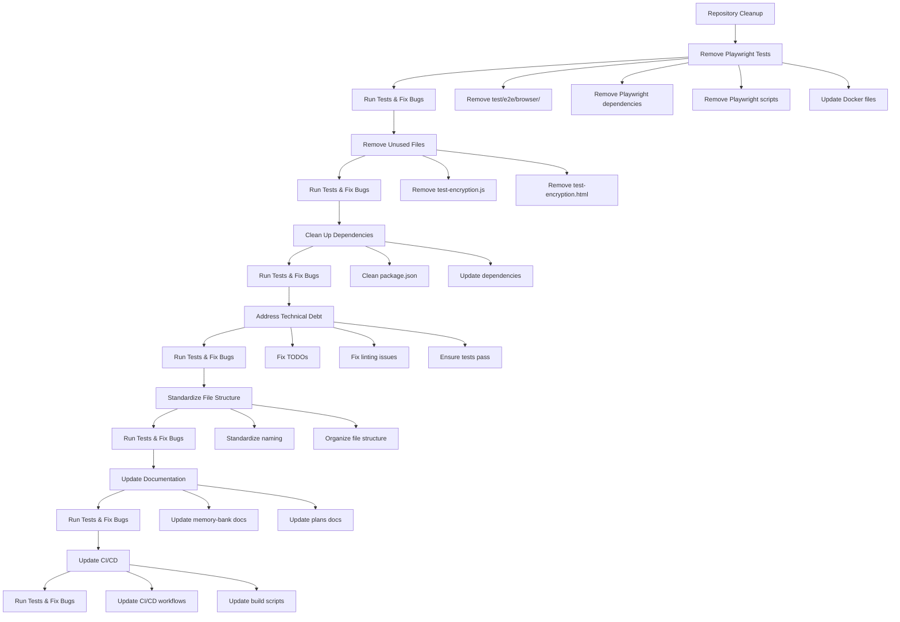

# ShareThings Repository Cleanup Plan

Based on my analysis of the repository, I've created a comprehensive cleanup plan to prepare for the upcoming refactoring. This plan addresses removing unused code, cleaning up dependencies, standardizing file structure, and addressing technical debt.

## 1. Remove Playwright Tests and Dependencies

The Playwright tests are brittle and don't work well, so we'll remove them completely along with all related dependencies and configurations.

### Files to Remove:
- **Entire Directory**: `test/e2e/browser/` (including all tests, fixtures, helpers, and configuration files)
- **Docker File**: `test/e2e/browser/Dockerfile.test`
- **Configuration**: `test/e2e/browser/playwright.config.ts`

### Dependencies to Remove:
- `@playwright/test` from root `package.json`

### Scripts to Remove from `package.json`:
```json
"test:e2e:browser": "playwright test --config=test/e2e/browser/playwright.config.ts",
"test:e2e:browser:ui": "playwright test --config=test/e2e/browser/playwright.config.ts --ui",
"test:e2e:browser:debug": "playwright test --config=test/e2e/browser/playwright.config.ts --debug",
"test:e2e:browser:report": "playwright show-report",
"test:e2e:browser:install": "playwright install --with-deps",
"test:e2e:browser:concurrent": "node test/e2e/browser/run-concurrent.js",
"test:e2e:browser:simple": "npx playwright test test/e2e/browser/tests/simple.test.ts --config=test/e2e/browser/playwright.config.ts --project=chromium",
"test:e2e:browser:all": "./test/e2e/browser/run-all-tests.sh",
"test:e2e:browser:session": "./test/e2e/browser/run-session-tests.sh",
"test:e2e:browser:content": "./test/e2e/browser/run-content-tests.sh"
```

### Update Docker Compose Files:
- Remove `e2e-tests` service from `docker-compose.test.yml`

### Update Build Scripts:
- Remove Playwright-related sections from `build-and-test.sh`

### After Removal:
- Run all remaining tests to ensure nothing was broken
- Fix any bugs that result from running the tests

## 2. Remove Unused Files

### Files to Remove:
- `client/src/test-encryption.js` (test script)
- `client/test-encryption.html` (test HTML file)

### After Removal:
- Run all tests to ensure nothing was broken
- Fix any bugs that result from running the tests

## 3. Clean Up Dependencies

### Dependencies to Review:
- Review all dependencies in root `package.json`
- Review all dependencies in `client/package.json`
- Review all dependencies in `server/package.json`
- Remove any unused dependencies

### After Cleanup:
- Run all tests to ensure nothing was broken
- Fix any bugs that result from running the tests

## 4. Address Technical Debt

### Code Cleanup:
- Address TODO comment in `client/src/pages/SessionPage.tsx`
- Review and fix any linting issues
- Ensure all tests are passing

### After Addressing Technical Debt:
- Run all tests to ensure nothing was broken
- Fix any bugs that result from running the tests

## 5. Standardize File Structure and Naming Conventions

### Standardization:
- Ensure consistent naming conventions across the codebase
- Organize files in a logical structure
- Ensure consistent code formatting

### After Standardization:
- Run all tests to ensure nothing was broken
- Fix any bugs that result from running the tests

## 6. Clean Up Documentation

### Review and Update:
- Review all documentation in `memory-bank/` directory
- Review all documentation in `plans/` directory
- Ensure documentation reflects current architecture and implementation
- Remove any outdated or irrelevant documentation

### After Documentation Cleanup:
- Run all tests to ensure nothing was broken
- Fix any bugs that result from running the tests

## 7. Update CI/CD Configuration

### CI/CD Updates:
- Remove any Playwright-related steps from CI/CD workflows
- Update test scripts in CI/CD workflows

### After CI/CD Updates:
- Run all tests to ensure nothing was broken
- Fix any bugs that result from running the tests

## Implementation Approach

I recommend implementing this cleanup in the following order:

1. **First Phase**: Remove Playwright tests and dependencies
   - This is the most significant change and will have the most impact
   - It will also simplify the codebase for subsequent cleanup steps
   - Run all remaining tests and fix any bugs

2. **Second Phase**: Remove unused files and clean up dependencies
   - Remove test-encryption.js and test-encryption.html
   - Clean up any other unused files or dependencies
   - Run all tests and fix any bugs

3. **Third Phase**: Address technical debt and standardize file structure
   - Fix TODOs and linting issues
   - Standardize file structure and naming conventions
   - Run all tests and fix any bugs

4. **Fourth Phase**: Update documentation
   - Review and update all documentation to reflect the current state of the project
   - Run all tests and fix any bugs

5. **Final Phase**: Update CI/CD configuration
   - Ensure CI/CD workflows are updated to reflect the changes
   - Run all tests and fix any bugs

## Mermaid Diagram: Cleanup Process



## Expected Outcomes

After implementing this cleanup plan, we expect:

1. A cleaner, more maintainable codebase
2. Reduced dependencies and package size
3. Improved build and test times
4. Better documentation that reflects the current state of the project
5. A solid foundation for the upcoming refactoring
6. All tests passing with no regressions