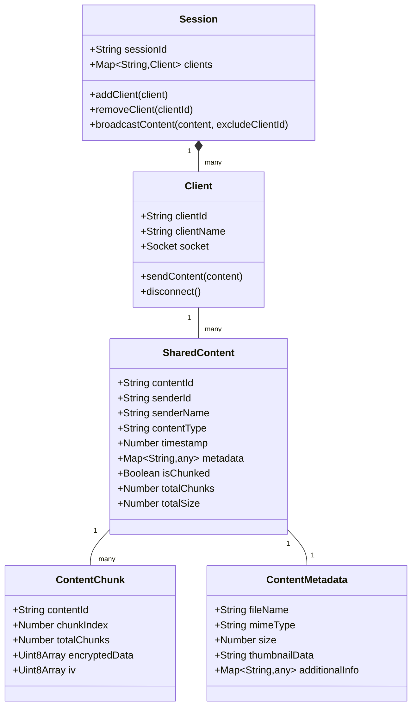

# ShareThings Data Model

## Overview

ShareThings uses a unified data model for all types of shared content. This document outlines the core data structures and their relationships.

## Domain Model



## Core Data Structures

### Session

The Session represents a sharing room where multiple clients can connect and share content.

```typescript
interface Session {
  sessionId: string;
  clients: Map<string, Client>;
  
  addClient(client: Client): void;
  removeClient(clientId: string): void;
  broadcastContent(content: SharedContent | ContentChunk, excludeClientId?: string): void;
}
```

### Client

The Client represents a connected user in a session.

```typescript
interface Client {
  clientId: string;
  clientName: string;
  socket: Socket;
  
  sendContent(content: SharedContent | ContentChunk): void;
  disconnect(): void;
}
```

### SharedContent

SharedContent is the unified model for all types of content (text, images, files).

```typescript
interface SharedContent {
  contentId: string;
  senderId: string;
  senderName: string;
  contentType: ContentType;
  timestamp: number;
  metadata: ContentMetadata;
  isChunked: boolean;
  totalChunks?: number;
  totalSize: number;
}

// Enum for content types
enum ContentType {
  TEXT = 'text',
  IMAGE = 'image',
  FILE = 'file',
  OTHER = 'other'
}
```

### ContentMetadata

ContentMetadata contains information about the content, with type-specific fields.

```typescript
interface ContentMetadata {
  // Common metadata
  fileName?: string;
  mimeType: string;
  size: number;
  
  // Type-specific metadata
  textInfo?: {
    encoding: string;
    language?: string;
    lineCount?: number;
  };
  
  imageInfo?: {
    width: number;
    height: number;
    thumbnailData?: string; // Base64 thumbnail for preview
    format: string;
  };
  
  fileInfo?: {
    extension: string;
    icon?: string; // Icon representation
  };
}
```

### ContentChunk

ContentChunk represents a piece of a larger content that has been split for transmission.

```typescript
interface ContentChunk {
  contentId: string;
  chunkIndex: number;
  totalChunks: number;
  encryptedData: Uint8Array;
  iv: Uint8Array; // Initialization vector for decryption
}
```

## Content Store

The ContentStore manages all shared content on the client side.

```typescript
class ContentStore {
  private contentItems: Map<string, ContentEntry>;
  private chunkStores: Map<string, ChunkStore>;
  
  addContent(content: SharedContent, data?: Blob|string): Promise<void>;
  addChunk(chunk: ContentChunk): Promise<boolean>;
  getContent(contentId: string): ContentEntry | undefined;
  getContentList(): SharedContent[];
  removeContent(contentId: string): boolean;
  clearOldContent(): number;
}

interface ContentEntry {
  metadata: SharedContent;
  data?: Blob | string;
  lastAccessed: Date;
  isComplete: boolean;
}

class ChunkStore {
  chunks: Map<number, ContentChunk>;
  totalChunks: number;
  receivedChunks: number;
  
  addChunk(chunk: ContentChunk): void;
  hasAllChunks(): boolean;
  getOrderedChunks(): ContentChunk[];
}
```

## Socket.IO Message Types

The application uses the following Socket.IO message types:

1. **join**: Client joins a session
   ```typescript
   interface JoinMessage {
     sessionId: string;
     clientName: string;
   }
   ```

2. **leave**: Client leaves a session
   ```typescript
   interface LeaveMessage {
     sessionId: string;
     clientId: string;
   }
   ```

3. **content**: Client shares content
   ```typescript
   interface ContentMessage {
     sessionId: string;
     content: SharedContent;
     data?: string; // Base64 encoded data (for small content)
   }
   ```

4. **chunk**: Client sends a content chunk
   ```typescript
   interface ChunkMessage {
     sessionId: string;
     chunk: ContentChunk;
   }
   ```

5. **client-joined**: Server notifies clients of a new client
   ```typescript
   interface ClientJoinedMessage {
     sessionId: string;
     clientId: string;
     clientName: string;
   }
   ```

6. **client-left**: Server notifies clients of a client leaving
   ```typescript
   interface ClientLeftMessage {
     sessionId: string;
     clientId: string;
   }
   ```

## Data Flow

1. Client creates or joins a session
2. Client captures content (text, image, file)
3. Content is analyzed and metadata extracted
4. If content is small, it's sent as a single message
5. If content is large, it's split into chunks and sent sequentially
6. Server forwards content/chunks to other clients in the session
7. Receiving clients reassemble chunks if necessary
8. Content is displayed based on its type

## Encryption

All content is encrypted before transmission:

1. A key is derived from the session passphrase using PBKDF2
2. Each content/chunk is encrypted using AES-GCM
3. A unique initialization vector (IV) is generated for each encryption
4. The IV is sent along with the encrypted data
5. Receiving clients use the same passphrase to derive the key and decrypt