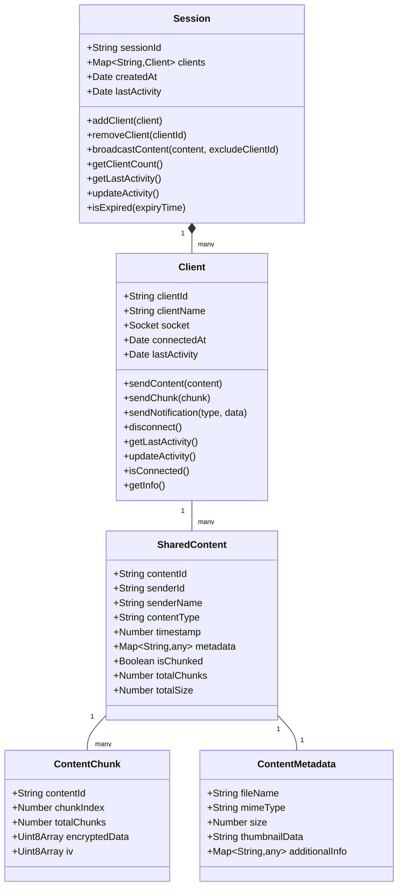

# ShareThings Data Model

## Overview

ShareThings uses a unified data model for all types of shared content. This document outlines the core data structures and their relationships.

## Domain Model



## Core Data Structures

### Session

The Session represents a sharing room where multiple clients can connect and share content.

```typescript
class Session {
  /**
   * Session identifier
   */
  public readonly sessionId: string;
  
  /**
   * Map of clients in the session
   */
  public readonly clients: Map<string, Client>;
  
  /**
   * Creation timestamp
   */
  public readonly createdAt: Date;
  
  /**
   * Last activity timestamp
   */
  private lastActivity: Date;
  
  /**
   * Creates a new session
   * @param sessionId Session identifier
   */
  constructor(sessionId: string);
  
  /**
   * Adds a client to the session
   * @param client Client to add
   */
  public addClient(client: Client): void;
  
  /**
   * Removes a client from the session
   * @param clientId Client identifier
   */
  public removeClient(clientId: string): void;
  
  /**
   * Broadcasts content to all clients in the session
   * @param content Content to broadcast
   * @param excludeClientId Client to exclude from broadcast
   */
  public broadcastContent(content: any, excludeClientId?: string): void;
  
  /**
   * Gets the number of clients in the session
   * @returns Number of clients
   */
  public getClientCount(): number;
  
  /**
   * Gets the last activity timestamp
   * @returns Last activity timestamp
   */
  public getLastActivity(): Date;
  
  /**
   * Updates the last activity timestamp
   */
  private updateActivity(): void;
  
  /**
   * Checks if the session is expired
   * @param expiryTime Expiry time in milliseconds
   * @returns True if the session is expired
   */
  public isExpired(expiryTime: number): boolean;
}
```

### Client

The Client represents a connected user in a session.

```typescript
class Client {
  /**
   * Client identifier (Socket.IO socket ID)
   */
  public readonly clientId: string;
  
  /**
   * Client display name
   */
  public readonly clientName: string;
  
  /**
   * Socket.IO socket
   */
  private readonly socket: Socket;
  
  /**
   * Connection timestamp
   */
  public readonly connectedAt: Date;
  
  /**
   * Last activity timestamp
   */
  private lastActivity: Date;
  
  /**
   * Creates a new client
   * @param clientId Client identifier
   * @param clientName Client display name
   * @param socket Socket.IO socket
   */
  constructor(clientId: string, clientName: string, socket: Socket);
  
  /**
   * Sends content to the client
   * @param content Content to send
   */
  public sendContent(content: any): void;
  
  /**
   * Sends a chunk to the client
   * @param chunk Chunk to send
   */
  public sendChunk(chunk: any): void;
  
  /**
   * Sends a notification to the client
   * @param type Notification type
   * @param data Notification data
   */
  public sendNotification(type: string, data: any): void;
  
  /**
   * Disconnects the client
   */
  public disconnect(): void;
  
  /**
   * Gets the last activity timestamp
   * @returns Last activity timestamp
   */
  public getLastActivity(): Date;
  
  /**
   * Updates the last activity timestamp
   */
  private updateActivity(): void;
  
  /**
   * Checks if the client is connected
   * @returns True if the client is connected
   */
  public isConnected(): boolean;
  
  /**
   * Gets client information
   * @returns Client information
   */
  public getInfo(): { id: string, name: string };
}
```

### SharedContent

SharedContent is the unified model for all types of content (text, images, files).

```typescript
interface SharedContent {
  contentId: string;
  senderId: string;
  senderName: string;
  contentType: ContentType;
  timestamp: number;
  metadata: ContentMetadata;
  isChunked: boolean;
  totalChunks?: number;
  totalSize: number;
}

// Enum for content types
enum ContentType {
  TEXT = 'text',
  IMAGE = 'image',
  FILE = 'file',
  OTHER = 'other'
}
```

### ContentMetadata

ContentMetadata contains information about the content, with type-specific fields.

```typescript
interface ContentMetadata {
  // Common metadata
  fileName?: string;
  mimeType: string;
  size: number;
  
  // Type-specific metadata
  textInfo?: {
    encoding: string;
    language?: string;
    lineCount?: number;
  };
  
  imageInfo?: {
    width: number;
    height: number;
    thumbnailData?: string; // Base64 thumbnail for preview
    format: string;
  };
  
  fileInfo?: {
    extension: string;
    icon?: string; // Icon representation
  };
}
```

### ContentChunk

ContentChunk represents a piece of a larger content that has been split for transmission.

```typescript
interface ContentChunk {
  contentId: string;
  chunkIndex: number;
  totalChunks: number;
  encryptedData: Uint8Array;
  iv: Uint8Array; // Initialization vector for decryption
}
```

## Content Store

The ContentStore manages all shared content on the client side.

```typescript
class ContentStore {
  private contentItems: Map<string, ContentEntry>;
  private chunkStores: Map<string, ChunkStore>;
  
  addContent(content: SharedContent, data?: Blob|string): Promise<void>;
  addChunk(chunk: ContentChunk): Promise<boolean>;
  getContent(contentId: string): ContentEntry | undefined;
  getContentList(): SharedContent[];
  removeContent(contentId: string): boolean;
  clearOldContent(): number;
}

interface ContentEntry {
  metadata: SharedContent;
  data?: Blob | string;
  lastAccessed: Date;
  isComplete: boolean;
}

class ChunkStore {
  chunks: Map<number, ContentChunk>;
  totalChunks: number;
  receivedChunks: number;
  
  addChunk(chunk: ContentChunk): void;
  hasAllChunks(): boolean;
  getOrderedChunks(): ContentChunk[];
}
```

## Authentication Data Structures

### SessionAuth

SessionAuth contains authentication information for a session.

```typescript
interface SessionAuth {
  /**
   * Passphrase fingerprint (self-encrypted passphrase)
   */
  fingerprint: {
    iv: number[];
    data: number[];
  };
  
  /**
   * Session creation timestamp
   */
  createdAt: Date;
  
  /**
   * Last activity timestamp
   */
  lastActivity: Date;
}
```

### SessionJoinResult

SessionJoinResult represents the result of a session join operation.

```typescript
interface SessionJoinResult {
  /**
   * Whether the join was successful
   */
  success: boolean;
  
  /**
   * Session token (if successful)
   */
  token?: string;
  
  /**
   * Error message (if unsuccessful)
   */
  error?: string;
}
```

## Socket.IO Message Types

The application uses the following Socket.IO message types:

1. **join**: Client joins a session
   ```typescript
   interface JoinMessage {
     sessionId: string;
     clientName: string;
     fingerprint: {
       iv: number[];
       data: number[];
     };
   }
   ```

2. **leave**: Client leaves a session
   ```typescript
   interface LeaveMessage {
     sessionId: string;
   }
   ```

3. **content**: Client shares content
   ```typescript
   interface ContentMessage {
     sessionId: string;
     content: SharedContent;
     data?: string; // Base64 encoded data (for small content)
   }
   ```

4. **chunk**: Client sends a content chunk
   ```typescript
   interface ChunkMessage {
     sessionId: string;
     chunk: ContentChunk;
   }
   ```

5. **client-joined**: Server notifies clients of a new client
   ```typescript
   interface ClientJoinedMessage {
     sessionId: string;
     clientId: string;
     clientName: string;
   }
   ```

6. **client-left**: Server notifies clients of a client leaving
   ```typescript
   interface ClientLeftMessage {
     sessionId: string;
     clientId: string;
   }
   ```

## Data Flow

1. **Session Establishment**:
   - Client creates or joins a session with a name, client name, and passphrase
   - Client creates a passphrase fingerprint
   - Server verifies the fingerprint or creates a new session
   - Server issues a session token
   - Client stores the token for future requests

2. **Content Sharing**:
   - Client captures content (clipboard, file, etc.)
   - Content is analyzed and metadata extracted
   - Content is chunked if necessary
   - Each chunk is encrypted with a key derived from the passphrase
   - Encrypted chunks are sent to the server with the session token
   - Server validates the token and forwards chunks to other clients
   - Receiving clients decrypt and reassemble content
   - Content is displayed based on its type

3. **Session Termination**:
   - Client disconnects from session
   - Server removes client from room
   - Server notifies other clients of departure
   - If no clients remain, session is marked for expiration

## Encryption and Security

### Encryption

All content is encrypted before transmission:

1. A key is derived from the session passphrase using PBKDF2
2. Each content/chunk is encrypted using AES-GCM
3. A unique initialization vector (IV) is generated for each encryption
4. The IV is sent along with the encrypted data
5. Receiving clients use the same passphrase to derive the key and decrypt

### Passphrase Fingerprinting

To verify the passphrase without exposing it, a self-encryption approach is used:

1. The client creates a SHA-256 hash of the passphrase
2. The first half of the hash is used as an encryption key
3. The second half of the hash is encrypted using the key
4. The resulting encrypted data and IV form the "fingerprint"

```typescript
async function createPassphraseFingerprint(passphrase: string): Promise<{ iv: number[], data: number[] }> {
  // Create a key from the passphrase
  const encoder = new TextEncoder();
  const passphraseData = encoder.encode(passphrase);
  const hashBuffer = await crypto.subtle.digest('SHA-256', passphraseData);
  const hashArray = new Uint8Array(hashBuffer);
  
  // Use the first half of the hash to encrypt the second half
  const encryptionPart = hashArray.slice(0, 16);
  const dataPart = hashArray.slice(16, 32);
  
  // Import the key
  const key = await crypto.subtle.importKey(
    'raw',
    encryptionPart,
    { name: 'AES-GCM' },
    false,
    ['encrypt']
  );
  
  // Generate IV
  const iv = crypto.getRandomValues(new Uint8Array(12));
  
  // Encrypt
  const encrypted = await crypto.subtle.encrypt(
    { name: 'AES-GCM', iv },
    key,
    dataPart
  );
  
  // Return fingerprint
  return {
    iv: Array.from(iv),
    data: Array.from(new Uint8Array(encrypted))
  };
}
```

### Session Tokens

After successful authentication, the server issues a session token:

1. The token is a cryptographically secure random string
2. The token is associated with the client ID on the server
3. The client stores the token in localStorage
4. The token is included in subsequent requests

```typescript
// Server-side token generation
private generateSessionToken(): string {
  // Generate a random token
  const array = Buffer.alloc(32);
  crypto.randomFillSync(array);
  return array.toString('hex');
}

// Client-side token storage
localStorage.setItem('sessionToken', response.token);
```

### Session Expiration

Sessions expire after a period of inactivity:

1. The server tracks the last activity timestamp for each session
2. If no activity occurs for the configured timeout period (default: 10 minutes), the session is expired
3. Expired sessions are automatically cleaned up