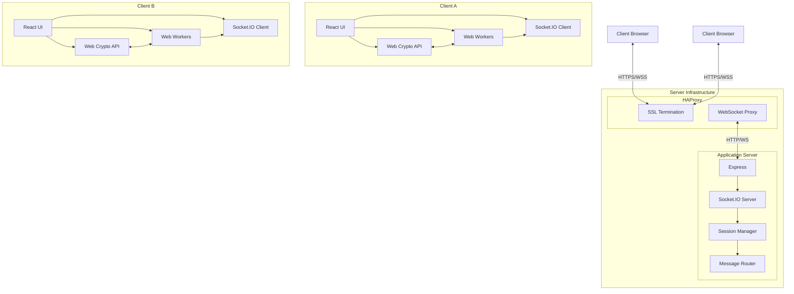

# ShareThings System Architecture (Updated)

## Overview

ShareThings is a real-time content sharing application with end-to-end encryption. The system consists of:

1. React frontend with Chakra UI
2. Express backend with Socket.IO
3. HAProxy for SSL termination

The application allows multiple clients to connect to the same session and share content among each other. All content is encrypted client-side before transmission, ensuring the server never has access to unencrypted data.

## Architecture Diagram

## Key Components

### Frontend Components

1. **Session Management**
   - Session creation and joining
   - Client identification
   - Passphrase handling and fingerprinting
   - Token-based authentication

2. **Content Handling**
   - Unified content model for text, images, and files
   - Content type detection and metadata extraction
   - Content visualization based on type

3. **Encryption/Decryption**
   - Web Crypto API for encryption operations
   - Web Workers for non-blocking processing
   - Passphrase-based key derivation

4. **Real-time Communication**
   - Socket.IO client for WebSocket communication
   - Reconnection handling
   - Event-based messaging

### Backend Components

1. **Session Management**
   - Session creation and tracking
   - Client registration and identification
   - Passphrase fingerprint verification
   - Token-based authentication
   - Session expiration and cleanup

2. **Message Routing**
   - Content and chunk forwarding
   - Broadcast to session participants
   - Message sequencing

3. **WebSocket Handling**
   - Socket.IO server for WebSocket communication
   - Connection management
   - Proxy-aware configuration

## Enhanced Session Management

ShareThings implements a secure session management system:

1. **Passphrase Fingerprinting**
   - Client creates a fingerprint from the passphrase
   - Fingerprint allows verification without exposing the passphrase
   - Server stores the fingerprint for session authentication

2. **Token-based Authentication**
   - Server issues session tokens after successful authentication
   - Tokens are required for content-related operations
   - Middleware validates tokens for each request

3. **Session Expiration**
   - Sessions expire after a period of inactivity (default: 10 minutes)
   - Expired sessions are automatically cleaned up
   - Configurable timeout via environment variables

## Data Flow

1. **Session Establishment**
   - Client creates or joins a session with a name, client name, and passphrase
   - Client creates a passphrase fingerprint
   - Server verifies the fingerprint or creates a new session
   - Server issues a session token
   - Client stores the token for future requests

2. **Content Sharing**
   - Client captures content (clipboard, file, etc.)
   - Content is analyzed and metadata extracted
   - Content is chunked if necessary
   - Each chunk is encrypted with a key derived from the passphrase
   - Encrypted chunks are sent to the server with the session token
   - Server validates the token and forwards chunks to other clients
   - Receiving clients decrypt and reassemble content
   - Content is displayed based on its type

3. **Session Termination**
   - Client disconnects from session
   - Server removes client from room
   - Server notifies other clients of departure
   - If no clients remain, session is marked for expiration

## Security Architecture

- **End-to-end Encryption**: All content is encrypted client-side before transmission
- **Client-side Passphrase**: The encryption passphrase never leaves the client
- **Passphrase Fingerprinting**: Allows verification without exposing the passphrase
- **Token-based Authentication**: Secure session tokens for request authorization
- **No Server Access**: The server cannot decrypt any content
- **Secure Key Derivation**: PBKDF2 is used to derive keys from passphrases
- **Unique IVs**: Each encrypted message uses a unique initialization vector
- **Session Expiration**: Inactive sessions are automatically expired

## Deployment Architecture

- **HAProxy**: Handles SSL termination and WebSocket proxying
- **Node.js Application Server**: Runs the Express and Socket.IO server
- **Static File Serving**: Serves the React frontend
- **WebSocket Configuration**: Properly configured for long-lived connections

## Scalability Considerations

- **Sticky Sessions**: Ensure clients maintain connection to the same server
- **Memory Management**: Efficient handling of large content transfers
- **Worker Processes**: Multiple Node.js processes for handling load
- **Load Balancing**: HAProxy can distribute load across multiple application servers