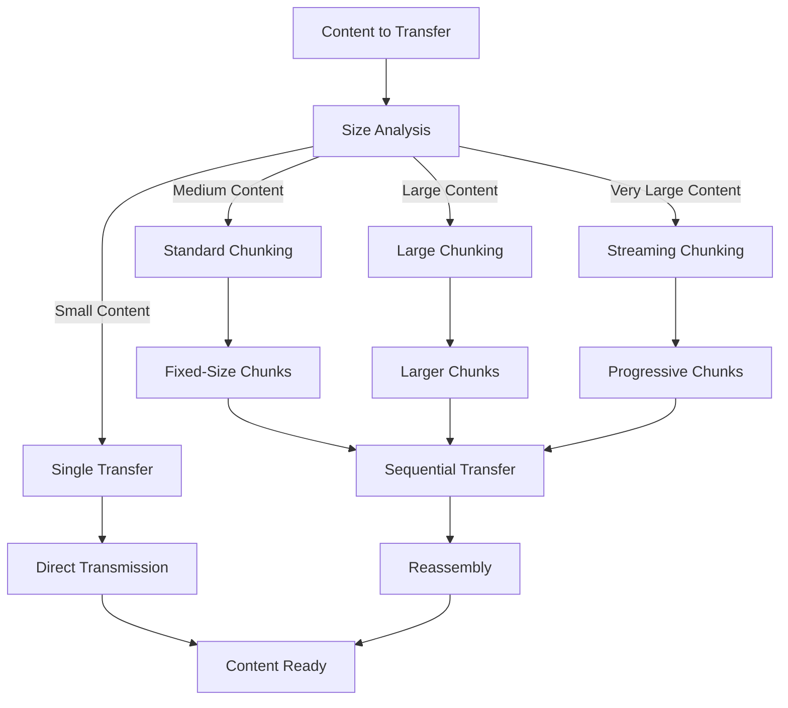

# Content Chunking Strategy

## Overview

ShareThings implements a progressive chunking strategy for handling large content transfers. This approach allows the application to efficiently transfer content of any size while maintaining responsiveness and preventing WebSocket disconnections.

This document outlines the chunking strategy, implementation details, and optimization techniques.

## Why Chunking is Necessary

When transferring large content over WebSockets, several challenges arise:

1. **Browser Memory Limitations**: Browsers have memory constraints for single objects
2. **Main Thread Blocking**: Processing large content can block the main thread
3. **WebSocket Timeouts**: Long operations can cause WebSocket connections to time out
4. **Network Reliability**: Larger transfers are more susceptible to network issues
5. **Progress Tracking**: Users need feedback on transfer progress

Chunking addresses these challenges by breaking large content into manageable pieces that can be:
- Processed incrementally
- Transferred sequentially
- Tracked for progress
- Resumed if interrupted

## Progressive Chunking Approach

ShareThings uses a progressive chunking approach that adapts to content size:



### Size Thresholds

The chunking strategy uses adaptive thresholds based on content size:

| Content Size | Chunk Size | Strategy |
|--------------|------------|----------|
| < 64 KB | No chunking | Direct transmission |
| 64 KB - 1 MB | 64 KB | Standard chunking |
| 1 MB - 10 MB | 128 KB | Medium chunking |
| 10 MB - 100 MB | 256 KB | Large chunking |
| > 100 MB | 512 KB | Very large chunking |

These thresholds balance transfer efficiency with memory usage and are configurable based on application requirements.

## Chunking Implementation

### Content Analysis

Before transfer, content is analyzed to determine the appropriate chunking strategy:

```typescript
/**
 * Analyzes content and determines chunking strategy
 * @param content Content to analyze
 * @returns Chunking strategy
 */
function analyzeContent(content: Blob | string): ChunkingStrategy {
  const size = typeof content === 'string' ? content.length : content.size;
  
  // Determine chunking strategy based on size
  if (size <= 64 * 1024) { // 64 KB
    return {
      needsChunking: false,
      chunkSize: 0,
      estimatedChunks: 1
    };
  } else if (size <= 1 * 1024 * 1024) { // 1 MB
    return {
      needsChunking: true,
      chunkSize: 64 * 1024, // 64 KB chunks
      estimatedChunks: Math.ceil(size / (64 * 1024))
    };
  } else if (size <= 10 * 1024 * 1024) { // 10 MB
    return {
      needsChunking: true,
      chunkSize: 128 * 1024, // 128 KB chunks
      estimatedChunks: Math.ceil(size / (128 * 1024))
    };
  } else if (size <= 100 * 1024 * 1024) { // 100 MB
    return {
      needsChunking: true,
      chunkSize: 256 * 1024, // 256 KB chunks
      estimatedChunks: Math.ceil(size / (256 * 1024))
    };
  } else {
    return {
      needsChunking: true,
      chunkSize: 512 * 1024, // 512 KB chunks
      estimatedChunks: Math.ceil(size / (512 * 1024))
    };
  }
}
```

### Content Chunking

Once the strategy is determined, content is split into chunks:

```typescript
/**
 * Splits content into chunks
 * @param content Content to split
 * @param strategy Chunking strategy
 * @returns Array of content chunks
 */
function splitIntoChunks(content: Blob | string, strategy: ChunkingStrategy): ContentChunkData[] {
  if (!strategy.needsChunking) {
    return [{
      index: 0,
      data: content,
      isLast: true
    }];
  }
  
  const chunks: ContentChunkData[] = [];
  const totalSize = typeof content === 'string' ? content.length : content.size;
  const chunkSize = strategy.chunkSize;
  const totalChunks = Math.ceil(totalSize / chunkSize);
  
  for (let i = 0; i < totalChunks; i++) {
    const start = i * chunkSize;
    const end = Math.min(start + chunkSize, totalSize);
    
    let chunkData: string | Blob;
    
    if (typeof content === 'string') {
      chunkData = content.substring(start, end);
    } else {
      chunkData = content.slice(start, end);
    }
    
    chunks.push({
      index: i,
      data: chunkData,
      isLast: i === totalChunks - 1
    });
  }
  
  return chunks;
}
```

### Chunk Processing

Each chunk is processed (encrypted) before transmission:

```typescript
/**
 * Processes chunks for transmission
 * @param chunks Content chunks
 * @param contentId Unique content identifier
 * @param encryptionService Encryption service
 * @returns Processed chunks ready for transmission
 */
async function processChunks(
  chunks: ContentChunkData[],
  contentId: string,
  encryptionService: EncryptionService
): Promise<ContentChunk[]> {
  const totalChunks = chunks.length;
  const processedChunks: ContentChunk[] = [];
  
  // Process chunks sequentially to avoid memory issues
  for (const chunk of chunks) {
    // Encrypt chunk data
    const { encryptedData, iv } = await encryptionService.encrypt(chunk.data);
    
    // Create content chunk
    const contentChunk: ContentChunk = {
      contentId,
      chunkIndex: chunk.index,
      totalChunks,
      encryptedData: new Uint8Array(encryptedData),
      iv
    };
    
    processedChunks.push(contentChunk);
  }
  
  return processedChunks;
}
```

### Chunk Transmission

Chunks are transmitted sequentially with progress tracking:

```typescript
/**
 * Transmits chunks to the server
 * @param chunks Processed content chunks
 * @param sessionId Session identifier
 * @param socketService Socket service for transmission
 * @param progressCallback Callback for progress updates
 * @returns Promise that resolves when all chunks are transmitted
 */
async function transmitChunks(
  chunks: ContentChunk[],
  sessionId: string,
  socketService: SocketService,
  progressCallback?: (progress: number) => void
): Promise<void> {
  const totalChunks = chunks.length;
  
  for (let i = 0; i < totalChunks; i++) {
    const chunk = chunks[i];
    
    // Transmit chunk
    await new Promise<void>((resolve, reject) => {
      socketService.emit('chunk', {
        sessionId,
        chunk
      }, (response: { success: boolean, error?: string }) => {
        if (response.success) {
          resolve();
        } else {
          reject(new Error(response.error || 'Failed to transmit chunk'));
        }
      });
    });
    
    // Update progress
    if (progressCallback) {
      progressCallback((i + 1) / totalChunks);
    }
    
    // Small delay between chunks to prevent flooding
    if (i < totalChunks - 1) {
      await new Promise(resolve => setTimeout(resolve, 10));
    }
  }
}
```

## Chunk Reception and Reassembly

On the receiving end, chunks are collected and reassembled:

```typescript
class ChunkManager {
  private chunkStores: Map<string, ChunkStore> = new Map();
  private contentService: ContentService;
  
  constructor(contentService: ContentService) {
    this.contentService = contentService;
  }
  
  /**
   * Handles a received content chunk
   * @param chunk Received content chunk
   * @returns True if all chunks for the content have been received
   */
  async handleChunk(chunk: ContentChunk): Promise<boolean> {
    const { contentId, chunkIndex, totalChunks } = chunk;
    
    // Get or create chunk store
    let chunkStore = this.chunkStores.get(contentId);
    if (!chunkStore) {
      chunkStore = new ChunkStore(totalChunks);
      this.chunkStores.set(contentId, chunkStore);
    }
    
    // Add chunk to store
    chunkStore.addChunk(chunk);
    
    // Check if all chunks have been received
    if (chunkStore.isComplete()) {
      // Reassemble content
      await this.reassembleContent(contentId);
      return true;
    }
    
    return false;
  }
  
  /**
   * Reassembles content from chunks
   * @param contentId Content identifier
   */
  private async reassembleContent(contentId: string): Promise<void> {
    const chunkStore = this.chunkStores.get(contentId);
    if (!chunkStore) {
      throw new Error(`No chunk store found for content ${contentId}`);
    }
    
    // Get ordered chunks
    const orderedChunks = chunkStore.getOrderedChunks();
    
    // Decrypt chunks
    const decryptedChunks = await Promise.all(
      orderedChunks.map(chunk => 
        this.contentService.decryptChunk(chunk)
      )
    );
    
    // Combine chunks based on content type
    const content = await this.contentService.getContent(contentId);
    if (!content) {
      throw new Error(`Content metadata not found for ${contentId}`);
    }
    
    let combinedData: Blob | string;
    
    if (content.contentType === 'text') {
      // Combine text chunks
      combinedData = decryptedChunks.join('');
    } else {
      // Combine binary chunks
      const blobParts = decryptedChunks.map(chunk => 
        chunk instanceof Blob ? chunk : new Blob([chunk])
      );
      combinedData = new Blob(blobParts, { type: content.metadata.mimeType });
    }
    
    // Update content with combined data
    await this.contentService.updateContent(contentId, combinedData);
    
    // Clean up chunk store
    this.chunkStores.delete(contentId);
  }
}

class ChunkStore {
  private chunks: Map<number, ContentChunk> = new Map();
  private totalChunks: number;
  
  constructor(totalChunks: number) {
    this.totalChunks = totalChunks;
  }
  
  /**
   * Adds a chunk to the store
   * @param chunk Content chunk
   */
  addChunk(chunk: ContentChunk): void {
    this.chunks.set(chunk.chunkIndex, chunk);
  }
  
  /**
   * Checks if all chunks have been received
   * @returns True if all chunks are present
   */
  isComplete(): boolean {
    return this.chunks.size === this.totalChunks;
  }
  
  /**
   * Gets chunks in order
   * @returns Ordered array of chunks
   */
  getOrderedChunks(): ContentChunk[] {
    return Array.from(this.chunks.entries())
      .sort(([indexA], [indexB]) => indexA - indexB)
      .map(([_, chunk]) => chunk);
  }
  
  /**
   * Gets the number of received chunks
   * @returns Number of received chunks
   */
  getReceivedCount(): number {
    return this.chunks.size;
  }
  
  /**
   * Gets the total number of chunks
   * @returns Total number of chunks
   */
  getTotalCount(): number {
    return this.totalChunks;
  }
}
```

## Web Worker Integration

To prevent blocking the main thread during chunk processing, Web Workers are used:

```typescript
// In main thread
class ChunkProcessor {
  private workerPool: WorkerPool;
  
  constructor(poolSize: number = navigator.hardwareConcurrency || 4) {
    this.workerPool = new WorkerPool(poolSize);
  }
  
  /**
   * Processes a content chunk
   * @param chunk Content chunk data
   * @param contentId Content identifier
   * @param encryptionKey Encryption key
   * @returns Processed chunk
   */
  async processChunk(
    chunk: ContentChunkData,
    contentId: string,
    encryptionKey: CryptoKey
  ): Promise<ContentChunk> {
    // Get a worker from the pool
    const worker = await this.workerPool.getWorker();
    
    try {
      // Process chunk in worker
      const result = await worker.processChunk(chunk.data, encryptionKey);
      
      // Create content chunk
      const contentChunk: ContentChunk = {
        contentId,
        chunkIndex: chunk.index,
        totalChunks: chunk.totalChunks,
        encryptedData: new Uint8Array(result.encryptedData),
        iv: result.iv
      };
      
      return contentChunk;
    } finally {
      // Return worker to pool
      this.workerPool.releaseWorker(worker);
    }
  }
}
```

## Progress Tracking

The chunking system includes progress tracking for both sending and receiving:

```typescript
class TransferProgress {
  private contentId: string;
  private totalChunks: number;
  private processedChunks: number = 0;
  private transmittedChunks: number = 0;
  private startTime: number;
  private listeners: Array<(progress: TransferProgressInfo) => void> = [];
  
  constructor(contentId: string, totalChunks: number) {
    this.contentId = contentId;
    this.totalChunks = totalChunks;
    this.startTime = Date.now();
  }
  
  /**
   * Updates processing progress
   * @param processed Number of processed chunks
   */
  updateProcessing(processed: number): void {
    this.processedChunks = processed;
    this.notifyListeners();
  }
  
  /**
   * Updates transmission progress
   * @param transmitted Number of transmitted chunks
   */
  updateTransmission(transmitted: number): void {
    this.transmittedChunks = transmitted;
    this.notifyListeners();
  }
  
  /**
   * Notifies all listeners of progress update
   */
  private notifyListeners(): void {
    const elapsedTime = Date.now() - this.startTime;
    const processingProgress = this.processedChunks / this.totalChunks;
    const transmissionProgress = this.transmittedChunks / this.totalChunks;
    const overallProgress = (processingProgress + transmissionProgress) / 2;
    
    const progressInfo: TransferProgressInfo = {
      contentId: this.contentId,
      totalChunks: this.totalChunks,
      processedChunks: this.processedChunks,
      transmittedChunks: this.transmittedChunks,
      processingProgress,
      transmissionProgress,
      overallProgress,
      elapsedTime,
      estimatedTimeRemaining: this.estimateTimeRemaining(overallProgress, elapsedTime)
    };
    
    for (const listener of this.listeners) {
      listener(progressInfo);
    }
  }
  
  /**
   * Estimates remaining time based on progress
   * @param progress Current progress (0-1)
   * @param elapsedTime Elapsed time in milliseconds
   * @returns Estimated time remaining in milliseconds
   */
  private estimateTimeRemaining(progress: number, elapsedTime: number): number {
    if (progress === 0) {
      return 0;
    }
    
    const timePerPercent = elapsedTime / progress;
    return timePerPercent * (1 - progress);
  }
}
```

## Memory Management

Careful memory management is implemented to prevent memory leaks:

```typescript
/**
 * Manages memory for chunk processing
 * @param maxMemoryUsage Maximum memory usage in bytes
 * @param cleanupThreshold Threshold for cleanup (0-1)
 */
class ChunkMemoryManager {
  private maxMemoryUsage: number;
  private cleanupThreshold: number;
  private currentMemoryUsage: number = 0;
  private chunks: Map<string, { size: number, lastAccessed: number }> = new Map();
  
  constructor(maxMemoryUsage: number = 100 * 1024 * 1024, cleanupThreshold: number = 0.8) {
    this.maxMemoryUsage = maxMemoryUsage;
    this.cleanupThreshold = cleanupThreshold;
  }
  
  /**
   * Registers a chunk in memory
   * @param chunkId Chunk identifier
   * @param size Chunk size in bytes
   */
  registerChunk(chunkId: string, size: number): void {
    this.chunks.set(chunkId, {
      size,
      lastAccessed: Date.now()
    });
    
    this.currentMemoryUsage += size;
    
    // Check if cleanup is needed
    if (this.currentMemoryUsage > this.maxMemoryUsage * this.cleanupThreshold) {
      this.cleanup();
    }
  }
  
  /**
   * Cleans up memory by removing oldest chunks
   */
  private cleanup(): void {
    // Sort chunks by last accessed time
    const sortedChunks = Array.from(this.chunks.entries())
      .sort(([_, a], [__, b]) => a.lastAccessed - b.lastAccessed);
    
    // Remove oldest chunks until we're under threshold
    for (const [chunkId, chunk] of sortedChunks) {
      if (this.currentMemoryUsage <= this.maxMemoryUsage * 0.7) {
        break;
      }
      
      this.currentMemoryUsage -= chunk.size;
      this.chunks.delete(chunkId);
    }
  }
}