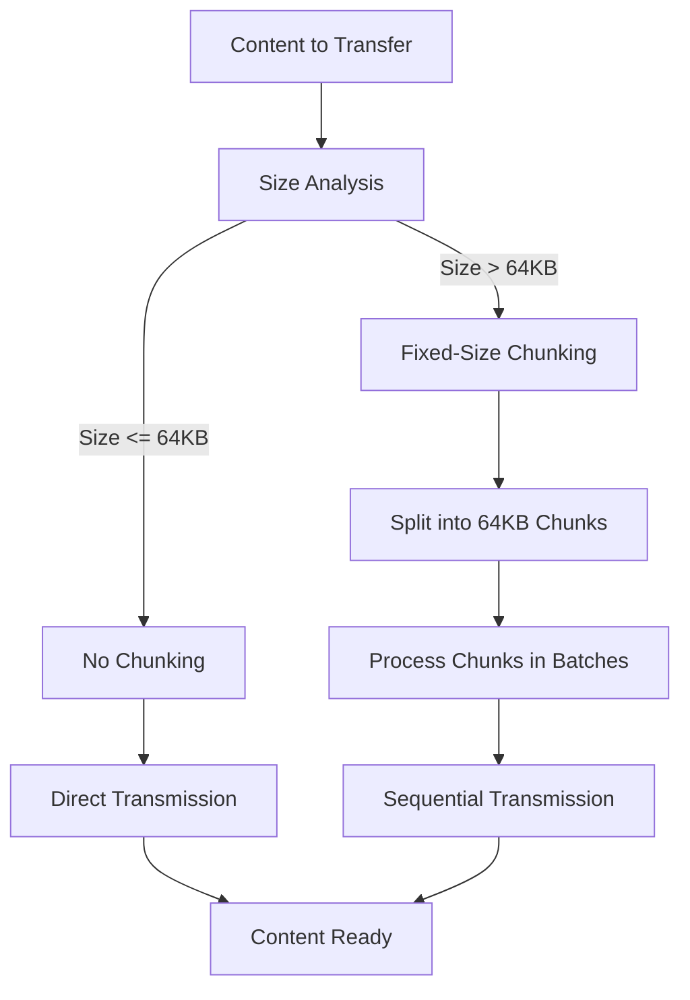

# Content Chunking Strategy

## Overview

ShareThings implements a chunking strategy for handling large content transfers. This approach allows the application to efficiently transfer content of any size while maintaining responsiveness and preventing WebSocket disconnections.

This document outlines the current chunking implementation, based on the actual code in `chunking.ts`.

## Why Chunking is Necessary

When transferring large content over WebSockets, several challenges arise:

1. **Browser Memory Limitations**: Browsers have memory constraints for single objects
2. **Main Thread Blocking**: Processing large content can block the main thread
3. **WebSocket Timeouts**: Long operations can cause WebSocket connections to time out
4. **Network Reliability**: Larger transfers are more susceptible to network issues
5. **Progress Tracking**: Users need feedback on transfer progress

Chunking addresses these challenges by breaking large content into manageable pieces that can be:
- Processed incrementally
- Transferred sequentially
- Tracked for progress
- Resumed if interrupted

## Current Chunking Implementation

The current implementation uses a fixed-size chunking approach with a default chunk size of 64KB:



### Core Interfaces

The chunking implementation defines the following interfaces:

```typescript
/**
 * Chunk metadata
 */
export interface ChunkMetadata {
  contentId: string;
  chunkIndex: number;
  totalChunks: number;
  size: number;
  iv: Uint8Array;
}

/**
 * Chunk data
 */
export interface Chunk {
  contentId: string;
  chunkIndex: number;
  totalChunks: number;
  encryptedData: Uint8Array;
  iv: Uint8Array;
}

/**
 * Chunking options
 */
export interface ChunkingOptions {
  chunkSize?: number;
  onProgress?: (progress: number) => void;
}
```

### Default Configuration

The current implementation uses a fixed default chunk size:

```typescript
/**
 * Default chunking options
 */
const DEFAULT_OPTIONS: ChunkingOptions = {
  chunkSize: 64 * 1024, // 64KB
  onProgress: () => {}
};
```

Unlike the progressive chunking approach described in earlier documentation, the current implementation uses a single fixed chunk size for all content, regardless of size.

### Chunking and Encryption

The main chunking function combines chunking with encryption:

```typescript
/**
 * Chunks and encrypts a blob
 * @param blob The blob to chunk and encrypt
 * @param passphrase The encryption passphrase
 * @param options Chunking options
 * @returns Array of chunks and content ID
 */
export async function chunkAndEncryptBlob(
  blob: Blob,
  passphrase: string,
  options: ChunkingOptions = {}
): Promise<{ chunks: Chunk[]; contentId: string }> {
  // Merge options with defaults
  const opts = { ...DEFAULT_OPTIONS, ...options };
  const chunkSize = opts.chunkSize || DEFAULT_OPTIONS.chunkSize!;
  const onProgress = opts.onProgress || DEFAULT_OPTIONS.onProgress!;
  
  // Generate content ID
  const contentId = uuidv4();
  
  // Calculate total chunks
  const totalChunks = Math.ceil(blob.size / chunkSize);
  
  // Derive encryption key
  const key = await deriveKeyFromPassphrase(passphrase);
  
  // Create chunks
  const chunks: Chunk[] = [];
  
  for (let i = 0; i < totalChunks; i++) {
    // Calculate chunk range
    const start = i * chunkSize;
    const end = Math.min(start + chunkSize, blob.size);
    
    // Extract chunk data
    const chunkBlob = blob.slice(start, end);
    const arrayBuffer = await chunkBlob.arrayBuffer();
    const chunkData = new Uint8Array(arrayBuffer);

    // Encrypt chunk
    const { encryptedData, iv } = await encryptData(key, chunkData, passphrase);
    
    // Create chunk
    chunks.push({
      contentId,
      chunkIndex: i,
      totalChunks,
      encryptedData: new Uint8Array(encryptedData),
      iv
    });
    
    // Report progress
    onProgress((i + 1) / totalChunks);
  }
  
  return { chunks, contentId };
}
```

### Batch Processing

Instead of using Web Workers as described in earlier documentation, the current implementation uses a simpler batch processing approach to avoid blocking the UI:

```typescript
/**
 * Processes chunks in batches to avoid blocking the UI
 * @param chunks Array of chunks to process
 * @param processor Function to process each chunk
 * @param batchSize Number of chunks to process in each batch
 * @param onProgress Progress callback
 * @returns Promise that resolves when all chunks are processed
 */
export async function processChunksInBatches(
  chunks: Chunk[],
  processor: (chunk: Chunk) => Promise<void>,
  batchSize: number = 5,
  onProgress?: (progress: number) => void
): Promise<void> {
  const totalChunks = chunks.length;
  let processedChunks = 0;
  
  // Process chunks in batches
  for (let i = 0; i < totalChunks; i += batchSize) {
    const batch = chunks.slice(i, i + batchSize);
    
    // Process batch in parallel
    await Promise.all(batch.map(async (chunk) => {
      await processor(chunk);
      processedChunks++;
      
      // Report progress
      if (onProgress) {
        onProgress(processedChunks / totalChunks);
      }
    }));
    
    // Yield to UI thread
    await new Promise(resolve => setTimeout(resolve, 0));
  }
}
```

This approach processes chunks in small batches with a yield to the UI thread between batches, which helps prevent UI freezing without the complexity of Web Workers.

### Serialization for Transmission

The chunking implementation includes functions for serializing and deserializing chunks for transmission:

```typescript
/**
 * Serializes a chunk for transmission
 * @param chunk The chunk to serialize
 * @returns Serialized chunk
 */
export function serializeChunk(chunk: Chunk): any {
  return {
    contentId: chunk.contentId,
    chunkIndex: chunk.chunkIndex,
    totalChunks: chunk.totalChunks,
    encryptedData: Array.from(chunk.encryptedData),
    iv: Array.from(chunk.iv)
  };
}

/**
 * Deserializes a chunk from transmission
 * @param data The serialized chunk data
 * @returns Deserialized chunk
 */
export function deserializeChunk(data: any): Chunk {
  return {
    contentId: data.contentId,
    chunkIndex: data.chunkIndex,
    totalChunks: data.totalChunks,
    encryptedData: new Uint8Array(data.encryptedData),
    iv: new Uint8Array(data.iv)
  };
}
```

### Utility Functions

The implementation includes utility functions for estimating chunks and determining if chunking is needed:

```typescript
/**
 * Estimates the number of chunks for a given file size
 * @param fileSize File size in bytes
 * @param chunkSize Chunk size in bytes
 * @returns Estimated number of chunks
 */
export function estimateChunks(fileSize: number, chunkSize: number = DEFAULT_OPTIONS.chunkSize!): number {
  return Math.ceil(fileSize / chunkSize);
}

/**
 * Checks if chunking is needed for a given file size
 * @param fileSize File size in bytes
 * @param threshold Threshold size in bytes
 * @returns True if chunking is needed
 */
export function isChunkingNeeded(fileSize: number, threshold: number = DEFAULT_OPTIONS.chunkSize!): boolean {
  return fileSize > threshold;
}
```

## Integration with Content Store

The chunking implementation is integrated with the ContentStoreContext, which handles the storage and reassembly of chunks. The ContentStoreContext maintains a collection of chunks for each content item and reassembles them when all chunks are received.

## Future Enhancements

Potential future enhancements to the chunking implementation could include:

1. **Adaptive Chunk Sizing**: Implement a progressive chunking approach with adaptive thresholds based on content size
2. **Web Worker Integration**: Use Web Workers for non-blocking chunk processing
3. **Resumable Transfers**: Add support for resuming interrupted transfers
4. **Chunk Compression**: Add compression to reduce transfer size
5. **Parallel Uploads**: Implement parallel chunk uploads for faster transfers