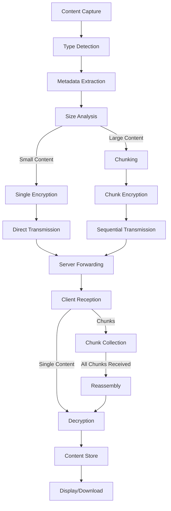

# Content Handling Approach

## Overview

ShareThings uses a unified approach to handle different types of content (text, images, files) with a consistent processing pipeline. This document outlines the content handling strategy, from capture to display.

## Content Types

The application supports the following content types:

1. **Text**: Plain text, formatted text, code snippets
2. **Image**: Images from clipboard or files
3. **File**: Any file type (including images that should be treated as files)
4. **Other**: Any other content type that might be supported in the future

## Content Processing Pipeline



### 1. Content Capture

Content can be captured from multiple sources:

- **Clipboard**: Text and images from the clipboard
- **Drag and Drop**: Files and content dragged into the application
- **File Selection**: Files selected through a file picker
- **Text Input**: Text entered directly into the application

```typescript
// Content capture service
class ContentCaptureService {
  // Capture from clipboard
  async captureFromClipboard(): Promise<CapturedContent> {
    const items = await navigator.clipboard.read();
    return this.processClipboardItems(items);
  }
  
  // Capture from drop event
  captureFromDrop(event: React.DragEvent): Promise<CapturedContent> {
    const items = event.dataTransfer.items;
    return this.processDataTransferItems(items);
  }
  
  // Capture from file input
  captureFromFileInput(files: FileList): Promise<CapturedContent> {
    return this.processFiles(files);
  }
  
  // Capture text input
  captureText(text: string): CapturedContent {
    return {
      type: 'text',
      data: text,
      metadata: {
        mimeType: 'text/plain',
        size: text.length
      }
    };
  }
}
```

### 2. Type Detection

Content type is detected based on:

- MIME type
- File extension
- Content analysis

```typescript
// Content type detection
function detectContentType(data: any, mimeType?: string): ContentType {
  if (typeof data === 'string') {
    // Check if it's a base64 image
    if (data.startsWith('data:image/')) {
      return ContentType.IMAGE;
    }
    return ContentType.TEXT;
  }
  
  if (data instanceof Blob || data instanceof File) {
    if (mimeType?.startsWith('image/') || data.type?.startsWith('image/')) {
      return ContentType.IMAGE;
    }
    return ContentType.FILE;
  }
  
  return ContentType.OTHER;
}
```

### 3. Metadata Extraction

Metadata is extracted based on content type:

```typescript
// Metadata extraction
async function extractMetadata(data: any, contentType: ContentType): Promise<ContentMetadata> {
  const baseMetadata: ContentMetadata = {
    mimeType: '',
    size: 0
  };
  
  switch (contentType) {
    case ContentType.TEXT:
      return {
        ...baseMetadata,
        mimeType: 'text/plain',
        size: typeof data === 'string' ? data.length : 0,
        textInfo: {
          encoding: 'utf-8',
          lineCount: typeof data === 'string' ? data.split('\n').length : 0
        }
      };
      
    case ContentType.IMAGE:
      // For images, extract dimensions
      let width = 0;
      let height = 0;
      
      if (data instanceof Blob || data instanceof File) {
        const img = await createImageFromBlob(data);
        width = img.width;
        height = img.height;
      }
      
      return {
        ...baseMetadata,
        mimeType: data.type || 'image/png',
        size: data.size || 0,
        fileName: data.name,
        imageInfo: {
          width,
          height,
          format: data.type?.split('/')[1] || 'png'
        }
      };
      
    case ContentType.FILE:
      return {
        ...baseMetadata,
        fileName: data.name,
        mimeType: data.type || 'application/octet-stream',
        size: data.size || 0,
        fileInfo: {
          extension: data.name?.split('.').pop() || ''
        }
      };
      
    default:
      return baseMetadata;
  }
}
```

### 4. Size Analysis and Chunking

Content is analyzed to determine if it needs to be chunked:

```typescript
// Size analysis and chunking
function analyzeAndChunk(data: Blob | string, metadata: ContentMetadata): ChunkingResult {
  const MAX_CHUNK_SIZE = 64 * 1024; // 64KB default chunk size
  const size = typeof data === 'string' ? data.length : data.size;
  
  // Determine if chunking is needed
  if (size <= MAX_CHUNK_SIZE) {
    return {
      needsChunking: false,
      chunks: [],
      originalData: data
    };
  }
  
  // Determine optimal chunk size based on content size
  let chunkSize = MAX_CHUNK_SIZE;
  if (size > 10 * 1024 * 1024) { // > 10MB
    chunkSize = 256 * 1024; // 256KB chunks for large files
  } else if (size > 1 * 1024 * 1024) { // > 1MB
    chunkSize = 128 * 1024; // 128KB chunks for medium files
  }
  
  // Create chunks
  const chunks = [];
  let offset = 0;
  let chunkIndex = 0;
  
  while (offset < size) {
    let chunkData;
    
    if (typeof data === 'string') {
      chunkData = data.substring(offset, offset + chunkSize);
    } else {
      chunkData = data.slice(offset, offset + chunkSize);
    }
    
    chunks.push({
      index: chunkIndex,
      data: chunkData
    });
    
    offset += chunkSize;
    chunkIndex++;
  }
  
  return {
    needsChunking: true,
    chunks,
    totalChunks: chunks.length
  };
}
```

### 5. Encryption

Content is encrypted using Web Crypto API in Web Workers:

```typescript
// Encryption in Web Worker
self.addEventListener('message', async (e) => {
  const { action, data, key, iv } = e.data;
  
  if (action === 'encrypt') {
    try {
      const encryptedData = await encrypt(data, key, iv);
      self.postMessage({ success: true, encryptedData, iv });
    } catch (error) {
      self.postMessage({ success: false, error: error.message });
    }
  } else if (action === 'decrypt') {
    try {
      const decryptedData = await decrypt(data, key, iv);
      self.postMessage({ success: true, decryptedData });
    } catch (error) {
      self.postMessage({ success: false, error: error.message });
    }
  }
});

async function encrypt(data, key, iv) {
  // Convert data to ArrayBuffer if it's a string
  const dataBuffer = typeof data === 'string' 
    ? new TextEncoder().encode(data) 
    : await data.arrayBuffer();
  
  // Encrypt the data
  const encryptedBuffer = await crypto.subtle.encrypt(
    {
      name: 'AES-GCM',
      iv
    },
    key,
    dataBuffer
  );
  
  return encryptedBuffer;
}
```

### 6. Transmission

Content is transmitted via Socket.IO:

```typescript
// Content transmission
async function transmitContent(content: SharedContent, data?: ArrayBuffer | string): Promise<void> {
  if (!content.isChunked) {
    // Send as single message
    socket.emit('content', {
      sessionId,
      content,
      data: typeof data === 'string' ? data : arrayBufferToBase64(data)
    });
    return;
  }
  
  // Send content metadata first
  socket.emit('content', {
    sessionId,
    content
  });
  
  // Then send chunks
  for (const chunk of chunks) {
    socket.emit('chunk', {
      sessionId,
      chunk
    });
    
    // Wait for acknowledgment or add delay between chunks
    await new Promise(resolve => setTimeout(resolve, 50));
  }
}
```

### 7. Reception and Reassembly

Receiving clients collect chunks and reassemble content:

```typescript
// Content reception
socket.on('content', (message) => {
  const { content, data } = message;
  
  // Add to content store
  contentStore.addContent(content, data);
});

socket.on('chunk', (message) => {
  const { chunk } = message;
  
  // Add chunk to content store
  contentStore.addChunk(chunk).then(isComplete => {
    if (isComplete) {
      // Content is now complete
      notifyContentComplete(chunk.contentId);
    }
  });
});
```

### 8. Display

Content is displayed based on its type:

```tsx
// Content display component
const ContentDisplay: React.FC<{ contentId: string }> = ({ contentId }) => {
  const content = useContent(contentId);
  
  if (!content) {
    return <ContentPlaceholder />;
  }
  
  switch (content.metadata.contentType) {
    case ContentType.TEXT:
      return <TextDisplay content={content} />;
      
    case ContentType.IMAGE:
      return <ImageDisplay content={content} />;
      
    case ContentType.FILE:
      return <FileDisplay content={content} />;
      
    default:
      return <GenericDisplay content={content} />;
  }
};
```

## Type-Specific Handling

### Text Content

- Syntax highlighting for code
- Formatting options
- Copy to clipboard functionality

### Image Content

- Responsive sizing
- Zoom functionality
- Download option
- Copy to clipboard functionality

### File Content

- File icon based on type
- File size and name display
- Download button
- Preview for supported file types

## Content Store

The ContentStore manages all shared content:

```typescript
class ContentStore {
  private contentItems: Map<string, ContentEntry> = new Map();
  private chunkStores: Map<string, ChunkStore> = new Map();
  
  // Add new content
  async addContent(content: SharedContent, data?: Blob|string): Promise<void> {
    const entry: ContentEntry = {
      metadata: content,
      data: data,
      lastAccessed: new Date(),
      isComplete: !content.isChunked || (data !== undefined)
    };
    
    this.contentItems.set(content.contentId, entry);
    
    // If chunked but no data provided, create chunk store
    if (content.isChunked && !data) {
      this.chunkStores.set(content.contentId, new ChunkStore(content.totalChunks || 0));
    }
    
    // Notify listeners
    this.notifyContentAdded(content.contentId);
  }
  
  // Add a chunk
  async addChunk(chunk: ContentChunk): Promise<boolean> {
    const chunkStore = this.chunkStores.get(chunk.contentId);
    if (!chunkStore) {
      console.error(`No chunk store found for content ${chunk.contentId}`);
      return false;
    }
    
    chunkStore.addChunk(chunk);
    
    // Check if we have all chunks
    if (chunkStore.hasAllChunks()) {
      // Assemble the content
      await this.assembleContent(chunk.contentId);
      return true;
    }
    
    // Notify progress
    this.notifyChunkProgress(chunk.contentId, chunkStore.receivedChunks, chunkStore.totalChunks);
    return false;
  }
  
  // Other methods...
}
```

## Memory Management

To prevent memory issues with large content:

1. **Lazy Loading**: Only decrypt and process content when needed
2. **Content Eviction**: Remove old content when storage limits are reached
3. **Chunk Cleanup**: Remove chunks after reassembly
4. **Session Cleanup**: Clear content when leaving a session

## Progressive Enhancement

The application uses progressive enhancement to handle different browser capabilities:

1. Check for Web Crypto API support
2. Check for Clipboard API support
3. Check for Web Workers support
4. Provide fallbacks where possible
5. Notify users of unsupported features