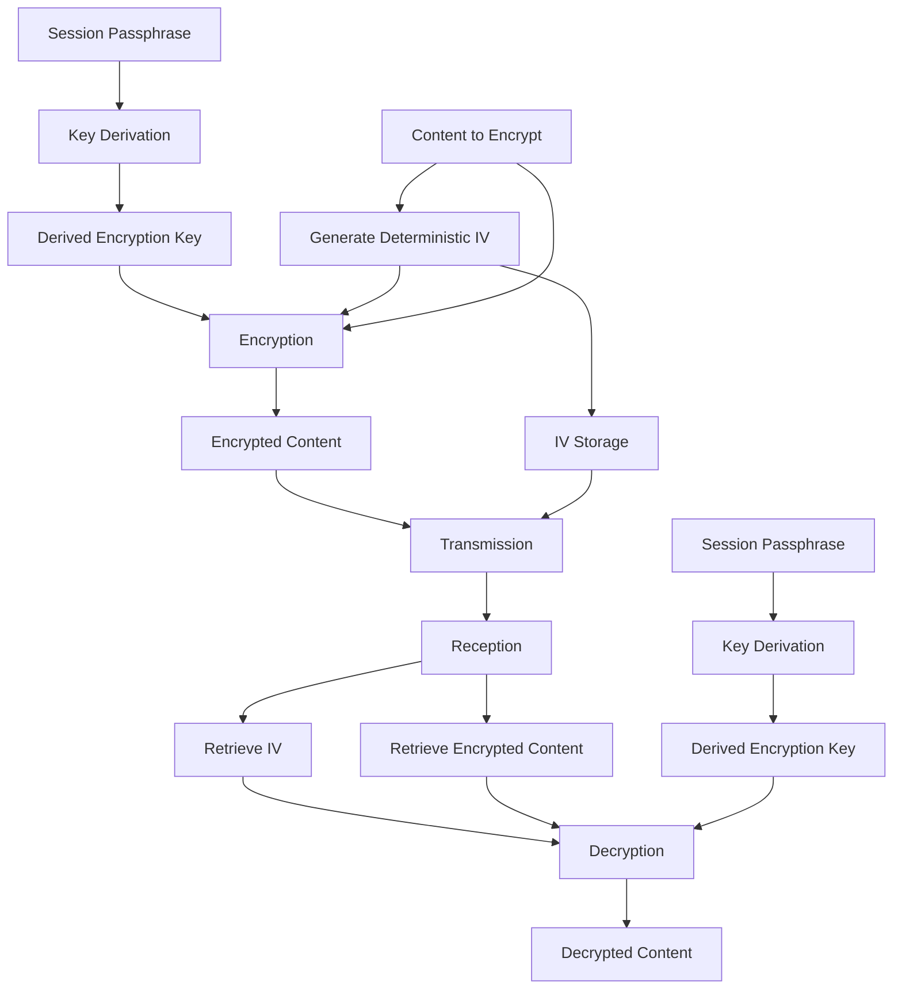

# Encryption Implementation

## Overview

ShareThings uses end-to-end encryption to ensure that all shared content is secure and private. The encryption is implemented entirely on the client side, ensuring that the server never has access to unencrypted content or encryption keys.

This document outlines the encryption approach, key derivation, and implementation details based on the current implementation.

## Encryption Flow



## Implementation Approach

The current implementation uses CryptoJS for encryption operations, which provides compatibility with non-HTTPS environments. This is different from the Web Crypto API approach that might be used in other contexts.

```typescript
// Import CryptoJS
import * as CryptoJS from 'crypto-js';

// Define interface for our crypto key
interface CryptoKey {
  key: CryptoJS.lib.WordArray;
  algorithm: string;
  usages: string[];
  type: string;
  extractable: boolean;
}
```

## Key Derivation

The encryption key is derived from the session passphrase using PBKDF2 (Password-Based Key Derivation Function 2):

```typescript
/**
 * Derives an encryption key from a passphrase
 * @param passphrase The passphrase to derive the key from
 * @returns The derived key
 */
export async function deriveKeyFromPassphrase(passphrase: string): Promise<CryptoKey> {
  try {
    console.log('Deriving key from passphrase using CryptoJS');
    
    // Use a fixed salt for deterministic key derivation
    const salt = CryptoJS.enc.Utf8.parse('ShareThings-Salt-2025');
    
    // Derive the key using PBKDF2
    const key = CryptoJS.PBKDF2(passphrase, salt, {
      keySize: 256/32, // 256 bits
      iterations: 100000,
      hasher: CryptoJS.algo.SHA256
    });
    
    // Return a crypto key object
    return {
      key: key,
      algorithm: 'AES',
      usages: ['encrypt', 'decrypt'],
      type: 'secret',
      extractable: true
    };
  } catch (error) {
    console.error('Error deriving key from passphrase:', error);
    throw new Error(`Failed to derive key: ${error instanceof Error ? error.message : 'Unknown error'}`);
  }
}
```

Key features of the key derivation:
- Uses PBKDF2 with SHA-256
- 100,000 iterations for security
- 256-bit AES key
- Fixed salt for deterministic key derivation

## Deterministic IV Generation

Unlike the random IV approach often used in encryption, the current implementation uses a deterministic IV generation approach to ensure that the same content encrypted with the same passphrase produces the same ciphertext:

```typescript
/**
 * Generates a deterministic IV from the passphrase and data
 * @param passphrase The passphrase
 * @param data The data to generate the IV from
 * @returns The deterministic IV
 */
async function generateDeterministicIV(passphrase: string, data: ArrayBuffer | Uint8Array): Promise<Uint8Array> {
  try {
    console.log('Generating deterministic IV using CryptoJS');
    
    // Convert data to array
    const dataArray = new Uint8Array(data instanceof ArrayBuffer ? data : data.buffer);
    
    // Convert to WordArray for CryptoJS
    const dataWords = [];
    for (let i = 0; i < dataArray.length; i += 4) {
      dataWords.push(
        ((dataArray[i] || 0) << 24) |
        ((dataArray[i + 1] || 0) << 16) |
        ((dataArray[i + 2] || 0) << 8) |
        (dataArray[i + 3] || 0)
      );
    }
    const dataWordArray = CryptoJS.lib.WordArray.create(dataWords, dataArray.length);
    
    // Combine passphrase and data
    const passphraseWordArray = CryptoJS.enc.Utf8.parse(passphrase);
    const combinedWordArray = CryptoJS.lib.WordArray.create()
      .concat(passphraseWordArray)
      .concat(dataWordArray);
    
    // Hash the combined data
    const hash = CryptoJS.SHA256(combinedWordArray);
    
    // Convert to Uint8Array and use first 12 bytes as IV
    const hashWords = hash.words;
    const hashBytes = new Uint8Array(16);
    for (let i = 0; i < 4; i++) {
      const word = hashWords[i];
      hashBytes[i * 4] = (word >>> 24) & 0xff;
      hashBytes[i * 4 + 1] = (word >>> 16) & 0xff;
      hashBytes[i * 4 + 2] = (word >>> 8) & 0xff;
      hashBytes[i * 4 + 3] = word & 0xff;
    }
    
    return hashBytes.slice(0, 12);
  } catch (error) {
    console.error('Error generating deterministic IV:', error);
    throw new Error(`Failed to generate IV: ${error instanceof Error ? error.message : 'Unknown error'}`);
  }
}
```

## Encryption Algorithm

The application uses AES for encryption with PKCS7 padding:

```typescript
/**
 * Encrypts data with a key
 * @param key The encryption key
 * @param data The data to encrypt
 * @param passphrase The passphrase (used for IV generation)
 * @returns The encrypted data and IV
 */
export async function encryptData(
  key: CryptoKey,
  data: ArrayBuffer | Uint8Array,
  passphrase: string
): Promise<{ encryptedData: ArrayBuffer; iv: Uint8Array }> {
  try {
    console.log('Encrypting data using CryptoJS');
    
    // Generate IV
    const iv = await generateDeterministicIV(passphrase, data);
    
    // Convert data to WordArray
    const dataArray = new Uint8Array(data instanceof ArrayBuffer ? data : data.buffer);
    const dataWords = [];
    for (let i = 0; i < dataArray.length; i += 4) {
      dataWords.push(
        ((dataArray[i] || 0) << 24) |
        ((dataArray[i + 1] || 0) << 16) |
        ((dataArray[i + 2] || 0) << 8) |
        (dataArray[i + 3] || 0)
      );
    }
    const dataWordArray = CryptoJS.lib.WordArray.create(dataWords, dataArray.length);
    
    // Convert IV to WordArray
    const ivWords = [];
    for (let i = 0; i < iv.length; i += 4) {
      ivWords.push(
        ((iv[i] || 0) << 24) |
        ((iv[i + 1] || 0) << 16) |
        ((iv[i + 2] || 0) << 8) |
        (iv[i + 3] || 0)
      );
    }
    const ivWordArray = CryptoJS.lib.WordArray.create(ivWords, iv.length);
    
    // Encrypt data
    const encrypted = CryptoJS.AES.encrypt(dataWordArray, key.key, {
      iv: ivWordArray,
      padding: CryptoJS.pad.Pkcs7
    });
    
    // Convert to ArrayBuffer
    const ciphertext = encrypted.ciphertext;
    const encryptedWords = ciphertext.words;
    const encryptedBytes = new Uint8Array(ciphertext.sigBytes);
    
    for (let i = 0; i < encryptedBytes.length; i += 4) {
      const word = encryptedWords[i / 4];
      encryptedBytes[i] = (word >>> 24) & 0xff;
      if (i + 1 < encryptedBytes.length) encryptedBytes[i + 1] = (word >>> 16) & 0xff;
      if (i + 2 < encryptedBytes.length) encryptedBytes[i + 2] = (word >>> 8) & 0xff;
      if (i + 3 < encryptedBytes.length) encryptedBytes[i + 3] = word & 0xff;
    }
    
    return { encryptedData: encryptedBytes.buffer, iv };
  } catch (error) {
    console.error('Error encrypting data:', error);
    throw new Error(`Encryption failed: ${error instanceof Error ? error.message : 'Unknown error'}`);
  }
}
```

Key features of the encryption:
- AES encryption with PKCS7 padding
- Deterministic IV generation based on passphrase and data
- Supports binary data (ArrayBuffer/Uint8Array)

## Decryption

The decryption process uses the same key and the IV that was used for encryption:

```typescript
/**
 * Decrypts data with a key
 * @param key The decryption key
 * @param encryptedData The encrypted data
 * @param iv The initialization vector
 * @returns The decrypted data
 */
export async function decryptData(
  key: CryptoKey,
  encryptedData: ArrayBuffer | Uint8Array,
  iv: Uint8Array
): Promise<ArrayBuffer> {
  try {
    console.log('Decrypting data using CryptoJS');
    
    // Convert encryptedData to WordArray
    const encryptedArray = new Uint8Array(encryptedData instanceof ArrayBuffer ? encryptedData : encryptedData.buffer);
    const encryptedWords = [];
    for (let i = 0; i < encryptedArray.length; i += 4) {
      encryptedWords.push(
        ((encryptedArray[i] || 0) << 24) |
        ((encryptedArray[i + 1] || 0) << 16) |
        ((encryptedArray[i + 2] || 0) << 8) |
        (encryptedArray[i + 3] || 0)
      );
    }
    
    // Create WordArray from encryptedData
    const encryptedWordArray = CryptoJS.lib.WordArray.create(encryptedWords, encryptedArray.length);
    
    // Convert IV to WordArray
    const ivWords = [];
    for (let i = 0; i < iv.length; i += 4) {
      ivWords.push(
        ((iv[i] || 0) << 24) |
        ((iv[i + 1] || 0) << 16) |
        ((iv[i + 2] || 0) << 8) |
        (iv[i + 3] || 0)
      );
    }
    const ivWordArray = CryptoJS.lib.WordArray.create(ivWords, iv.length);
    
    // Create a CipherParams object with just the ciphertext
    const cipherParams = CryptoJS.lib.CipherParams.create({
      ciphertext: encryptedWordArray
    });
    
    // Decrypt data
    const decrypted = CryptoJS.AES.decrypt(cipherParams, key.key, {
      iv: ivWordArray,
      padding: CryptoJS.pad.Pkcs7
    });
    
    // Convert to ArrayBuffer
    const decryptedWords = decrypted.words;
    const decryptedBytes = new Uint8Array(decrypted.sigBytes);
    
    for (let i = 0; i < decryptedBytes.length; i += 4) {
      const word = decryptedWords[i / 4];
      decryptedBytes[i] = (word >>> 24) & 0xff;
      if (i + 1 < decryptedBytes.length) decryptedBytes[i + 1] = (word >>> 16) & 0xff;
      if (i + 2 < decryptedBytes.length) decryptedBytes[i + 2] = (word >>> 8) & 0xff;
      if (i + 3 < decryptedBytes.length) decryptedBytes[i + 3] = word & 0xff;
    }
    
    // If decryption succeeded but returned empty data, that's suspicious
    if (decryptedBytes.length === 0) {
      throw new Error('Decryption failed: Empty result');
    }
    
    return decryptedBytes.buffer;
  } catch (error) {
    console.error('Error decrypting data:', error);
    throw new Error(`Decryption failed: ${error instanceof Error ? error.message : 'Unknown error'}`);
  }
}
```

## Passphrase Fingerprinting

The application implements passphrase fingerprinting for session authentication:

```typescript
/**
 * Generates a deterministic fingerprint from a passphrase
 * @param passphrase The passphrase to generate the fingerprint from
 * @returns The fingerprint
 */
export async function generateFingerprint(passphrase: string): Promise<any> {
  try {
    console.log('Generating fingerprint using CryptoJS');
    
    // Use a fixed IV for fingerprint generation
    const fixedIv = new Uint8Array([1, 2, 3, 4, 5, 6, 7, 8, 9, 10, 11, 12]);
    
    // Create a deterministic hash of the passphrase
    const passphraseWordArray = CryptoJS.enc.Utf8.parse(passphrase);
    const hash = CryptoJS.SHA256(passphraseWordArray);
    
    // Convert hash to bytes
    const hashWords = hash.words;
    const hashBytes = new Uint8Array(hash.sigBytes);
    for (let i = 0; i < hashBytes.length; i += 4) {
      const word = hashWords[i / 4];
      hashBytes[i] = (word >>> 24) & 0xff;
      if (i + 1 < hashBytes.length) hashBytes[i + 1] = (word >>> 16) & 0xff;
      if (i + 2 < hashBytes.length) hashBytes[i + 2] = (word >>> 8) & 0xff;
      if (i + 3 < hashBytes.length) hashBytes[i + 3] = word & 0xff;
    }
    
    // Use the first 16 bytes of the hash as the "encrypted data"
    const dataBytes = hashBytes.slice(0, 16);
    
    return {
      iv: Array.from(fixedIv),
      data: Array.from(dataBytes)
    };
  } catch (error) {
    console.error('Error generating fingerprint:', error);
    throw new Error(`Failed to generate fingerprint: ${error instanceof Error ? error.message : 'Unknown error'}`);
  }
}
```

This fingerprint is used for session authentication without exposing the actual passphrase to the server.

## High-Level Encryption Functions

The application provides high-level functions for encrypting and decrypting different types of data:

### Text Encryption/Decryption

```typescript
/**
 * Encrypts text with a passphrase
 * @param passphrase The encryption passphrase
 * @param text The text to encrypt
 * @returns The encrypted text and IV as base64 strings
 */
export async function encryptText(
  passphrase: string,
  text: string
): Promise<{ encryptedText: string; iv: string }> {
  // Implementation details...
}

/**
 * Decrypts text with a passphrase
 * @param passphrase The decryption passphrase
 * @param encryptedText The encrypted text as a base64 string
 * @param ivBase64 The IV as a base64 string
 * @returns The decrypted text
 */
export async function decryptText(
  passphrase: string,
  encryptedText: string,
  ivBase64: string
): Promise<string> {
  // Implementation details...
}
```

### Blob Encryption/Decryption

```typescript
/**
 * Encrypts a blob with a passphrase
 * @param passphrase The encryption passphrase
 * @param blob The blob to encrypt
 * @returns The encrypted blob and IV
 */
export async function encryptBlob(
  passphrase: string,
  blob: Blob
): Promise<{ encryptedBlob: Blob; iv: Uint8Array }> {
  // Implementation details...
}

/**
 * Decrypts a blob with a passphrase
 * @param passphrase The decryption passphrase
 * @param encryptedBlob The encrypted blob
 * @param iv The initialization vector
 * @param mimeType The original MIME type
 * @returns The decrypted blob
 */
export async function decryptBlob(
  passphrase: string,
  encryptedBlob: Blob,
  iv: Uint8Array,
  mimeType: string
): Promise<Blob> {
  // Implementation details...
}
```

## Security Considerations

1. **Passphrase Strength**:
   - Encourage users to use strong passphrases
   - Provide feedback on passphrase strength
   - Consider implementing minimum passphrase requirements

2. **Key Management**:
   - Keys are derived client-side and never transmitted
   - Keys are stored in memory only, not persisted
   - Keys are cleared when leaving a session

3. **IV Management**:
   - Deterministic IV generation based on passphrase and data
   - IV is transmitted alongside encrypted data
   - Fixed IV for fingerprint generation

4. **Secure Transmission**:
   - All communication is over HTTPS/WSS
   - Encrypted data is transmitted as binary when possible
   - Metadata is kept to a minimum

5. **Browser Support**:
   - CryptoJS provides compatibility with a wide range of browsers
   - No Web Workers are used in the current implementation
   - Error handling for encryption/decryption failures

## Limitations

1. **Browser Compatibility**:
   - CryptoJS is supported in all modern browsers
   - Performance may vary across browsers

2. **Performance**:
   - CryptoJS is not as performant as the Web Crypto API
   - Large files may cause performance issues
   - No Web Workers are used for non-blocking operations

3. **Key Recovery**:
   - No key recovery mechanism
   - Lost passphrases cannot be recovered
   - Consider implementing session persistence options

## Testing

The encryption implementation should be thoroughly tested:

1. **Unit Tests**:
   - Test key derivation
   - Test encryption/decryption
   - Test fingerprint generation

2. **Integration Tests**:
   - Test end-to-end encryption flow
   - Test with different content types
   - Test with different content sizes

3. **Performance Tests**:
   - Test with large files
   - Test with multiple concurrent operations

4. **Security Tests**:
   - Verify encryption strength
   - Test against known vulnerabilities
   - Verify key isolation