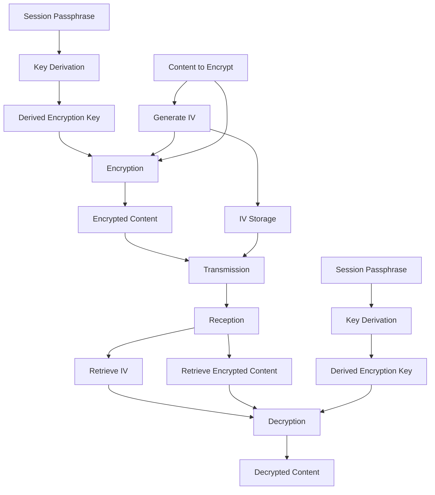

# Encryption Implementation

## Overview

ShareThings uses end-to-end encryption to ensure that all shared content is secure and private. The encryption is implemented entirely on the client side, ensuring that the server never has access to unencrypted content or encryption keys.

This document outlines the encryption approach, key derivation, and implementation details.

## Encryption Flow



## Key Derivation

The encryption key is derived from the session passphrase using PBKDF2 (Password-Based Key Derivation Function 2):

```typescript
/**
 * Derives an encryption key from a passphrase
 * @param passphrase The session passphrase
 * @param salt Salt for key derivation (optional, generated if not provided)
 * @returns The derived key and salt
 */
async function deriveKey(passphrase: string, salt?: Uint8Array): Promise<{ key: CryptoKey, salt: Uint8Array }> {
  // Generate salt if not provided
  if (!salt) {
    salt = crypto.getRandomValues(new Uint8Array(16));
  }
  
  // Convert passphrase to buffer
  const passphraseBuffer = new TextEncoder().encode(passphrase);
  
  // Import passphrase as raw key
  const importedKey = await crypto.subtle.importKey(
    'raw',
    passphraseBuffer,
    { name: 'PBKDF2' },
    false,
    ['deriveBits', 'deriveKey']
  );
  
  // Derive key using PBKDF2
  const derivedKey = await crypto.subtle.deriveKey(
    {
      name: 'PBKDF2',
      salt,
      iterations: 100000,
      hash: 'SHA-256'
    },
    importedKey,
    { name: 'AES-GCM', length: 256 },
    false,
    ['encrypt', 'decrypt']
  );
  
  return { key: derivedKey, salt };
}
```

Key features of the key derivation:
- Uses PBKDF2 with SHA-256
- 100,000 iterations for security
- 256-bit AES key
- Unique salt for each session

## Encryption Algorithm

The application uses AES-GCM (Advanced Encryption Standard with Galois/Counter Mode) for encryption:

```typescript
/**
 * Encrypts data using AES-GCM
 * @param data Data to encrypt (string or ArrayBuffer)
 * @param key Encryption key
 * @param iv Initialization vector (optional, generated if not provided)
 * @returns Encrypted data and IV
 */
async function encrypt(data: string | ArrayBuffer, key: CryptoKey, iv?: Uint8Array): Promise<{ encryptedData: ArrayBuffer, iv: Uint8Array }> {
  // Generate IV if not provided
  if (!iv) {
    iv = crypto.getRandomValues(new Uint8Array(12));
  }
  
  // Convert data to ArrayBuffer if it's a string
  const dataBuffer = typeof data === 'string' 
    ? new TextEncoder().encode(data) 
    : data;
  
  // Encrypt the data
  const encryptedData = await crypto.subtle.encrypt(
    {
      name: 'AES-GCM',
      iv
    },
    key,
    dataBuffer
  );
  
  return { encryptedData, iv };
}
```

Key features of the encryption:
- AES-GCM for authenticated encryption
- 12-byte random IV for each encryption operation
- Supports both string and binary data

## Decryption

The decryption process uses the same key and the IV that was used for encryption:

```typescript
/**
 * Decrypts data using AES-GCM
 * @param encryptedData Encrypted data
 * @param key Decryption key
 * @param iv Initialization vector used for encryption
 * @param outputType Type of output to return
 * @returns Decrypted data
 */
async function decrypt(
  encryptedData: ArrayBuffer, 
  key: CryptoKey, 
  iv: Uint8Array,
  outputType: 'string' | 'arraybuffer' = 'arraybuffer'
): Promise<string | ArrayBuffer> {
  try {
    // Decrypt the data
    const decryptedBuffer = await crypto.subtle.decrypt(
      {
        name: 'AES-GCM',
        iv
      },
      key,
      encryptedData
    );
    
    // Return as string or ArrayBuffer based on outputType
    if (outputType === 'string') {
      return new TextDecoder().decode(decryptedBuffer);
    }
    
    return decryptedBuffer;
  } catch (error) {
    console.error('Decryption failed:', error);
    throw new Error('Failed to decrypt data. The passphrase may be incorrect.');
  }
}
```

## Web Workers Implementation

To prevent blocking the main thread during encryption/decryption operations, especially for large content, the application uses Web Workers:

```typescript
// Encryption worker
class EncryptionWorker {
  private worker: Worker;
  private taskQueue: Map<string, { resolve: Function, reject: Function }> = new Map();
  private nextTaskId: number = 1;
  
  constructor() {
    // Create worker
    this.worker = new Worker(new URL('./encryption-worker.ts', import.meta.url));
    
    // Set up message handler
    this.worker.onmessage = (e) => {
      const { taskId, result, error } = e.data;
      const task = this.taskQueue.get(taskId);
      
      if (task) {
        if (error) {
          task.reject(new Error(error));
        } else {
          task.resolve(result);
        }
        
        this.taskQueue.delete(taskId);
      }
    };
  }
  
  /**
   * Encrypts data in a worker
   */
  async encrypt(data: string | ArrayBuffer, key: CryptoKey, iv?: Uint8Array): Promise<{ encryptedData: ArrayBuffer, iv: Uint8Array }> {
    const taskId = `task_${this.nextTaskId++}`;
    
    // Create exportable key
    const exportedKey = await crypto.subtle.exportKey('raw', key);
    
    return new Promise((resolve, reject) => {
      this.taskQueue.set(taskId, { resolve, reject });
      
      this.worker.postMessage({
        taskId,
        action: 'encrypt',
        data,
        key: exportedKey,
        iv
      }, [
        ...(data instanceof ArrayBuffer ? [data] : []),
        exportedKey
      ]);
    });
  }
  
  /**
   * Decrypts data in a worker
   */
  async decrypt(
    encryptedData: ArrayBuffer, 
    key: CryptoKey, 
    iv: Uint8Array,
    outputType: 'string' | 'arraybuffer' = 'arraybuffer'
  ): Promise<string | ArrayBuffer> {
    const taskId = `task_${this.nextTaskId++}`;
    
    // Create exportable key
    const exportedKey = await crypto.subtle.exportKey('raw', key);
    
    return new Promise((resolve, reject) => {
      this.taskQueue.set(taskId, { resolve, reject });
      
      this.worker.postMessage({
        taskId,
        action: 'decrypt',
        data: encryptedData,
        key: exportedKey,
        iv,
        outputType
      }, [
        encryptedData,
        exportedKey
      ]);
    });
  }
  
  /**
   * Terminates the worker
   */
  terminate() {
    this.worker.terminate();
    this.taskQueue.clear();
  }
}
```

The worker script (`encryption-worker.ts`):

```typescript
// Import necessary crypto functions
import { importKey, encrypt, decrypt } from './crypto-utils';

// Handle messages from main thread
self.onmessage = async (e) => {
  const { taskId, action, data, key, iv, outputType } = e.data;
  
  try {
    // Import the key
    const importedKey = await importKey(key);
    
    if (action === 'encrypt') {
      // Encrypt data
      const { encryptedData, iv: generatedIv } = await encrypt(data, importedKey, iv);
      
      // Send result back to main thread
      self.postMessage({
        taskId,
        result: {
          encryptedData,
          iv: generatedIv
        }
      }, [encryptedData]);
    } else if (action === 'decrypt') {
      // Decrypt data
      const decryptedData = await decrypt(data, importedKey, iv, outputType);
      
      // Send result back to main thread
      if (decryptedData instanceof ArrayBuffer) {
        self.postMessage({
          taskId,
          result: decryptedData
        }, [decryptedData]);
      } else {
        self.postMessage({
          taskId,
          result: decryptedData
        });
      }
    }
  } catch (error) {
    // Send error back to main thread
    self.postMessage({
      taskId,
      error: error.message
    });
  }
};
```

## Worker Pool

For efficient processing of multiple encryption/decryption tasks, especially when dealing with chunked content, the application uses a worker pool:

```typescript
class EncryptionWorkerPool {
  private workers: EncryptionWorker[] = [];
  private availableWorkers: EncryptionWorker[] = [];
  private taskQueue: Array<{
    task: () => Promise<any>,
    resolve: Function,
    reject: Function
  }> = [];
  
  constructor(size: number = navigator.hardwareConcurrency || 4) {
    // Create workers
    for (let i = 0; i < size; i++) {
      const worker = new EncryptionWorker();
      this.workers.push(worker);
      this.availableWorkers.push(worker);
    }
  }
  
  /**
   * Executes a task in the pool
   */
  async execute<T>(task: () => Promise<T>): Promise<T> {
    // If there's an available worker, use it
    if (this.availableWorkers.length > 0) {
      const worker = this.availableWorkers.pop()!;
      
      try {
        const result = await task();
        this.availableWorkers.push(worker);
        this.processQueue();
        return result;
      } catch (error) {
        this.availableWorkers.push(worker);
        this.processQueue();
        throw error;
      }
    }
    
    // Otherwise, queue the task
    return new Promise((resolve, reject) => {
      this.taskQueue.push({ task, resolve, reject });
    });
  }
  
  /**
   * Processes the task queue
   */
  private processQueue() {
    if (this.taskQueue.length > 0 && this.availableWorkers.length > 0) {
      const { task, resolve, reject } = this.taskQueue.shift()!;
      const worker = this.availableWorkers.pop()!;
      
      task().then(result => {
        resolve(result);
        this.availableWorkers.push(worker);
        this.processQueue();
      }).catch(error => {
        reject(error);
        this.availableWorkers.push(worker);
        this.processQueue();
      });
    }
  }
  
  /**
   * Terminates all workers
   */
  terminate() {
    for (const worker of this.workers) {
      worker.terminate();
    }
    
    this.workers = [];
    this.availableWorkers = [];
    this.taskQueue = [];
  }
}
```

## Encryption Service

The EncryptionService provides a high-level API for encryption operations:

```typescript
class EncryptionService {
  private key: CryptoKey | null = null;
  private salt: Uint8Array | null = null;
  private workerPool: EncryptionWorkerPool;
  
  constructor() {
    this.workerPool = new EncryptionWorkerPool();
  }
  
  /**
   * Initializes the encryption service with a passphrase
   */
  async initialize(passphrase: string, salt?: Uint8Array): Promise<void> {
    const result = await deriveKey(passphrase, salt);
    this.key = result.key;
    this.salt = result.salt;
  }
  
  /**
   * Encrypts data
   */
  async encrypt(data: string | ArrayBuffer): Promise<{ encryptedData: ArrayBuffer, iv: Uint8Array }> {
    if (!this.key) {
      throw new Error('Encryption service not initialized');
    }
    
    return this.workerPool.execute(() => {
      const worker = new EncryptionWorker();
      const result = worker.encrypt(data, this.key!);
      worker.terminate();
      return result;
    });
  }
  
  /**
   * Decrypts data
   */
  async decrypt(
    encryptedData: ArrayBuffer, 
    iv: Uint8Array,
    outputType: 'string' | 'arraybuffer' = 'arraybuffer'
  ): Promise<string | ArrayBuffer> {
    if (!this.key) {
      throw new Error('Encryption service not initialized');
    }
    
    return this.workerPool.execute(() => {
      const worker = new EncryptionWorker();
      const result = worker.decrypt(encryptedData, this.key!, iv, outputType);
      worker.terminate();
      return result;
    });
  }
  
  /**
   * Cleans up resources
   */
  cleanup() {
    this.key = null;
    this.salt = null;
    this.workerPool.terminate();
  }
}
```

## Security Considerations

1. **Passphrase Strength**:
   - Encourage users to use strong passphrases
   - Provide feedback on passphrase strength
   - Consider implementing minimum passphrase requirements

2. **Key Management**:
   - Keys are derived client-side and never transmitted
   - Keys are stored in memory only, not persisted
   - Keys are cleared when leaving a session

3. **IV Management**:
   - Unique IV for each encryption operation
   - IV is transmitted alongside encrypted data
   - IV is not reused

4. **Secure Transmission**:
   - All communication is over HTTPS/WSS
   - Encrypted data is transmitted as binary when possible
   - Metadata is kept to a minimum

5. **Browser Support**:
   - Check for Web Crypto API support
   - Provide fallbacks where possible
   - Notify users of unsupported browsers

## Limitations

1. **Browser Compatibility**:
   - Web Crypto API is supported in modern browsers
   - Older browsers may not support all features

2. **Performance**:
   - Large files may still cause performance issues
   - Web Workers help but have overhead
   - Progressive chunking mitigates some issues

3. **Key Recovery**:
   - No key recovery mechanism
   - Lost passphrases cannot be recovered
   - Consider implementing session persistence options

## Testing

The encryption implementation should be thoroughly tested:

1. **Unit Tests**:
   - Test key derivation
   - Test encryption/decryption
   - Test worker communication

2. **Integration Tests**:
   - Test end-to-end encryption flow
   - Test with different content types
   - Test with different content sizes

3. **Performance Tests**:
   - Test with large files
   - Test with multiple concurrent operations
   - Test worker pool efficiency

4. **Security Tests**:
   - Verify encryption strength
   - Test against known vulnerabilities
   - Verify key isolation