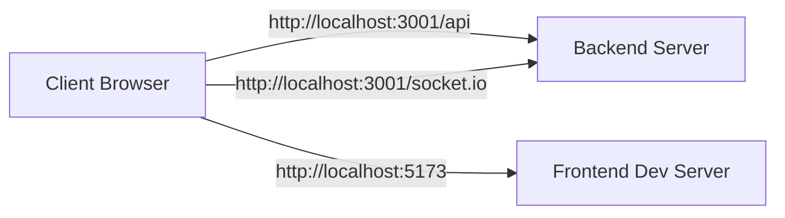
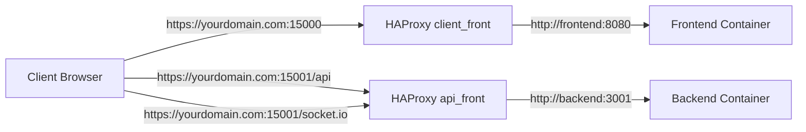
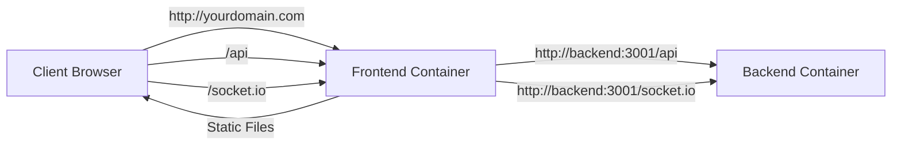

# Networking Configuration

## Overview

ShareThings supports multiple deployment configurations with different networking setups. This document details how the application's networking is configured in different environments, including development, production with HAProxy, and production with Docker and Nginx.

## Deployment Configurations

ShareThings can be deployed in several configurations:

1. **Development**: Direct connection to the backend server
2. **Production with HAProxy**: HAProxy routes traffic to frontend and backend containers
3. **Production with Docker and Nginx**: Nginx in the frontend container proxies API and WebSocket requests to the backend container

## Network Flow Diagrams

### Development Environment



In development:
- The frontend runs on a Vite development server (typically on port 5173)
- The backend runs directly on port 3001
- The client connects directly to both servers

### Production with HAProxy



In production with HAProxy:
- HAProxy has two frontends:
  - `client_front` on port 15000 for the client application
  - `api_front` on port 15001 for API and Socket.IO
- The client application is served by the frontend container through HAProxy's `client_front`
- API requests and Socket.IO connections go directly to the backend container through HAProxy's `api_front`

### Production with Docker and Nginx



In production with Docker and Nginx (no HAProxy):
- The frontend container serves the client application
- The frontend container's Nginx proxies API and Socket.IO requests to the backend container
- All traffic goes through the frontend container

## Client Configuration

The client determines the backend URL dynamically based on environment variables:

```typescript
// Dynamically determine the backend URL based on the current window location
const getBackendUrl = () => {
  // If an environment variable is set to a specific value (not 'auto'), use it
  if (import.meta.env.VITE_SOCKET_URL && import.meta.env.VITE_SOCKET_URL !== 'auto') {
    console.log(`[Socket] Using configured backend URL: ${import.meta.env.VITE_SOCKET_URL}`);
    return import.meta.env.VITE_SOCKET_URL;
  }
  
  // Otherwise, derive from the current URL
  const currentUrl = new URL(window.location.href);
  
  // Determine the appropriate port based on environment variables or fallback to default
  const port = import.meta.env.VITE_API_PORT || '3001';
  
  // Construct the backend URL
  const backendUrl = `${currentUrl.protocol}//${currentUrl.hostname}${port ? ':' + port : ''}`;
  console.log(`[Socket] Automatically determined backend URL: ${backendUrl}`);
  
  return backendUrl;
};
```

### Environment Variables

The client uses the following environment variables:

| Variable | Description | Example Values |
|----------|-------------|----------------|
| `VITE_API_URL` | Base URL for API requests | `http://localhost:3001`, `https://yourdomain.com`, `auto` |
| `VITE_SOCKET_URL` | URL for Socket.IO connections | `http://localhost:3001`, `https://yourdomain.com`, `auto` |
| `VITE_API_PORT` | Port for API and Socket.IO when auto-detecting | `3001` |

## HAProxy Configuration

HAProxy is configured with two frontends and two backends:

### Frontends

#### client_front (Port 15000)

```
frontend client_front
    bind *:15000
    
    # Forward client IP
    option forwardfor
    http-request set-header X-Forwarded-Proto http
    
    # Route all traffic to frontend container
    default_backend sharethings_front
```

#### api_front (Port 15001)

```
frontend api_front
    bind *:15001
    
    # Forward client IP
    option forwardfor
    http-request set-header X-Forwarded-Proto http
    
    # WebSocket detection for Socket.IO
    acl is_websocket hdr(Upgrade) -i WebSocket
    acl is_socketio path_beg /socket.io/
    
    # Route all traffic to backend container
    default_backend sharethings_back
```

### Backends

#### sharethings_front

```
backend sharethings_front
    balance roundrobin
    option httpchk GET /
    
    # Server definition - point to frontend container
    server frontend docker-host:8080 check
```

#### sharethings_back

```
backend sharethings_back
    balance roundrobin
    option httpchk GET /health
    
    # WebSocket handling
    option http-server-close
    http-reuse safe
    
    # Sticky sessions
    stick-table type ip size 200k expire 30m
    stick on src
    
    # Server definition - point to backend container
    server backend docker-host:3001 check
```

## Nginx Configuration

Nginx in the frontend container is configured to proxy API and Socket.IO requests to the backend:

### API Proxy

```nginx
# Proxy API requests to backend
location /api {
    proxy_pass http://backend:3001;
    proxy_http_version 1.1;
    proxy_set_header Upgrade $http_upgrade;
    proxy_set_header Connection 'upgrade';
    proxy_set_header Host $host;
    proxy_cache_bypass $http_upgrade;
    proxy_set_header X-Real-IP $remote_addr;
    proxy_set_header X-Forwarded-For $proxy_add_x_forwarded_for;
    proxy_set_header X-Forwarded-Proto $scheme;
}
```

### Socket.IO Proxy

```nginx
# Proxy Socket.IO requests to backend
location /socket.io {
    proxy_pass http://backend:3001;
    proxy_http_version 1.1;
    proxy_set_header Upgrade $http_upgrade;
    proxy_set_header Connection 'upgrade';
    proxy_set_header Host $host;
    proxy_cache_bypass $http_upgrade;
    proxy_set_header X-Real-IP $remote_addr;
    proxy_set_header X-Forwarded-For $proxy_add_x_forwarded_for;
    proxy_set_header X-Forwarded-Proto $scheme;
    
    # WebSocket specific settings
    proxy_read_timeout 86400;
    proxy_connect_timeout 60s;
    proxy_send_timeout 60s;
}
```

## Environment-Specific Configurations

### Development

In development:
- Client directly accesses backend on port 3001
- No HAProxy or Nginx involved
- Environment variables set to include port: `VITE_API_URL=http://localhost:3001`

### Production with HAProxy

In production with HAProxy:
- Client accesses frontend through HAProxy on port 15000
- Client accesses backend through HAProxy on port 15001
- Environment variables set to domain with specific ports:
  ```
  VITE_API_URL=https://yourdomain.com:15001
  VITE_SOCKET_URL=https://yourdomain.com:15001
  ```

### Production with Docker and Nginx (No HAProxy)

In production with Docker and Nginx (no HAProxy):
- Client accesses everything through the frontend container
- Nginx proxies API and Socket.IO requests to the backend
- Environment variables set to domain without port:
  ```
  VITE_API_URL=https://yourdomain.com
  VITE_SOCKET_URL=https://yourdomain.com
  ```

## Configuration Synchronization

To ensure all components work together correctly, the following must be synchronized:

1. **Client Environment Variables**: Set to the appropriate URL based on deployment configuration
2. **HAProxy Configuration**: Configure to route traffic to the correct containers
3. **Nginx Configuration**: Configure to proxy API and Socket.IO paths to backend
4. **Backend Port**: Set to the port the backend container is listening on (3001)

## Security Considerations

1. **SSL Termination**: In production, SSL termination should be handled by HAProxy or Nginx
2. **CORS Configuration**: CORS must be properly configured on the backend to allow requests from the frontend
3. **WebSocket Security**: WebSocket connections must be properly secured with authentication
4. **Proxy Headers**: Proxy headers must be properly set to preserve client information