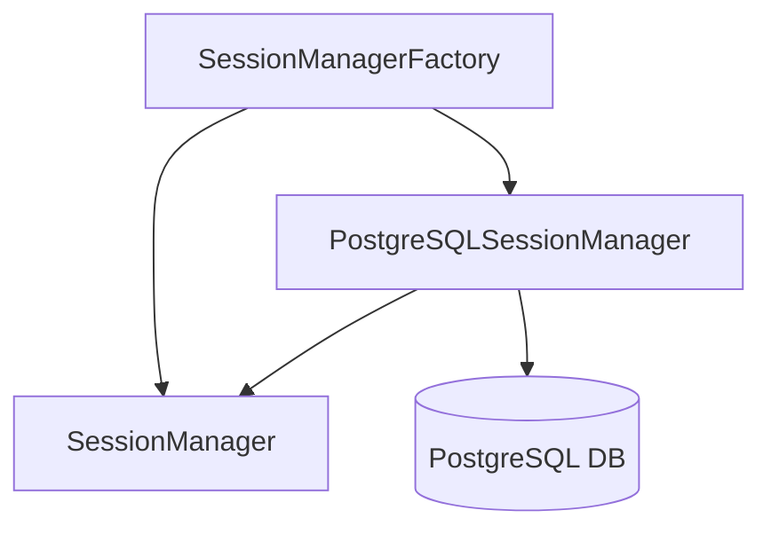

# PostgreSQL Session Management

## Overview

ShareThings now supports PostgreSQL as a backend for session management, providing persistent session storage across server restarts and enabling multi-server deployments. This document outlines the implementation details, configuration options, and usage instructions.

## Architecture

The session management system uses a pluggable architecture that supports multiple storage backends:



- **SessionManager**: Base class that provides in-memory session storage
- **PostgreSQLSessionManager**: Extension of SessionManager that uses PostgreSQL for persistence
- **SessionManagerFactory**: Factory class that creates the appropriate session manager based on configuration

## Database Schema

The PostgreSQL implementation uses the following database schema:

```sql
-- Schema version tracking
CREATE TABLE schema_version (
  id SERIAL PRIMARY KEY,
  version INTEGER NOT NULL,
  applied_at TIMESTAMP NOT NULL DEFAULT NOW()
);

-- Sessions table
CREATE TABLE sessions (
  session_id VARCHAR(255) PRIMARY KEY,
  created_at TIMESTAMP NOT NULL,
  last_activity TIMESTAMP NOT NULL,
  fingerprint_iv BYTEA NOT NULL,
  fingerprint_data BYTEA NOT NULL
);

-- Clients table
CREATE TABLE clients (
  client_id VARCHAR(255) PRIMARY KEY,
  session_id VARCHAR(255) NOT NULL,
  client_name VARCHAR(255) NOT NULL,
  created_at TIMESTAMP NOT NULL,
  last_activity TIMESTAMP NOT NULL,
  CONSTRAINT fk_session FOREIGN KEY(session_id) REFERENCES sessions(session_id) ON DELETE CASCADE
);

-- Session tokens table
CREATE TABLE session_tokens (
  client_id VARCHAR(255) PRIMARY KEY,
  token VARCHAR(255) NOT NULL,
  created_at TIMESTAMP NOT NULL,
  CONSTRAINT fk_client FOREIGN KEY(client_id) REFERENCES clients(client_id) ON DELETE CASCADE
);
```

## Implementation Details

### SessionManagerFactory

The `SessionManagerFactory` class creates the appropriate session manager based on the storage type:

```typescript
export class SessionManagerFactory {
  static createSessionManager(config: SessionManagerFactoryConfig): SessionManager {
    switch (config.storageType) {
      case 'memory':
        return new SessionManager({
          sessionTimeout: config.sessionTimeout
        });
      
      case 'postgresql':
        if (!config.postgresConfig) {
          throw new Error('PostgreSQL configuration is required for postgresql storage type');
        }
        
        return new PostgreSQLSessionManager({
          sessionTimeout: config.sessionTimeout,
          postgresConfig: config.postgresConfig
        });
      
      default:
        throw new Error(`Unsupported storage type: ${config.storageType}`);
    }
  }
}
```

### PostgreSQLSessionManager

The `PostgreSQLSessionManager` class extends the base `SessionManager` to provide PostgreSQL-backed session storage:

```typescript
export class PostgreSQLSessionManager extends SessionManager {
  private pool: Pool;
  private initialized: boolean = false;
  
  constructor(config: PostgreSQLSessionManagerConfig) {
    super({ sessionTimeout: config.sessionTimeout });
    
    // Initialize PostgreSQL connection pool
    this.pool = new Pool(config.postgresConfig);
    
    // Initialize database schema
    this.initialize().catch(err => {
      console.error('[PostgreSQL] Failed to initialize PostgreSQL session storage:', err);
    });
  }
  
  // Override methods to use PostgreSQL for persistence
  // ...
}
```

Key features of the PostgreSQL implementation:

1. **Automatic Schema Initialization**: The database schema is automatically created and migrated when the session manager starts
2. **Fallback to In-Memory**: If the database connection fails, the session manager falls back to in-memory storage
3. **Caching**: Sessions are cached in memory for performance, with database persistence for durability
4. **Automatic Cleanup**: Expired sessions are automatically cleaned up from both memory and the database

## Configuration

### Environment Variables

Configure PostgreSQL session storage using the following environment variables:

```
# Session Storage Configuration
SESSION_STORAGE_TYPE=postgresql

# PostgreSQL Configuration
PG_HOST=localhost
PG_PORT=5432
PG_DATABASE=sharethings
PG_USER=postgres
PG_PASSWORD=postgres
PG_SSL=false
```

### Docker Compose

The Docker Compose configuration includes a PostgreSQL service when PostgreSQL session storage is enabled:

```yaml
services:
  postgres:
    image: postgres:17-alpine
    container_name: share-things-postgres
    environment:
      - POSTGRES_USER=${PG_USER:-postgres}
      - POSTGRES_PASSWORD=${PG_PASSWORD:-postgres}
      - POSTGRES_DB=${PG_DATABASE:-sharethings}
    ports:
      - "${PG_HOST_PORT:-5432}:5432"
    volumes:
      - postgres-data:/var/lib/postgresql/data
    networks:
      app_network:
        aliases:
          - postgres

volumes:
  postgres-data:
```

## Setup Script

The setup script has been modularized and enhanced to support PostgreSQL configuration:

```
setup.sh                # Main setup script
setup/
  common.sh             # Common functions and utilities
  postgres.sh           # PostgreSQL setup functions
  docker.sh             # Docker/Podman setup functions
  env.sh                # Environment configuration functions
  test.sh               # Test functions
```

### Usage

```bash
# Basic setup
./setup.sh

# Setup with PostgreSQL
./setup.sh --postgres

# Setup with in-memory storage
./setup.sh --memory

# Setup and start containers
./setup.sh --start

# Run tests
./setup.sh --test all
./setup.sh --test memory
./setup.sh --test postgres
```

### Test Mode

The setup script includes a test mode that can be used to verify the setup process:

1. **Memory Test**: Tests the setup process with in-memory session storage
2. **PostgreSQL Test**: Tests the setup process with PostgreSQL session storage
3. **All Tests**: Runs both memory and PostgreSQL tests

Tests are automatically run on the Rocky Linux GitHub runner as part of the CI/CD pipeline.

## Multi-Server Deployment

PostgreSQL session storage enables multi-server deployments by providing a shared session store:

1. Configure all servers to use the same PostgreSQL database
2. Sessions will be shared across all servers
3. Use a load balancer to distribute client connections
4. Session state is synchronized through the database

This architecture enables horizontal scaling and high availability for the ShareThings application.

## Automated Testing

The CI/CD pipeline includes tests for PostgreSQL session management:

1. **Unit Tests**: Test the PostgreSQLSessionManager class
2. **Integration Tests**: Test the PostgreSQL session management with a real database
3. **Setup Tests**: Test the setup script with both memory and PostgreSQL storage

These tests ensure that the PostgreSQL session management implementation works correctly and is compatible with the rest of the application.