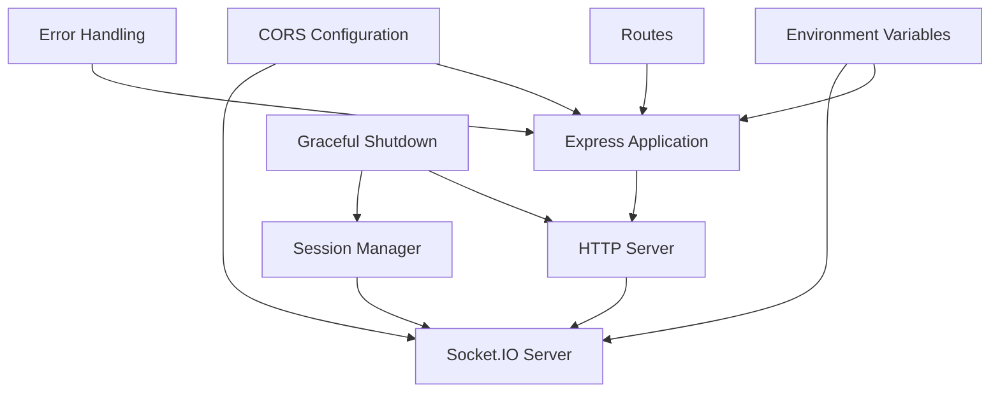

# Server Configuration

## Overview

ShareThings server is built on Express and Socket.IO, providing both HTTP API endpoints and WebSocket communication. This document details the server configuration, initialization, and key components.

## Server Initialization

The server is initialized in `server.ts` with the following components:



### Express Application

The Express application is created and configured with middleware:

```typescript
// Create Express app
const app = express();

// Middleware
app.use(cors({
  origin: process.env.CORS_ORIGIN || '*',
  methods: ['GET', 'POST', 'OPTIONS'],
  credentials: true
}));
app.use(express.json());
```

### HTTP Server

An HTTP server is created using the Express application:

```typescript
// Create HTTP server
const server = http.createServer(app);
```

### Socket.IO Server

A Socket.IO server is created and attached to the HTTP server:

```typescript
// Create Socket.IO server
const io = new Server(server, {
  cors: {
    origin: process.env.CORS_ORIGIN || '*',
    methods: ['GET', 'POST'],
    credentials: true
  },
  transports: ['websocket', 'polling'],
  pingTimeout: 60000,
  pingInterval: 25000,
  maxHttpBufferSize: 1e8 // 100MB
});
```

### Session Manager

A session manager is created to handle session-related operations:

```typescript
// Create session manager
const sessionManager = new SessionManager({
  sessionTimeout: parseInt(process.env.SESSION_TIMEOUT || '600000') // Default 10 minutes
});
```

### Routes and Socket Handlers

Routes and socket handlers are set up:

```typescript
// Set up routes
setupRoutes(app);

// Set up socket handlers with session manager
setupSocketHandlers(io, sessionManager);
```

### Server Start

The server is started on the specified port:

```typescript
// Start server
server.listen({
  port: Number(PORT),
  host: '0.0.0.0'
}, () => {
  console.log(`Server running on port ${PORT}`);
  console.log(`Server binding to all network interfaces (0.0.0.0) - accessible from external machines`);
});
```

### Graceful Shutdown

The server handles graceful shutdown:

```typescript
// Handle graceful shutdown
process.on('SIGTERM', () => {
  console.log('SIGTERM signal received: closing HTTP server');
  
  // Stop session manager
  sessionManager.stop();
  
  server.close(() => {
    console.log('HTTP server closed');
    process.exit(0);
  });
});
```

## Environment Variables

The server uses the following environment variables:

| Variable | Description | Default |
|----------|-------------|---------|
| `PORT` | Port to listen on | `3001` |
| `CORS_ORIGIN` | CORS origin | `'*'` |
| `SESSION_TIMEOUT` | Session timeout in milliseconds | `600000` (10 minutes) |

## API Routes

The server provides the following API endpoints:

### Health Check

```
GET /health
```

Returns a 200 OK response with the text "OK" if the server is running.

### API Routes

All API routes are prefixed with `/api`.

#### GET /api/sessions

Returns information about active sessions.

**Response:**
```json
{
  "message": "This endpoint would return active sessions",
  "note": "For security reasons, this is just a placeholder"
}
```

#### GET /api/version

Returns the version of the application.

**Response:**
```json
{
  "version": "0.1.0",
  "environment": "development"
}
```

## Error Handling

The server includes error handling middleware:

```typescript
// 404 handler
app.use((req: Request, res: Response) => {
  res.status(404).json({ error: 'Not found' });
});

// Error handler
app.use((err: Error, req: Request, res: Response, next: Function) => {
  console.error('Unhandled error:', err);
  res.status(500).json({ error: 'Internal server error' });
});
```

## Socket.IO Configuration

Socket.IO is configured with the following options:

| Option | Value | Description |
|--------|-------|-------------|
| `cors.origin` | `process.env.CORS_ORIGIN \|\| '*'` | CORS origin |
| `cors.methods` | `['GET', 'POST']` | Allowed HTTP methods |
| `cors.credentials` | `true` | Allow credentials |
| `transports` | `['websocket', 'polling']` | Allowed transports |
| `pingTimeout` | `60000` | Ping timeout in milliseconds |
| `pingInterval` | `25000` | Ping interval in milliseconds |
| `maxHttpBufferSize` | `1e8` (100MB) | Maximum HTTP buffer size |

For detailed information about Socket.IO event handling, see [WebSockets](websockets.md).

## Session Management

The session manager is configured with a timeout value:

```typescript
const sessionManager = new SessionManager({
  sessionTimeout: parseInt(process.env.SESSION_TIMEOUT || '600000') // Default 10 minutes
});
```

For detailed information about session management, see [Session Management](session-management.md).