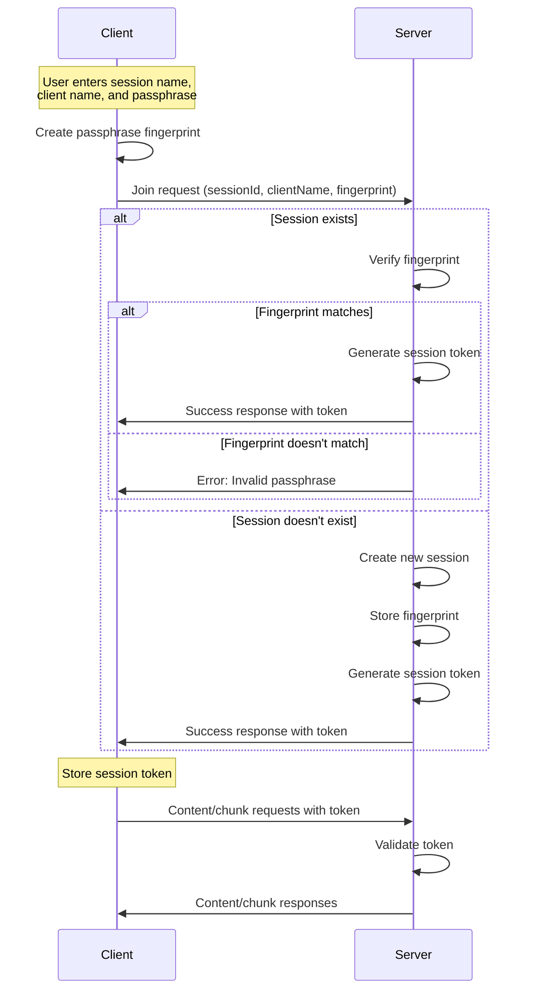

# Session Management

## Overview

ShareThings implements a secure session management system that provides authentication, authorization, and session persistence while maintaining end-to-end encryption. This document outlines the session management approach, including authentication, token handling, and session expiration.

## Session Authentication Flow



## Passphrase Fingerprinting

To verify the passphrase without exposing it, we use a self-encryption approach:

1. The client creates a SHA-256 hash of the passphrase
2. The first half of the hash is used as an encryption key
3. The second half of the hash is encrypted using the key
4. The resulting encrypted data and IV form the "fingerprint"

```typescript
async function createPassphraseFingerprint(passphrase: string): Promise<{ iv: number[], data: number[] }> {
  // Create a key from the passphrase
  const encoder = new TextEncoder();
  const passphraseData = encoder.encode(passphrase);
  const hashBuffer = await crypto.subtle.digest('SHA-256', passphraseData);
  const hashArray = new Uint8Array(hashBuffer);
  
  // Use the first half of the hash to encrypt the second half
  const encryptionPart = hashArray.slice(0, 16);
  const dataPart = hashArray.slice(16, 32);
  
  // Import the key
  const key = await crypto.subtle.importKey(
    'raw', 
    encryptionPart, 
    { name: 'AES-GCM' }, 
    false, 
    ['encrypt']
  );
  
  // Generate IV
  const iv = crypto.getRandomValues(new Uint8Array(12));
  
  // Encrypt
  const encrypted = await crypto.subtle.encrypt(
    { name: 'AES-GCM', iv }, 
    key, 
    dataPart
  );
  
  // Return fingerprint
  return {
    iv: Array.from(iv),
    data: Array.from(new Uint8Array(encrypted))
  };
}
```

This approach allows the server to verify that clients are using the same passphrase without knowing the actual passphrase.

## Session Tokens

After successful authentication, the server issues a session token:

1. The token is a cryptographically secure random string
2. The token is associated with the client ID on the server
3. The client stores the token in localStorage
4. The token is included in subsequent requests

```typescript
// Server-side token generation
private generateSessionToken(): string {
  // Generate a random token
  const array = new Uint8Array(32);
  crypto.getRandomValues(array);
  return Array.from(array, byte => byte.toString(16).padStart(2, '0')).join('');
}

// Client-side token storage
localStorage.setItem('sessionToken', response.token);
```

## Session Expiration

Sessions expire after a period of inactivity:

1. The server tracks the last activity timestamp for each session
2. If no activity occurs for the configured timeout period (default: 10 minutes), the session is expired
3. Expired sessions are automatically cleaned up

```typescript
// Server-side session cleanup
private cleanupExpiredSessions(): void {
  const now = new Date();
  
  for (const [sessionId, auth] of this.sessionAuth.entries()) {
    const elapsed = now.getTime() - auth.lastActivity.getTime();
    
    if (elapsed > this.sessionTimeout) {
      // Get session
      const session = this.sessions.get(sessionId);
      
      // If session has no clients or timeout exceeded, remove it
      if (!session || session.clients.size === 0) {
        console.log(`Session ${sessionId} expired (inactive for ${elapsed / 1000}s)`);
        
        // Remove session
        this.sessions.delete(sessionId);
        this.sessionAuth.delete(sessionId);
        
        // Remove associated tokens
        for (const [clientId, _] of this.sessionTokens.entries()) {
          if (session?.clients.has(clientId)) {
            this.sessionTokens.delete(clientId);
          }
        }
      }
    }
  }
}
```

## Server-Side Session Management

The server manages sessions using the `SessionManager` class:

```typescript
class SessionManager {
  // Session storage
  private sessions: Map<string, Session> = new Map();
  private sessionAuth: Map<string, SessionAuth> = new Map();
  private sessionTokens: Map<string, string> = new Map();
  
  // Configuration
  private sessionTimeout: number;
  
  constructor(config: { sessionTimeout?: number } = {}) {
    this.sessionTimeout = config.sessionTimeout || 10 * 60 * 1000; // Default 10 minutes
    
    // Start cleanup interval
    setInterval(() => this.cleanupExpiredSessions(), 60 * 1000); // Check every minute
  }
  
  // Join session
  async joinSession(
    sessionId: string,
    fingerprint: any,
    clientId: string,
    clientName: string,
    socket: Socket
  ): Promise<SessionJoinResult> {
    // Check if session exists
    if (this.sessionAuth.has(sessionId)) {
      // Verify fingerprint
      const storedAuth = this.sessionAuth.get(sessionId)!;
      if (!this.compareFingerprints(fingerprint, storedAuth.fingerprint)) {
        return { success: false, error: 'Invalid passphrase' };
      }
    } else {
      // Create new session auth
      this.sessionAuth.set(sessionId, {
        fingerprint,
        createdAt: new Date(),
        lastActivity: new Date()
      });
    }
    
    // Update last activity
    const auth = this.sessionAuth.get(sessionId)!;
    auth.lastActivity = new Date();
    
    // Generate session token
    const token = this.generateSessionToken();
    this.sessionTokens.set(clientId, token);
    
    // Get or create session
    let session = this.sessions.get(sessionId);
    if (!session) {
      session = new Session(sessionId);
      this.sessions.set(sessionId, session);
    }
    
    // Add client to session
    const client = new Client(clientId, clientName, socket);
    session.addClient(client);
    
    return { success: true, token };
  }
  
  // Validate session token
  validateSessionToken(clientId: string, token: string): boolean {
    return this.sessionTokens.get(clientId) === token;
  }
  
  // Other methods...
}
```

## Client-Side Session Handling

The client handles sessions using the `SocketContext`:

```typescript
// Join session
const joinSession = async (sessionId: string, clientName: string, passphrase: string): Promise<any> => {
  return new Promise(async (resolve, reject) => {
    if (!socket) {
      reject(new Error('Socket not initialized'));
      return;
    }

    try {
      // Create passphrase fingerprint
      const fingerprint = await createPassphraseFingerprint(passphrase);
      
      // Join session
      socket.emit('join', { sessionId, clientName, fingerprint }, (response: any) => {
        if (response.success) {
          // Store session token
          localStorage.setItem('sessionToken', response.token);
          resolve(response);
        } else {
          reject(new Error(response.error || 'Failed to join session'));
        }
      });
    } catch (error) {
      console.error('Error creating passphrase fingerprint:', error);
      reject(new Error('Failed to create passphrase fingerprint'));
    }
  });
};
```

## Socket.IO Middleware

Socket.IO middleware is used to validate session tokens for content-related events:

```typescript
// Middleware to validate session token for content-related events
socket.use((packet, next) => {
  const [event] = packet;
  
  if (['content', 'chunk'].includes(event)) {
    const sessionId = socket.data.sessionId;
    const token = socket.data.sessionToken;
    
    if (!sessionId || !token || !sessionManager.validateSessionToken(socket.id, token)) {
      return next(new Error('Invalid session'));
    }
  }
  
  next();
});
```

## Security Considerations

1. **Passphrase Protection**: The passphrase is never transmitted to the server
2. **Token Security**: Session tokens are cryptographically secure random strings
3. **Session Isolation**: Each session is isolated from others
4. **Expiration**: Inactive sessions are automatically expired
5. **Validation**: All session operations require valid tokens

## Configuration

Session timeout is configurable via environment variables:

```
# .env file
SESSION_TIMEOUT=600000  # 10 minutes in milliseconds
```

```typescript
// Server initialization
const sessionManager = new SessionManager({
  sessionTimeout: parseInt(process.env.SESSION_TIMEOUT || '600000')
});