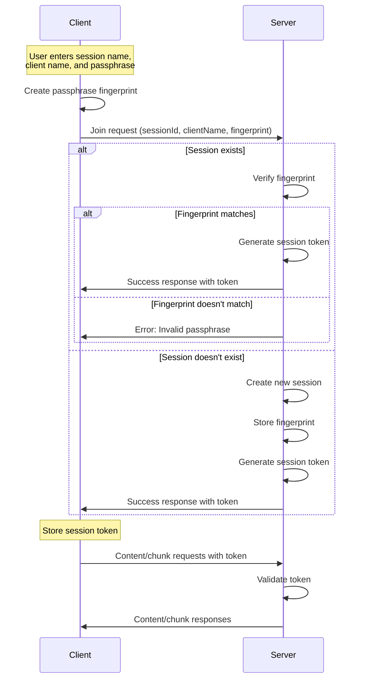

# Session Management with Persistent Storage

## Overview

ShareThings implements a secure session management system with **persistent SQLite storage** that provides authentication, authorization, and session persistence while maintaining end-to-end encryption. The system now supports **session recovery across server restarts** and **database-driven session state management**. This document outlines the session management approach, including authentication, token handling, session persistence, and expiration.

## Key Features

- **Persistent Session Storage**: SQLite database for session authentication data
- **Session Recovery**: Sessions survive server restarts and can be recovered
- **Repository Pattern**: Clean separation between business logic and data persistence
- **Database Migrations**: Automatic schema upgrades and versioning
- **Efficient Cleanup**: Database-driven session expiration and cleanup

## Session Authentication Flow



## Passphrase Fingerprinting

To verify the passphrase without exposing it, we use a self-encryption approach:

1. The client creates a SHA-256 hash of the passphrase
2. The first half of the hash is used as an encryption key
3. The second half of the hash is encrypted using the key
4. The resulting encrypted data and IV form the "fingerprint"

```typescript
async function createPassphraseFingerprint(passphrase: string): Promise<{ iv: number[], data: number[] }> {
  // Create a key from the passphrase
  const encoder = new TextEncoder();
  const passphraseData = encoder.encode(passphrase);
  const hashBuffer = await crypto.subtle.digest('SHA-256', passphraseData);
  const hashArray = new Uint8Array(hashBuffer);
  
  // Use the first half of the hash to encrypt the second half
  const encryptionPart = hashArray.slice(0, 16);
  const dataPart = hashArray.slice(16, 32);
  
  // Import the key
  const key = await crypto.subtle.importKey(
    'raw', 
    encryptionPart, 
    { name: 'AES-GCM' }, 
    false, 
    ['encrypt']
  );
  
  // Generate IV
  const iv = crypto.getRandomValues(new Uint8Array(12));
  
  // Encrypt
  const encrypted = await crypto.subtle.encrypt(
    { name: 'AES-GCM', iv }, 
    key, 
    dataPart
  );
  
## Persistent Storage Implementation

### SQLiteSessionRepository

The session management system uses a repository pattern with SQLite for persistent storage:

```typescript
export interface SessionRepository {
  initialize(): Promise<void>;
  findById(sessionId: string): Promise<SessionAuthRecord | null>;
  save(session: SessionAuthRecord): Promise<void>;
  update(session: SessionAuthRecord): Promise<void>;
  delete(sessionId: string): Promise<void>;
  findAll(): Promise<SessionAuthRecord[]>;
  findExpired(expiryTime: number): Promise<string[]>;
  close(): Promise<void>;
}
```

### Database Schema

```sql
CREATE TABLE sessions (
  session_id TEXT PRIMARY KEY,
  fingerprint_iv BLOB NOT NULL,
  fingerprint_data BLOB NOT NULL,
  created_at TEXT NOT NULL,
  last_activity TEXT NOT NULL
);

CREATE INDEX idx_sessions_last_activity ON sessions(last_activity);
```

### Session Authentication Record

```typescript
export interface SessionAuthRecord {
  sessionId: string;
  fingerprint: PassphraseFingerprint;
  createdAt: Date;
  lastActivity: Date;
}

export interface PassphraseFingerprint {
  iv: number[];
  data: number[];
}
```

### Database Migrations

The system includes automatic schema migrations:

```typescript
// Schema versioning table
CREATE TABLE schema_version (
  version INTEGER PRIMARY KEY,
  description TEXT NOT NULL,
  applied_at TEXT NOT NULL
);

// Migration 1: Initial schema
if (currentVersion < 1) {
  // Create sessions table and indexes
  // Update schema version
}
```
  // Return fingerprint
  return {
    iv: Array.from(iv),
    data: Array.from(new Uint8Array(encrypted))
  };
}
```

This approach allows the server to verify that clients are using the same passphrase without knowing the actual passphrase.

## Session Tokens

After successful authentication, the server issues a session token:

1. The token is a cryptographically secure random string
2. The token is associated with the client ID on the server
3. The client stores the token in localStorage
4. The token is included in subsequent requests

```typescript
// Server-side token generation
private generateSessionToken(): string {
  // Generate a random token
  const array = new Uint8Array(32);
  crypto.getRandomValues(array);
  return Array.from(array, byte => byte.toString(16).padStart(2, '0')).join('');
}

// Client-side token storage
localStorage.setItem('sessionToken', response.token);
```

## Session Expiration and Reconnection

Sessions expire after a period of inactivity:

1. The server tracks the last activity timestamp for each session
2. If no activity occurs for the configured timeout period (default: 10 minutes), the session is expired
3. Expired sessions are automatically cleaned up
4. Clients are notified when their session expires
5. Clients automatically attempt to rejoin when a session expires

```typescript
// Database-driven session cleanup
private async cleanupExpiredSessions(): Promise<void> {
  const now = new Date();
  console.log(`[SessionManager] Running cleanup check at ${now.toISOString()}`);
  
  try {
    // Find expired sessions using database query
    const expiredSessionIds = await this.sessionRepository.findExpired(this.sessionTimeout);
    
    for (const sessionId of expiredSessionIds) {
      console.log(`[SessionManager] Session ${sessionId} expired`);
      
      // Get session from memory (if active)
      const session = this.sessions.get(sessionId);
      
      // If session exists in memory, disconnect all clients
      if (session) {
        const clientCount = session.clients.size;
        console.log(`[SessionManager] Disconnecting ${clientCount} clients from expired session ${sessionId}`);
        
        // Disconnect all clients
        for (const [clientId, client] of session.clients.entries()) {
          console.log(`[SessionManager] Disconnecting client ${clientId} from expired session ${sessionId}`);
          client.sendNotification('session-expired', {
            sessionId,
            message: 'Session expired due to inactivity'
          });
          
          // Remove client token
          this.sessionTokens.delete(clientId);
        }
        
        // Remove session from memory
        this.sessions.delete(sessionId);
      }
      
      // Remove session from database
      await this.sessionRepository.delete(sessionId);
      
      console.log(`[SessionManager] Successfully removed expired session ${sessionId}`);
    }
  } catch (error) {
    console.error('[SessionManager] Error cleaning up expired sessions:', error);
  }
}
```

## Server-Side Session Management with Persistent Storage

The server manages sessions using the `SessionManager` class with persistent SQLite storage:

```typescript
class SessionManager {
  // In-memory session storage (for active sessions)
  private sessions: Map<string, Session> = new Map();
  
  // Persistent storage
  private sessionRepository: SessionRepository;
  
  // In-memory token management (for performance)
  private sessionTokens: Map<string, string> = new Map();
  
  // Configuration
  private sessionTimeout: number;
  
  constructor(config: SessionManagerConfig = {}) {
    this.sessionTimeout = config.sessionTimeout || 10 * 60 * 1000; // Default 10 minutes
    
    // Initialize SQLite repository
    const dbPath = config.dbPath || process.env.SQLITE_DB_PATH || './data/sessions.db';
    this.sessionRepository = new SQLiteSessionRepository(dbPath);
    
    // Start cleanup interval
    setInterval(() => this.cleanupExpiredSessions(), 60 * 1000); // Check every minute
  }
  
  async initialize(): Promise<void> {
    // Initialize repository and load existing sessions
    await this.sessionRepository.initialize();
    await this.loadSessionsFromRepository();
  }
  
  // Join session with persistent storage
  async joinSession(
    sessionId: string,
    fingerprint: PassphraseFingerprint,
    clientId: string,
    clientName: string,
    socket: Socket
  ): Promise<SessionJoinResult> {
    try {
      // Check if session exists in persistent storage
      const sessionRecord = await this.sessionRepository.findById(sessionId);
      
      if (sessionRecord) {
        // Verify fingerprint against stored data
        if (!this.compareFingerprints(fingerprint, sessionRecord.fingerprint)) {
          return { success: false, error: 'Invalid passphrase' };
        }
        
        // Update last activity in database
        sessionRecord.lastActivity = new Date();
        await this.sessionRepository.update(sessionRecord);
      } else {
        // Create new session record in database
        const newSessionRecord: SessionAuthRecord = {
          sessionId,
          fingerprint,
          createdAt: new Date(),
          lastActivity: new Date()
        };
        
        await this.sessionRepository.save(newSessionRecord);
      }
      
      // Generate session token (stored in-memory for performance)
      const token = this.generateSessionToken();
      this.sessionTokens.set(clientId, token);
      
      // Get or create in-memory session
      let session = this.sessions.get(sessionId);
      if (!session) {
        session = new Session(sessionId);
        this.sessions.set(sessionId, session);
      }
      
      // Add client to session
      const client = new Client(clientId, clientName, socket);
      session.addClient(client);
      
      return { success: true, token };
    } catch (error) {
      console.error(`Error joining session ${sessionId}:`, error);
      return { success: false, error: 'Internal server error' };
    }
  }
  
  // Validate session token
  validateSessionToken(clientId: string, token: string): boolean {
    return this.sessionTokens.get(clientId) === token;
  }
  
  // Other methods...
}
```

## Client-Side Session Handling

The client handles sessions using the `SocketContext`:

```typescript
// Join session
const joinSession = async (sessionId: string, clientName: string, passphrase: string): Promise<any> => {
  return new Promise(async (resolve, reject) => {
    if (!socket) {
      reject(new Error('Socket not initialized'));
      return;
    }

    try {
      // Create passphrase fingerprint
      const fingerprint = await createPassphraseFingerprint(passphrase);
      
      // Join session
      socket.emit('join', { sessionId, clientName, fingerprint }, (response: any) => {
        if (response.success) {
          // Store session token and credentials for potential reconnection
          localStorage.setItem('sessionToken', response.token);
          localStorage.setItem('sessionId', sessionId);
          localStorage.setItem('clientName', clientName);
          localStorage.setItem('passphrase', passphrase);
          resolve(response);
        } else {
          reject(new Error(response.error || 'Failed to join session'));
        }
      });
    } catch (error) {
      console.error('Error creating passphrase fingerprint:', error);
      reject(new Error('Failed to create passphrase fingerprint'));
    }
  });
};

// Rejoin session (used for automatic reconnection)
const rejoinSession = async (sessionId: string, clientName: string, passphrase: string) => {
  if (!socket || !socket.connected || isRejoining) return;
  
  try {
    setIsRejoining(true);
    console.log(`[Socket] Rejoining session ${sessionId} as ${clientName}`);
    
    // Create passphrase fingerprint
    const fingerprint = await generateFingerprint(passphrase);
    
    // Join session
    socket.emit('join', { sessionId, clientName, fingerprint }, (response: JoinResponse) => {
      if (response.success) {
        // Update session token
        if (response.token) {
          localStorage.setItem('sessionToken', response.token);
        }
        console.log('[Socket] Successfully rejoined session');
        
        // Notify application that we've rejoined
        if (socket) {
          socket.emit('client-rejoined', { sessionId, clientName });
        }
      } else {
        console.error('[Socket] Failed to rejoin session:', response.error);
      }
      setIsRejoining(false);
    });
  } catch (error) {
    console.error('[Socket] Error rejoining session:', error);
    setIsRejoining(false);
  }
};
```

## Socket.IO Middleware

Socket.IO middleware is used to validate session tokens for content-related events:

```typescript
// Middleware to validate session token for content-related events
socket.use((packet, next) => {
  const [event] = packet;
  
  if (['content', 'chunk'].includes(event)) {
    const sessionId = socket.data.sessionId;
    const token = socket.data.sessionToken;
    
    if (!sessionId || !token) {
      console.error(`[Middleware] Missing sessionId or token for ${event} event from client ${socket.id}`);
      return next(new Error('Invalid session'));
    }
    
    if (!sessionManager.validateSessionToken(socket.id, token)) {
      console.error(`[Middleware] Invalid token for ${event} event from client ${socket.id}`);
      return next(new Error('Invalid session'));
    }
    
    // Also check if session exists
    const session = sessionManager.getSession(sessionId);
    if (!session) {
      console.error(`[Middleware] Session ${sessionId} not found for ${event} event from client ${socket.id}`);
      return next(new Error('Session not found'));
    }
  }
  
  next();
});
```

## Automatic Reconnection

The client implements several mechanisms to ensure robust connection and session management:

### 1. Periodic Health Checks

```typescript
// Setup periodic health check
const interval = setInterval(() => {
  if (socket && socket.connected) {
    const sessionId = localStorage.getItem('sessionId');
    if (sessionId) {
      console.log('[Socket] Sending health check ping');
      socket.emit('ping', { sessionId }, (response: { valid: boolean, error?: string }) => {
        if (response && !response.valid) {
          console.warn('[Socket] Session invalid during health check:', response.error);
          
          // Try to rejoin if possible
          const clientName = localStorage.getItem('clientName');
          const passphrase = localStorage.getItem('passphrase');
          if (clientName && passphrase) {
            console.log('[Socket] Auto-rejoining after failed health check');
            rejoinSession(sessionId, clientName, passphrase);
          }
        } else {
          console.log('[Socket] Health check: Session valid');
        }
      });
    }
  }
}, 30000); // Check every 30 seconds
```

### 2. Action-Based Verification

Before any content sharing action, the client verifies the session is still valid:

```typescript
// First verify session is still valid
socket.emit('ping', { sessionId }, (pingResponse: { valid: boolean, error?: string }) => {
  if (!pingResponse || !pingResponse.valid) {
    console.warn('[Socket] Session invalid before sending content:', pingResponse?.error);
    
    // Try to rejoin if possible
    const clientName = localStorage.getItem('clientName');
    const passphrase = localStorage.getItem('passphrase');
    if (clientName && passphrase) {
      console.log('[Socket] Attempting to rejoin before sending content');
      rejoinSession(sessionId, clientName, passphrase)
        .then(() => {
          // Try sending content again after rejoining
          console.log('[Socket] Retrying content send after rejoining');
          sendContent(sessionId, content, data);
        })
        .catch(err => {
          console.error('[Socket] Failed to rejoin session:', err);
        });
    }
    return;
  }
  
  // Session is valid, proceed with sending content
  // ...
});
```

### 3. Visibility Change Detection

When the app regains focus after being in the background:

```typescript
const handleVisibilityChange = async () => {
  if (document.visibilityState === 'visible') {
    console.log('[SessionPage] Page became visible, verifying connection...');
    
    // Force connection check and rejoin if needed
    const isConnected = await ensureConnected(sessionId);
    console.log(`[SessionPage] Connection check result: ${isConnected ? 'connected' : 'disconnected'}`);
    
    if (!isConnected) {
      // If we failed to connect, show a message
      toast({
        title: 'Connection issue',
        description: 'Reconnecting to session...',
        status: 'warning',
        duration: 3000,
        isClosable: true
      });
    }
  }
};

// Add visibility change listener
document.addEventListener('visibilitychange', handleVisibilityChange);
```

### 4. Session Expiration Handling

```typescript
// Add socket expiration handler
socket.on('session-expired', (data: { sessionId: string, message: string }) => {
  if (data.sessionId === sessionId) {
    console.log('[SessionPage] Session expired notification received');
    
    toast({
      title: 'Session expired',
      description: data.message || 'Your session has expired due to inactivity',
      status: 'error',
      duration: 5000,
      isClosable: true
    });
    
    // Try to rejoin if we have credentials
    if (clientName && passphrase) {
      console.log('[SessionPage] Attempting to rejoin expired session');
      
      rejoinSession(sessionId, clientName, passphrase)
        .then(() => {
          console.log('[SessionPage] Successfully rejoined after expiration');
          
          toast({
            title: 'Reconnected',
            description: 'Successfully reconnected to session',
            status: 'success',
            duration: 3000,
            isClosable: true
          });
        })
        .catch(err => {
          console.error('[SessionPage] Failed to rejoin after expiration:', err);
          
          // Navigate to home page if rejoin fails
          toast({
            title: 'Session error',
            description: 'Could not rejoin the session. Returning to home page.',
            status: 'error',
            duration: 5000,
            isClosable: true
          });
          
          // Clear session info and redirect
          localStorage.removeItem('sessionId');
          localStorage.removeItem('clientName');
          localStorage.removeItem('passphrase');
          localStorage.removeItem('sessionToken');
          
          navigate('/');
        });
    }
  }
});
```

## Security Considerations

1. **Passphrase Protection**: The passphrase is never transmitted to the server
2. **Token Security**: Session tokens are cryptographically secure random strings
3. **Session Isolation**: Each session is isolated from others
4. **Expiration**: Inactive sessions are automatically expired and clients are notified
5. **Validation**: All session operations require valid tokens
6. **Automatic Reconnection**: Multiple mechanisms ensure clients maintain valid sessions
7. **Proactive Health Checks**: Regular verification prevents silent session failures

## Configuration

Session timeout is configurable via environment variables:

```
# .env file
SESSION_TIMEOUT=600000  # 10 minutes in milliseconds
```

```typescript
// Server initialization
const sessionManager = new SessionManager({
  sessionTimeout: parseInt(process.env.SESSION_TIMEOUT || '600000')
});
## Configuration

### Environment Variables

The persistent session management system supports the following configuration options:

```bash
# Database Configuration
SQLITE_DB_PATH=./data/sessions.db          # Path to SQLite session database
SESSION_TIMEOUT=600000                     # Session timeout in milliseconds (default: 10 minutes)

# Storage Configuration  
STORAGE_PATH=./data/sessions               # Base path for chunk storage
MAX_ITEMS_PER_SESSION=100                  # Maximum content items per session

# Server Configuration
NODE_ENV=production                        # Environment mode
PORT=3001                                  # Server port
CORS_ORIGIN=*                             # CORS origin configuration
```

### Database Management

**Initialization**
```typescript
// Initialize session manager with persistent storage
const sessionManager = new SessionManager({
  sessionTimeout: parseInt(process.env.SESSION_TIMEOUT || '600000'),
  dbPath: process.env.SQLITE_DB_PATH || './data/sessions.db'
});

await sessionManager.initialize();
```

**Backup and Recovery**
```bash
# Backup session database
cp ./data/sessions.db ./backups/sessions-$(date +%Y%m%d).db

# Restore from backup
cp ./backups/sessions-20231201.db ./data/sessions.db
```

**Database Maintenance**
```sql
-- Check database integrity
PRAGMA integrity_check;

-- Vacuum database to reclaim space
VACUUM;

-- Analyze query performance
PRAGMA optimize;
```