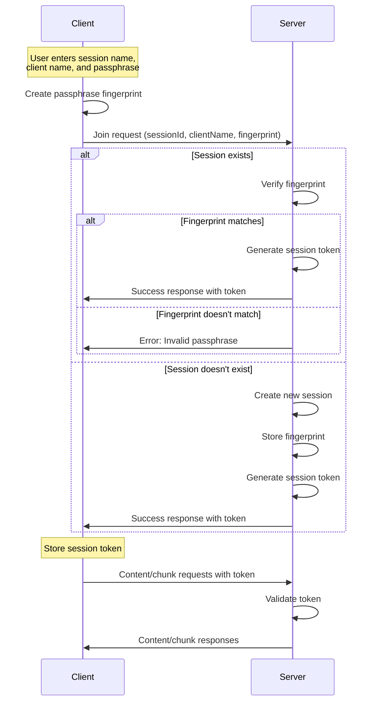

# Session Management

## Overview

ShareThings implements a secure session management system that provides authentication, authorization, and session persistence while maintaining end-to-end encryption. This document outlines the session management approach, including authentication, token handling, and session expiration.

## Session Authentication Flow



## Passphrase Fingerprinting

To verify the passphrase without exposing it, we use a self-encryption approach:

1. The client creates a SHA-256 hash of the passphrase
2. The first half of the hash is used as an encryption key
3. The second half of the hash is encrypted using the key
4. The resulting encrypted data and IV form the "fingerprint"

```typescript
async function createPassphraseFingerprint(passphrase: string): Promise<{ iv: number[], data: number[] }> {
  // Create a key from the passphrase
  const encoder = new TextEncoder();
  const passphraseData = encoder.encode(passphrase);
  const hashBuffer = await crypto.subtle.digest('SHA-256', passphraseData);
  const hashArray = new Uint8Array(hashBuffer);
  
  // Use the first half of the hash to encrypt the second half
  const encryptionPart = hashArray.slice(0, 16);
  const dataPart = hashArray.slice(16, 32);
  
  // Import the key
  const key = await crypto.subtle.importKey(
    'raw', 
    encryptionPart, 
    { name: 'AES-GCM' }, 
    false, 
    ['encrypt']
  );
  
  // Generate IV
  const iv = crypto.getRandomValues(new Uint8Array(12));
  
  // Encrypt
  const encrypted = await crypto.subtle.encrypt(
    { name: 'AES-GCM', iv }, 
    key, 
    dataPart
  );
  
  // Return fingerprint
  return {
    iv: Array.from(iv),
    data: Array.from(new Uint8Array(encrypted))
  };
}
```

This approach allows the server to verify that clients are using the same passphrase without knowing the actual passphrase.

## Session Tokens

After successful authentication, the server issues a session token:

1. The token is a cryptographically secure random string
2. The token is associated with the client ID on the server
3. The client stores the token in localStorage
4. The token is included in subsequent requests

```typescript
// Server-side token generation
private generateSessionToken(): string {
  // Generate a random token
  const array = new Uint8Array(32);
  crypto.getRandomValues(array);
  return Array.from(array, byte => byte.toString(16).padStart(2, '0')).join('');
}

// Client-side token storage
localStorage.setItem('sessionToken', response.token);
```

## Session Expiration and Reconnection

Sessions expire after a period of inactivity:

1. The server tracks the last activity timestamp for each session
2. If no activity occurs for the configured timeout period (default: 10 minutes), the session is expired
3. Expired sessions are automatically cleaned up
4. Clients are notified when their session expires
5. Clients automatically attempt to rejoin when a session expires

```typescript
// Server-side session cleanup
private cleanupExpiredSessions(): void {
  const now = new Date();
  console.log(`[SessionManager] Running cleanup check at ${now.toISOString()}`);
  
  for (const [sessionId, auth] of this.sessionAuth.entries()) {
    const elapsed = now.getTime() - auth.lastActivity.getTime();
    const elapsedSeconds = Math.floor(elapsed / 1000);
    
    // Log sessions that are getting close to timeout
    if (elapsed > (this.sessionTimeout * 0.8) && elapsed <= this.sessionTimeout) {
      console.log(`[SessionManager] Session ${sessionId} approaching timeout (inactive for ${elapsedSeconds}s, timeout at ${this.sessionTimeout / 1000}s)`);
    }
    
    if (elapsed > this.sessionTimeout) {
      // Get session
      const session = this.sessions.get(sessionId);
      
      console.log(`[SessionManager] Session ${sessionId} expired (inactive for ${elapsedSeconds}s)`);
      
      // If session exists, disconnect all clients
      if (session) {
        const clientCount = session.clients.size;
        console.log(`[SessionManager] Disconnecting ${clientCount} clients from expired session ${sessionId}`);
        
        // Disconnect all clients
        for (const [clientId, client] of session.clients.entries()) {
          console.log(`[SessionManager] Disconnecting client ${clientId} from expired session ${sessionId}`);
          client.sendNotification('session-expired', {
            sessionId,
            message: 'Session expired due to inactivity'
          });
          
          // Remove client token
          this.sessionTokens.delete(clientId);
        }
      }
      
      // Remove session
      this.sessions.delete(sessionId);
      this.sessionAuth.delete(sessionId);
      
      // Log successful cleanup
      console.log(`[SessionManager] Successfully removed expired session ${sessionId}`);
    }
  }
}
```

## Server-Side Session Management

The server manages sessions using the `SessionManager` class:

```typescript
class SessionManager {
  // Session storage
  private sessions: Map<string, Session> = new Map();
  private sessionAuth: Map<string, SessionAuth> = new Map();
  private sessionTokens: Map<string, string> = new Map();
  
  // Configuration
  private sessionTimeout: number;
  
  constructor(config: { sessionTimeout?: number } = {}) {
    this.sessionTimeout = config.sessionTimeout || 10 * 60 * 1000; // Default 10 minutes
    
    // Start cleanup interval
    setInterval(() => this.cleanupExpiredSessions(), 60 * 1000); // Check every minute
  }
  
  // Join session
  async joinSession(
    sessionId: string,
    fingerprint: any,
    clientId: string,
    clientName: string,
    socket: Socket
  ): Promise<SessionJoinResult> {
    // Check if session exists
    if (this.sessionAuth.has(sessionId)) {
      // Verify fingerprint
      const storedAuth = this.sessionAuth.get(sessionId)!;
      if (!this.compareFingerprints(fingerprint, storedAuth.fingerprint)) {
        return { success: false, error: 'Invalid passphrase' };
      }
    } else {
      // Create new session auth
      this.sessionAuth.set(sessionId, {
        fingerprint,
        createdAt: new Date(),
        lastActivity: new Date()
      });
    }
    
    // Update last activity
    const auth = this.sessionAuth.get(sessionId)!;
    auth.lastActivity = new Date();
    
    // Generate session token
    const token = this.generateSessionToken();
    this.sessionTokens.set(clientId, token);
    
    // Get or create session
    let session = this.sessions.get(sessionId);
    if (!session) {
      session = new Session(sessionId);
      this.sessions.set(sessionId, session);
    }
    
    // Add client to session
    const client = new Client(clientId, clientName, socket);
    session.addClient(client);
    
    return { success: true, token };
  }
  
  // Validate session token
  validateSessionToken(clientId: string, token: string): boolean {
    return this.sessionTokens.get(clientId) === token;
  }
  
  // Other methods...
}
```

## Client-Side Session Handling

The client handles sessions using the `SocketContext`:

```typescript
// Join session
const joinSession = async (sessionId: string, clientName: string, passphrase: string): Promise<any> => {
  return new Promise(async (resolve, reject) => {
    if (!socket) {
      reject(new Error('Socket not initialized'));
      return;
    }

    try {
      // Create passphrase fingerprint
      const fingerprint = await createPassphraseFingerprint(passphrase);
      
      // Join session
      socket.emit('join', { sessionId, clientName, fingerprint }, (response: any) => {
        if (response.success) {
          // Store session token and credentials for potential reconnection
          localStorage.setItem('sessionToken', response.token);
          localStorage.setItem('sessionId', sessionId);
          localStorage.setItem('clientName', clientName);
          localStorage.setItem('passphrase', passphrase);
          resolve(response);
        } else {
          reject(new Error(response.error || 'Failed to join session'));
        }
      });
    } catch (error) {
      console.error('Error creating passphrase fingerprint:', error);
      reject(new Error('Failed to create passphrase fingerprint'));
    }
  });
};

// Rejoin session (used for automatic reconnection)
const rejoinSession = async (sessionId: string, clientName: string, passphrase: string) => {
  if (!socket || !socket.connected || isRejoining) return;
  
  try {
    setIsRejoining(true);
    console.log(`[Socket] Rejoining session ${sessionId} as ${clientName}`);
    
    // Create passphrase fingerprint
    const fingerprint = await generateFingerprint(passphrase);
    
    // Join session
    socket.emit('join', { sessionId, clientName, fingerprint }, (response: JoinResponse) => {
      if (response.success) {
        // Update session token
        if (response.token) {
          localStorage.setItem('sessionToken', response.token);
        }
        console.log('[Socket] Successfully rejoined session');
        
        // Notify application that we've rejoined
        if (socket) {
          socket.emit('client-rejoined', { sessionId, clientName });
        }
      } else {
        console.error('[Socket] Failed to rejoin session:', response.error);
      }
      setIsRejoining(false);
    });
  } catch (error) {
    console.error('[Socket] Error rejoining session:', error);
    setIsRejoining(false);
  }
};
```

## Socket.IO Middleware

Socket.IO middleware is used to validate session tokens for content-related events:

```typescript
// Middleware to validate session token for content-related events
socket.use((packet, next) => {
  const [event] = packet;
  
  if (['content', 'chunk'].includes(event)) {
    const sessionId = socket.data.sessionId;
    const token = socket.data.sessionToken;
    
    if (!sessionId || !token) {
      console.error(`[Middleware] Missing sessionId or token for ${event} event from client ${socket.id}`);
      return next(new Error('Invalid session'));
    }
    
    if (!sessionManager.validateSessionToken(socket.id, token)) {
      console.error(`[Middleware] Invalid token for ${event} event from client ${socket.id}`);
      return next(new Error('Invalid session'));
    }
    
    // Also check if session exists
    const session = sessionManager.getSession(sessionId);
    if (!session) {
      console.error(`[Middleware] Session ${sessionId} not found for ${event} event from client ${socket.id}`);
      return next(new Error('Session not found'));
    }
  }
  
  next();
});
```

## Automatic Reconnection

The client implements several mechanisms to ensure robust connection and session management:

### 1. Periodic Health Checks

```typescript
// Setup periodic health check
const interval = setInterval(() => {
  if (socket && socket.connected) {
    const sessionId = localStorage.getItem('sessionId');
    if (sessionId) {
      console.log('[Socket] Sending health check ping');
      socket.emit('ping', { sessionId }, (response: { valid: boolean, error?: string }) => {
        if (response && !response.valid) {
          console.warn('[Socket] Session invalid during health check:', response.error);
          
          // Try to rejoin if possible
          const clientName = localStorage.getItem('clientName');
          const passphrase = localStorage.getItem('passphrase');
          if (clientName && passphrase) {
            console.log('[Socket] Auto-rejoining after failed health check');
            rejoinSession(sessionId, clientName, passphrase);
          }
        } else {
          console.log('[Socket] Health check: Session valid');
        }
      });
    }
  }
}, 30000); // Check every 30 seconds
```

### 2. Action-Based Verification

Before any content sharing action, the client verifies the session is still valid:

```typescript
// First verify session is still valid
socket.emit('ping', { sessionId }, (pingResponse: { valid: boolean, error?: string }) => {
  if (!pingResponse || !pingResponse.valid) {
    console.warn('[Socket] Session invalid before sending content:', pingResponse?.error);
    
    // Try to rejoin if possible
    const clientName = localStorage.getItem('clientName');
    const passphrase = localStorage.getItem('passphrase');
    if (clientName && passphrase) {
      console.log('[Socket] Attempting to rejoin before sending content');
      rejoinSession(sessionId, clientName, passphrase)
        .then(() => {
          // Try sending content again after rejoining
          console.log('[Socket] Retrying content send after rejoining');
          sendContent(sessionId, content, data);
        })
        .catch(err => {
          console.error('[Socket] Failed to rejoin session:', err);
        });
    }
    return;
  }
  
  // Session is valid, proceed with sending content
  // ...
});
```

### 3. Visibility Change Detection

When the app regains focus after being in the background:

```typescript
const handleVisibilityChange = async () => {
  if (document.visibilityState === 'visible') {
    console.log('[SessionPage] Page became visible, verifying connection...');
    
    // Force connection check and rejoin if needed
    const isConnected = await ensureConnected(sessionId);
    console.log(`[SessionPage] Connection check result: ${isConnected ? 'connected' : 'disconnected'}`);
    
    if (!isConnected) {
      // If we failed to connect, show a message
      toast({
        title: 'Connection issue',
        description: 'Reconnecting to session...',
        status: 'warning',
        duration: 3000,
        isClosable: true
      });
    }
  }
};

// Add visibility change listener
document.addEventListener('visibilitychange', handleVisibilityChange);
```

### 4. Session Expiration Handling

```typescript
// Add socket expiration handler
socket.on('session-expired', (data: { sessionId: string, message: string }) => {
  if (data.sessionId === sessionId) {
    console.log('[SessionPage] Session expired notification received');
    
    toast({
      title: 'Session expired',
      description: data.message || 'Your session has expired due to inactivity',
      status: 'error',
      duration: 5000,
      isClosable: true
    });
    
    // Try to rejoin if we have credentials
    if (clientName && passphrase) {
      console.log('[SessionPage] Attempting to rejoin expired session');
      
      rejoinSession(sessionId, clientName, passphrase)
        .then(() => {
          console.log('[SessionPage] Successfully rejoined after expiration');
          
          toast({
            title: 'Reconnected',
            description: 'Successfully reconnected to session',
            status: 'success',
            duration: 3000,
            isClosable: true
          });
        })
        .catch(err => {
          console.error('[SessionPage] Failed to rejoin after expiration:', err);
          
          // Navigate to home page if rejoin fails
          toast({
            title: 'Session error',
            description: 'Could not rejoin the session. Returning to home page.',
            status: 'error',
            duration: 5000,
            isClosable: true
          });
          
          // Clear session info and redirect
          localStorage.removeItem('sessionId');
          localStorage.removeItem('clientName');
          localStorage.removeItem('passphrase');
          localStorage.removeItem('sessionToken');
          
          navigate('/');
        });
    }
  }
});
```

## Security Considerations

1. **Passphrase Protection**: The passphrase is never transmitted to the server
2. **Token Security**: Session tokens are cryptographically secure random strings
3. **Session Isolation**: Each session is isolated from others
4. **Expiration**: Inactive sessions are automatically expired and clients are notified
5. **Validation**: All session operations require valid tokens
6. **Automatic Reconnection**: Multiple mechanisms ensure clients maintain valid sessions
7. **Proactive Health Checks**: Regular verification prevents silent session failures

## Configuration

Session timeout is configurable via environment variables:

```
# .env file
SESSION_TIMEOUT=600000  # 10 minutes in milliseconds
```

```typescript
// Server initialization
const sessionManager = new SessionManager({
  sessionTimeout: parseInt(process.env.SESSION_TIMEOUT || '600000')
});