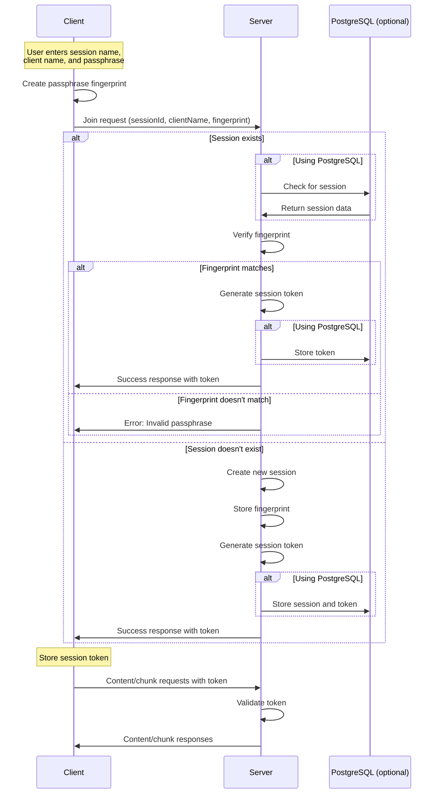

# Session Management

## Overview

ShareThings implements a secure session management system that provides authentication, authorization, and session persistence while maintaining end-to-end encryption. This document outlines the session management approach, including authentication, token handling, and session expiration.

The system supports two storage backends:
1. In-memory storage (default)
2. PostgreSQL database storage (for persistence across server restarts and multi-server deployments)

## Session Authentication Flow


```mermaid
sequenceDiagram
    participant Client
    participant Server
    participant DB as PostgreSQL (optional)
    
    Note over Client: User enters session name,<br/>client name, and passphrase
    
    Client->>Client: Create passphrase fingerprint
    
    Client->>Server: Join request (sessionId, clientName, fingerprint)
    
    alt Session exists
        alt Using PostgreSQL
            Server->>DB: Check for session
            DB->>Server: Return session data
        end
        Server->>Server: Verify fingerprint
        
        alt Fingerprint matches
            Server->>Server: Generate session token
            alt Using PostgreSQL
                Server->>DB: Store token
            end
            Server->>Client: Success response with token
        else Fingerprint doesn't match
            Server->>Client: Error: Invalid passphrase
        end
    else Session doesn't exist
        Server->>Server: Create new session
        Server->>Server: Store fingerprint
        Server->>Server: Generate session token
        alt Using PostgreSQL
            Server->>DB: Store session and token
        end
        Server->>Client: Success response with token
    end
    
    Note over Client: Store session token
    
    Client->>Server: Content/chunk requests with token
    Server->>Server: Validate token
    Server->>Client: Content/chunk responses
```

## Passphrase Fingerprinting

To verify the passphrase without exposing it, we use a self-encryption approach:

1. The client creates a SHA-256 hash of the passphrase
2. The first half of the hash is used as an encryption key
3. The second half of the hash is encrypted using the key
4. The resulting encrypted data and IV form the "fingerprint"

```typescript
async function createPassphraseFingerprint(passphrase: string): Promise<{ iv: number[], data: number[] }> {
  // Create a key from the passphrase
  const encoder = new TextEncoder();
  const passphraseData = encoder.encode(passphrase);
  const hashBuffer = await crypto.subtle.digest('SHA-256', passphraseData);
  const hashArray = new Uint8Array(hashBuffer);
  
  // Use the first half of the hash to encrypt the second half
  const encryptionPart = hashArray.slice(0, 16);
  const dataPart = hashArray.slice(16, 32);
  
  // Import the key
  const key = await crypto.subtle.importKey(
    'raw', 
    encryptionPart, 
    { name: 'AES-GCM' }, 
    false, 
    ['encrypt']
  );
  
  // Generate IV
  const iv = crypto.getRandomValues(new Uint8Array(12));
  
  // Encrypt
  const encrypted = await crypto.subtle.encrypt(
    { name: 'AES-GCM', iv }, 
    key, 
    dataPart
  );
  
  // Return fingerprint
  return {
    iv: Array.from(iv),
    data: Array.from(new Uint8Array(encrypted))
  };
}
```

This approach allows the server to verify that clients are using the same passphrase without knowing the actual passphrase.

## Session Tokens

After successful authentication, the server issues a session token:

1. The token is a cryptographically secure random string
2. The token is associated with the client ID on the server
3. The client stores the token in localStorage
4. The token is included in subsequent requests

```typescript
// Server-side token generation
private generateSessionToken(): string {
  // Generate a random token
  const array = new Uint8Array(32);
  crypto.getRandomValues(array);
  return Array.from(array, byte => byte.toString(16).padStart(2, '0')).join('');
}

// Client-side token storage
localStorage.setItem('sessionToken', response.token);
```

## Session Expiration and Reconnection

Sessions expire after a period of inactivity:

1. The server tracks the last activity timestamp for each session
2. If no activity occurs for the configured timeout period (default: 10 minutes), the session is expired
3. Expired sessions are automatically cleaned up
4. Clients are notified when their session expires
5. Clients automatically attempt to rejoin when a session expires

```typescript
// Server-side session cleanup
private cleanupExpiredSessions(): void {
  const now = new Date();
  console.log(`[SessionManager] Running cleanup check at ${now.toISOString()}`);
  
  for (const [sessionId, auth] of this.sessionAuth.entries()) {
    const elapsed = now.getTime() - auth.lastActivity.getTime();
    const elapsedSeconds = Math.floor(elapsed / 1000);
    
    // Log sessions that are getting close to timeout
    if (elapsed > (this.sessionTimeout * 0.8) && elapsed <= this.sessionTimeout) {
      console.log(`[SessionManager] Session ${sessionId} approaching timeout (inactive for ${elapsedSeconds}s, timeout at ${this.sessionTimeout / 1000}s)`);
    }
    
    if (elapsed > this.sessionTimeout) {
      // Get session
      const session = this.sessions.get(sessionId);
      
      console.log(`[SessionManager] Session ${sessionId} expired (inactive for ${elapsedSeconds}s)`);
      
      // If session exists, disconnect all clients
      if (session) {
        const clientCount = session.clients.size;
        console.log(`[SessionManager] Disconnecting ${clientCount} clients from expired session ${sessionId}`);
        
        // Disconnect all clients
        for (const [clientId, client] of session.clients.entries()) {
          console.log(`[SessionManager] Disconnecting client ${clientId} from expired session ${sessionId}`);
          client.sendNotification('session-expired', {
            sessionId,
            message: 'Session expired due to inactivity'
          });
          
          // Remove client token
          this.sessionTokens.delete(clientId);
        }
      }
      
      // Remove session
      this.sessions.delete(sessionId);
      this.sessionAuth.delete(sessionId);
      
      // Log successful cleanup
      console.log(`[SessionManager] Successfully removed expired session ${sessionId}`);
    }
  }
}
```

## Server-Side Session Management

The server manages sessions using a pluggable architecture that supports both in-memory storage and PostgreSQL database storage.

### Session Manager Factory

A factory pattern is used to create the appropriate session manager based on configuration:

```typescript
// Session manager factory
class SessionManagerFactory {
  static createSessionManager(config: SessionManagerFactoryConfig): SessionManager {
    switch (config.storageType) {
      case 'memory':
        return new SessionManager({
          sessionTimeout: config.sessionTimeout
        });
      
      case 'postgresql':
        if (!config.postgresConfig) {
          throw new Error('PostgreSQL configuration is required for postgresql storage type');
        }
        
        return new PostgreSQLSessionManager({
          sessionTimeout: config.sessionTimeout,
          postgresConfig: config.postgresConfig
        });
      
      default:
        throw new Error(`Unsupported storage type: ${config.storageType}`);
    }
  }
}
```

### In-Memory Session Manager

The base SessionManager class provides in-memory session storage:

```typescript
class SessionManager {
  // Session storage
  protected sessions: Map<string, Session> = new Map();
  protected sessionAuth: Map<string, SessionAuth> = new Map();
  protected sessionTokens: Map<string, string> = new Map();
  
  // Configuration
  protected sessionTimeout: number;
  
  constructor(config: { sessionTimeout?: number } = {}) {
    this.sessionTimeout = config.sessionTimeout || 10 * 60 * 1000; // Default 10 minutes
    
    // Start cleanup interval
    setInterval(() => this.cleanupExpiredSessions(), 60 * 1000); // Check every minute
  }
  
  // Join session
  async joinSession(
    sessionId: string,
    fingerprint: any,
    clientId: string,
    clientName: string,
    socket: Socket
  ): Promise<SessionJoinResult> {
    // Check if session exists
    if (this.sessionAuth.has(sessionId)) {
      // Verify fingerprint
      const storedAuth = this.sessionAuth.get(sessionId)!;
      if (!this.compareFingerprints(fingerprint, storedAuth.fingerprint)) {
        return { success: false, error: 'Invalid passphrase' };
      }
    } else {
      // Create new session auth
      this.sessionAuth.set(sessionId, {
        fingerprint,
        createdAt: new Date(),
        lastActivity: new Date()
      });
    }
    
    // Update last activity
    const auth = this.sessionAuth.get(sessionId)!;
    auth.lastActivity = new Date();
    
    // Generate session token
    const token = this.generateSessionToken();
    this.sessionTokens.set(clientId, token);
    
    // Get or create session
    let session = this.sessions.get(sessionId);
    if (!session) {
      session = new Session(sessionId);
      this.sessions.set(sessionId, session);
    }
    
    // Add client to session
    const client = new Client(clientId, clientName, socket);
    session.addClient(client);
    
    return { success: true, token };
  }
  
  // Validate session token
  validateSessionToken(clientId: string, token: string): boolean {
    return this.sessionTokens.get(clientId) === token;
  }
  
  // Other methods...
}
```

### PostgreSQL Session Manager

The PostgreSQLSessionManager extends the base SessionManager to provide database-backed session storage:

```typescript
class PostgreSQLSessionManager extends SessionManager {
  private pool: Pool;
  private initialized: boolean = false;
  
  constructor(config: { sessionTimeout?: number, postgresConfig: PostgreSQLConfig }) {
    super(config);
    
    // Initialize PostgreSQL connection pool
    this.pool = new Pool(config.postgresConfig);
    
    // Initialize database schema
    this.initialize().catch(err => {
      console.error('Failed to initialize PostgreSQL session storage:', err);
    });
  }
  
  /**
   * Initializes the database schema and handles migrations
   */
  private async initialize(): Promise<void> {
    if (this.initialized) return;
    
    const client = await this.pool.connect();
    try {
      // Check if schema_version table exists
      const schemaVersionExists = await client.query(`
        SELECT EXISTS (
          SELECT FROM information_schema.tables 
          WHERE table_schema = 'public' 
          AND table_name = 'schema_version'
        )
      `);
      
      let currentVersion = 0;
      
      if (!schemaVersionExists.rows[0].exists) {
        // Create schema_version table
        await client.query(`
          CREATE TABLE schema_version (
            id SERIAL PRIMARY KEY,
            version INTEGER NOT NULL,
            applied_at TIMESTAMP NOT NULL DEFAULT NOW()
          )
        `);
        
        // Insert initial version
        await client.query(`
          INSERT INTO schema_version (version) VALUES (0)
        `);
      } else {
        // Get current schema version
        const versionResult = await client.query(`
          SELECT version FROM schema_version ORDER BY id DESC LIMIT 1
        `);
        
        if (versionResult.rows.length > 0) {
          currentVersion = versionResult.rows[0].version;
        }
      }
      
      console.log(`[PostgreSQL] Current schema version: ${currentVersion}`);
      
      // Apply migrations based on current version
      if (currentVersion < 1) {
        console.log('[PostgreSQL] Applying migration to version 1: Creating initial tables');
        
        // Create initial tables
        await client.query(`
          CREATE TABLE IF NOT EXISTS sessions (
            session_id VARCHAR(255) PRIMARY KEY,
            created_at TIMESTAMP NOT NULL,
            last_activity TIMESTAMP NOT NULL,
            fingerprint_iv BYTEA NOT NULL,
            fingerprint_data BYTEA NOT NULL
          )
        `);
        
        await client.query(`
          CREATE TABLE IF NOT EXISTS clients (
            client_id VARCHAR(255) PRIMARY KEY,
            session_id VARCHAR(255) NOT NULL,
            client_name VARCHAR(255) NOT NULL,
            created_at TIMESTAMP NOT NULL,
            last_activity TIMESTAMP NOT NULL,
            CONSTRAINT fk_session FOREIGN KEY(session_id) REFERENCES sessions(session_id) ON DELETE CASCADE
          )
        `);
        
        await client.query(`
          CREATE TABLE IF NOT EXISTS session_tokens (
            client_id VARCHAR(255) PRIMARY KEY,
            token VARCHAR(255) NOT NULL,
            created_at TIMESTAMP NOT NULL,
            CONSTRAINT fk_client FOREIGN KEY(client_id) REFERENCES clients(client_id) ON DELETE CASCADE
          )
        `);
        
        // Update schema version
        await client.query(`
          INSERT INTO schema_version (version) VALUES (1)
        `);
        
        currentVersion = 1;
      }
      
      // Future migrations can be added here
      // if (currentVersion < 2) { ... }
      
      this.initialized = true;
    } finally {
      client.release();
    }
  }
  
  /**
   * Override joinSession to use PostgreSQL
   */
  async joinSession(
    sessionId: string,
    fingerprint: PassphraseFingerprint,
    clientId: string,
    clientName: string,
    socket: Socket
  ): Promise<SessionJoinResult> {
    console.log(`[PostgreSQL] Attempting to join session: ${sessionId}`);
    
    // First check in-memory cache
    const cachedResult = await super.joinSession(sessionId, fingerprint, clientId, clientName, socket);
    if (cachedResult.success) {
      // Also save to database for persistence
      await this.saveSessionToDatabase(sessionId, fingerprint, clientId, clientName, cachedResult.token!);
      return cachedResult;
    }
    
    // If not in cache, try to load from database
    try {
      const client = await this.pool.connect();
      try {
        // Check if session exists in database
        const sessionResult = await client.query(
          'SELECT fingerprint_iv, fingerprint_data, created_at, last_activity FROM sessions WHERE session_id = $1',
          [sessionId]
        );
        
        if (sessionResult.rows.length > 0) {
          // Session exists in database
          const dbSession = sessionResult.rows[0];
          const storedFingerprint: PassphraseFingerprint = {
            iv: Array.from(dbSession.fingerprint_iv),
            data: Array.from(dbSession.fingerprint_data)
          };
          
          // Verify fingerprint
          const fingerprintsMatch = this.compareFingerprints(fingerprint, storedFingerprint);
          if (!fingerprintsMatch) {
            return { success: false, error: 'Invalid passphrase' };
          }
          
          // Load session into memory
          await this.loadSessionFromDatabase(sessionId);
          
          // Now try joining the session again (it should be in memory now)
          return super.joinSession(sessionId, fingerprint, clientId, clientName, socket);
        } else {
          // Session doesn't exist, create it using the parent method
          const result = await super.joinSession(sessionId, fingerprint, clientId, clientName, socket);
          if (result.success) {
            // Save the new session to the database
            await this.saveSessionToDatabase(sessionId, fingerprint, clientId, clientName, result.token!);
          }
          return result;
        }
      } finally {
        client.release();
      }
    } catch (error) {
      console.error(`[PostgreSQL] Error joining session:`, error);
      // Fall back to in-memory if database fails
      return super.joinSession(sessionId, fingerprint, clientId, clientName, socket);
    }
  }
  
  // Other overridden methods...
}
```

## Database Schema

The PostgreSQL implementation uses the following database schema:

```sql
-- Schema version tracking
CREATE TABLE schema_version (
  id SERIAL PRIMARY KEY,
  version INTEGER NOT NULL,
  applied_at TIMESTAMP NOT NULL DEFAULT NOW()
);

-- Sessions table
CREATE TABLE sessions (
  session_id VARCHAR(255) PRIMARY KEY,
  created_at TIMESTAMP NOT NULL,
  last_activity TIMESTAMP NOT NULL,
  fingerprint_iv BYTEA NOT NULL,
  fingerprint_data BYTEA NOT NULL
);

-- Clients table
CREATE TABLE clients (
  client_id VARCHAR(255) PRIMARY KEY,
  session_id VARCHAR(255) NOT NULL,
  client_name VARCHAR(255) NOT NULL,
  created_at TIMESTAMP NOT NULL,
  last_activity TIMESTAMP NOT NULL,
  CONSTRAINT fk_session FOREIGN KEY(session_id) REFERENCES sessions(session_id) ON DELETE CASCADE
);

-- Session tokens table
CREATE TABLE session_tokens (
  client_id VARCHAR(255) PRIMARY KEY,
  token VARCHAR(255) NOT NULL,
  created_at TIMESTAMP NOT NULL,
  CONSTRAINT fk_client FOREIGN KEY(client_id) REFERENCES clients(client_id) ON DELETE CASCADE
);
```

## Client-Side Session Handling

The client handles sessions using the `SocketContext`:

```typescript
// Join session
const joinSession = async (sessionId: string, clientName: string, passphrase: string): Promise<any> => {
  return new Promise(async (resolve, reject) => {
    if (!socket) {
      reject(new Error('Socket not initialized'));
      return;
    }

    try {
      // Create passphrase fingerprint
      const fingerprint = await createPassphraseFingerprint(passphrase);
      
      // Join session
      socket.emit('join', { sessionId, clientName, fingerprint }, (response: any) => {
        if (response.success) {
          // Store session token and credentials for potential reconnection
          localStorage.setItem('sessionToken', response.token);
          localStorage.setItem('sessionId', sessionId);
          localStorage.setItem('clientName', clientName);
          localStorage.setItem('passphrase', passphrase);
          resolve(response);
        } else {
          reject(new Error(response.error || 'Failed to join session'));
        }
      });
    } catch (error) {
      console.error('Error creating passphrase fingerprint:', error);
      reject(new Error('Failed to create passphrase fingerprint'));
    }
  });
};

// Rejoin session (used for automatic reconnection)
const rejoinSession = async (sessionId: string, clientName: string, passphrase: string) => {
  if (!socket || !socket.connected || isRejoining) return;
  
  try {
    setIsRejoining(true);
    console.log(`[Socket] Rejoining session ${sessionId} as ${clientName}`);
    
    // Create passphrase fingerprint
    const fingerprint = await generateFingerprint(passphrase);
    
    // Join session
    socket.emit('join', { sessionId, clientName, fingerprint }, (response: JoinResponse) => {
      if (response.success) {
        // Update session token
        if (response.token) {
          localStorage.setItem('sessionToken', response.token);
        }
        console.log('[Socket] Successfully rejoined session');
        
        // Notify application that we've rejoined
        if (socket) {
          socket.emit('client-rejoined', { sessionId, clientName });
        }
      } else {
        console.error('[Socket] Failed to rejoin session:', response.error);
      }
      setIsRejoining(false);
    });
  } catch (error) {
    console.error('[Socket] Error rejoining session:', error);
    setIsRejoining(false);
  }
};
```

## Socket.IO Middleware

Socket.IO middleware is used to validate session tokens for content-related events:

```typescript
// Middleware to validate session token for content-related events
socket.use((packet, next) => {
  const [event] = packet;
  
  if (['content', 'chunk'].includes(event)) {
    const sessionId = socket.data.sessionId;
    const token = socket.data.sessionToken;
    
    if (!sessionId || !token) {
      console.error(`[Middleware] Missing sessionId or token for ${event} event from client ${socket.id}`);
      return next(new Error('Invalid session'));
    }
    
    if (!sessionManager.validateSessionToken(socket.id, token)) {
      console.error(`[Middleware] Invalid token for ${event} event from client ${socket.id}`);
      return next(new Error('Invalid session'));
    }
    
    // Also check if session exists
    const session = sessionManager.getSession(sessionId);
    if (!session) {
      console.error(`[Middleware] Session ${sessionId} not found for ${event} event from client ${socket.id}`);
      return next(new Error('Session not found'));
    }
  }
  
  next();
});
```

## Automatic Reconnection

The client implements several mechanisms to ensure robust connection and session management:

### 1. Periodic Health Checks

```typescript
// Setup periodic health check
const interval = setInterval(() => {
  if (socket && socket.connected) {
    const sessionId = localStorage.getItem('sessionId');
    if (sessionId) {
      console.log('[Socket] Sending health check ping');
      socket.emit('ping', { sessionId }, (response: { valid: boolean, error?: string }) => {
        if (response && !response.valid) {
          console.warn('[Socket] Session invalid during health check:', response.error);
          
          // Try to rejoin if possible
          const clientName = localStorage.getItem('clientName');
          const passphrase = localStorage.getItem('passphrase');
          if (clientName && passphrase) {
            console.log('[Socket] Auto-rejoining after failed health check');
            rejoinSession(sessionId, clientName, passphrase);
          }
        } else {
          console.log('[Socket] Health check: Session valid');
        }
      });
    }
  }
}, 30000); // Check every 30 seconds
```

### 2. Action-Based Verification

Before any content sharing action, the client verifies the session is still valid:

```typescript
// First verify session is still valid
socket.emit('ping', { sessionId }, (pingResponse: { valid: boolean, error?: string }) => {
  if (!pingResponse || !pingResponse.valid) {
    console.warn('[Socket] Session invalid before sending content:', pingResponse?.error);
    
    // Try to rejoin if possible
    const clientName = localStorage.getItem('clientName');
    const passphrase = localStorage.getItem('passphrase');
    if (clientName && passphrase) {
      console.log('[Socket] Attempting to rejoin before sending content');
      rejoinSession(sessionId, clientName, passphrase)
        .then(() => {
          // Try sending content again after rejoining
          console.log('[Socket] Retrying content send after rejoining');
          sendContent(sessionId, content, data);
        })
        .catch(err => {
          console.error('[Socket] Failed to rejoin session:', err);
        });
    }
    return;
  }
  
  // Session is valid, proceed with sending content
  // ...
});
```

### 3. Visibility Change Detection

When the app regains focus after being in the background:

```typescript
const handleVisibilityChange = async () => {
  if (document.visibilityState === 'visible') {
    console.log('[SessionPage] Page became visible, verifying connection...');
    
    // Force connection check and rejoin if needed
    const isConnected = await ensureConnected(sessionId);
    console.log(`[SessionPage] Connection check result: ${isConnected ? 'connected' : 'disconnected'}`);
    
    if (!isConnected) {
      // If we failed to connect, show a message
      toast({
        title: 'Connection issue',
        description: 'Reconnecting to session...',
        status: 'warning',
        duration: 3000,
        isClosable: true
      });
    }
  }
};

// Add visibility change listener
document.addEventListener('visibilitychange', handleVisibilityChange);
```

### 4. Session Expiration Handling

```typescript
// Add socket expiration handler
socket.on('session-expired', (data: { sessionId: string, message: string }) => {
  if (data.sessionId === sessionId) {
    console.log('[SessionPage] Session expired notification received');
    
    toast({
      title: 'Session expired',
      description: data.message || 'Your session has expired due to inactivity',
      status: 'error',
      duration: 5000,
      isClosable: true
    });
    
    // Try to rejoin if we have credentials
    if (clientName && passphrase) {
      console.log('[SessionPage] Attempting to rejoin expired session');
      
      rejoinSession(sessionId, clientName, passphrase)
        .then(() => {
          console.log('[SessionPage] Successfully rejoined after expiration');
          
          toast({
            title: 'Reconnected',
            description: 'Successfully reconnected to session',
            status: 'success',
            duration: 3000,
            isClosable: true
          });
        })
        .catch(err => {
          console.error('[SessionPage] Failed to rejoin after expiration:', err);
          
          // Navigate to home page if rejoin fails
          toast({
            title: 'Session error',
            description: 'Could not rejoin the session. Returning to home page.',
            status: 'error',
            duration: 5000,
            isClosable: true
          });
          
          // Clear session info and redirect
          localStorage.removeItem('sessionId');
          localStorage.removeItem('sessionToken');
          localStorage.removeItem('clientName');
          localStorage.removeItem('passphrase');
          navigate('/');
        });
    }
  }
});
```

## Security Considerations

1. **Passphrase Security**: Passphrases are never stored on the server, only fingerprints
2. **Token Security**: Session tokens are cryptographically secure random strings
3. **Database Security**: When using PostgreSQL, ensure the database connection is secure
4. **Connection Security**: Use HTTPS and WSS in production to secure all communication

## Configuration

The session management system can be configured through environment variables:

```
# Session timeout in milliseconds (default: 600000 = 10 minutes)
SESSION_TIMEOUT=600000

# Session storage type (memory or postgresql)
SESSION_STORAGE_TYPE=postgresql

# PostgreSQL configuration (required if SESSION_STORAGE_TYPE=postgresql)
PG_HOST=localhost
PG_PORT=5432
PG_DATABASE=sharethings
PG_USER=postgres
PG_PASSWORD=password
PG_SSL=false
```

## Multi-Server Deployment

When using PostgreSQL for session storage, ShareThings can be deployed across multiple server instances:

1. Each server connects to the same PostgreSQL database
2. Sessions are shared across all server instances
3. Load balancing can be used to distribute client connections
4. Session state is synchronized through the database

This architecture enables horizontal scaling and high availability for the ShareThings application.