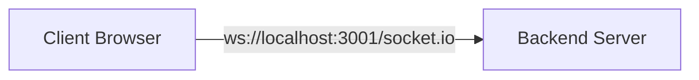
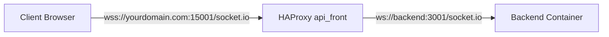
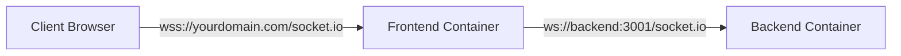

# WebSocket Configuration and Usage

## Overview

ShareThings uses WebSockets via Socket.IO for real-time communication between clients and the server. This document outlines the WebSocket configuration, event handling, and best practices for the application, as well as how WebSocket connections are handled in different deployment environments.

## Socket.IO Configuration

### Server Configuration

The Socket.IO server is configured with specific settings to ensure reliable communication, especially when operating behind proxies like HAProxy or Nginx:

```typescript
import express from 'express';
import http from 'http';
import { Server } from 'socket.io';
import cors from 'cors';
import { SessionManager } from './services/SessionManager';

// Create Express app and HTTP server
const app = express();
const server = http.createServer(app);

// Configure CORS
app.use(cors({
  origin: process.env.CORS_ORIGIN || '*',
  methods: ['GET', 'POST', 'OPTIONS'],
  credentials: true
}));

// Create session manager
const sessionManager = new SessionManager({
  sessionTimeout: parseInt(process.env.SESSION_TIMEOUT || '600000') // Default 10 minutes
});

// Configure Socket.IO server
const io = new Server(server, {
  // CORS configuration
  cors: {
    origin: process.env.CORS_ORIGIN || '*',
    methods: ['GET', 'POST'],
    credentials: true
  },
  
  // Transport configuration
  transports: ['websocket', 'polling'],
  
  // Ping configuration
  pingTimeout: 60000,
  pingInterval: 25000,
  
  // Max HTTP buffer size
  maxHttpBufferSize: 1e8 // 100MB
});

// Set up socket handlers with session manager
setupSocketHandlers(io, sessionManager);

// Start the server
const PORT = process.env.PORT || 3001;
server.listen({
  port: Number(PORT),
  host: '0.0.0.0'
}, () => {
  console.log(`Server running on port ${PORT}`);
  console.log(`Server binding to all network interfaces (0.0.0.0) - accessible from external machines`);
});

// Handle graceful shutdown
process.on('SIGTERM', () => {
  console.log('SIGTERM signal received: closing HTTP server');
  
  // Stop session manager
  sessionManager.stop();
  
  server.close(() => {
    console.log('HTTP server closed');
    process.exit(0);
  });
});
```

Key configuration options:

1. **CORS**: Cross-Origin Resource Sharing settings
2. **Transports**: Available transport methods (`websocket` and `polling`)
3. **Ping Settings**: Keep-alive configuration
4. **Buffer Size**: Maximum size of packets (100MB)
5. **Host Binding**: Binding to all network interfaces (`0.0.0.0`)

### Client Configuration

The Socket.IO client is configured to match the server settings:

```typescript
import { io, Socket } from 'socket.io-client';

// Configure Socket.IO client
const socket: Socket = io({
  // Path configuration - must match server and HAProxy
  path: '/socket.io/',
  
  // Transport configuration
  transports: ['websocket', 'polling'],
  
  // Reconnection configuration
  reconnection: true,
  reconnectionAttempts: 5,
  reconnectionDelay: 1000,
  reconnectionDelayMax: 5000,
  
  // Timeout configuration
  timeout: 20000,
  
  // Auto connect
  autoConnect: true,
  
  // Additional query parameters
  query: {
    clientVersion: '1.0.0'
  }
});

// Connection event handlers
socket.on('connect', () => {
  console.log('Connected to server');
});

socket.on('disconnect', (reason) => {
  console.log(`Disconnected: ${reason}`);
});

socket.on('connect_error', (error) => {
  console.error('Connection error:', error);
});
```

Key configuration options:

1. **Path**: Must match the server configuration
2. **Transports**: Available transport methods
3. **Reconnection**: Settings for automatic reconnection
4. **Timeout**: Connection timeout
5. **Query Parameters**: Additional information sent with the connection

## Event System

Socket.IO uses an event-based system for communication. ShareThings defines the following events:

### Server-to-Client Events

1. **client-joined**: Notifies clients when a new client joins a session
   ```typescript
   socket.on('client-joined', (data: { sessionId: string, clientId: string, clientName: string }) => {
     console.log(`Client ${data.clientName} joined session ${data.sessionId}`);
     // Update UI with new client
   });
   ```

2. **client-left**: Notifies clients when a client leaves a session
   ```typescript
   socket.on('client-left', (data: { sessionId: string, clientId: string }) => {
     console.log(`Client ${data.clientId} left session ${data.sessionId}`);
     // Update UI to remove client
   });
   ```

3. **content**: Delivers content from another client
   ```typescript
   socket.on('content', (data: { sessionId: string, content: SharedContent, data?: string }) => {
     console.log(`Received content in session ${data.sessionId}`);
     // Process and display content
   });
   ```

4. **chunk**: Delivers a content chunk from another client
   ```typescript
   socket.on('chunk', (data: { sessionId: string, chunk: ContentChunk }) => {
     console.log(`Received chunk ${data.chunk.chunkIndex}/${data.chunk.totalChunks} for content ${data.chunk.contentId}`);
     // Process chunk
   });
   ```

5. **error**: Notifies clients of errors
   ```typescript
   socket.on('error', (data: { message: string, code: string }) => {
     console.error(`Server error: ${data.message} (${data.code})`);
     // Display error to user
   });
   ```

### Client-to-Server Events

1. **join**: Client requests to join a session
   ```typescript
   socket.emit('join', {
     sessionId: 'session-123',
     clientName: 'John Doe'
   }, (response: { success: boolean, error?: string, clients?: Array<{ id: string, name: string }> }) => {
     if (response.success) {
       console.log('Joined session successfully');
       // Update UI with existing clients
     } else {
       console.error(`Failed to join session: ${response.error}`);
     }
   });
   ```

2. **leave**: Client leaves a session
   ```typescript
   socket.emit('leave', {
     sessionId: 'session-123'
   });
   ```

3. **content**: Client shares content
   ```typescript
   socket.emit('content', {
     sessionId: 'session-123',
     content: {
       contentId: 'content-456',
       senderId: socket.id,
       senderName: 'John Doe',
       contentType: 'text',
       timestamp: Date.now(),
       metadata: {
         mimeType: 'text/plain',
         size: 1024
       },
       isChunked: false,
       totalSize: 1024
     },
     data: 'Hello, world!'
   });
   ```

4. **chunk**: Client sends a content chunk
   ```typescript
   socket.emit('chunk', {
     sessionId: 'session-123',
     chunk: {
       contentId: 'content-456',
       chunkIndex: 0,
       totalChunks: 10,
       encryptedData: new Uint8Array([...]),
       iv: new Uint8Array([...])
     }
   });
   ```

## Server Implementation

The server implements event handlers for all client events with token-based authentication and extensive logging:

```typescript
export function setupSocketHandlers(io: Server, sessionManager: SessionManager): void {
  io.on('connection', (socket: Socket) => {
    console.log(`Client connected: ${socket.id}`);
    
    // Join session
    socket.on('join', async (data: {
      sessionId: string,
      clientName: string,
      fingerprint: any
    }, callback) => {
      try {
        console.log(`Client ${socket.id} attempting to join session ${data.sessionId}`);
        const sessionExists = sessionManager.getSession(data.sessionId) !== undefined;
        console.log(`Session ${data.sessionId} exists: ${sessionExists}`);

        // Join session with passphrase fingerprint authentication
        const result = await sessionManager.joinSession(
          data.sessionId,
          data.fingerprint,
          socket.id,
          data.clientName,
          socket
        );
        
        if (!result.success) {
          callback({
            success: false,
            error: result.error
          });
          return;
        }
        
        // Join Socket.IO room
        socket.join(data.sessionId);
        
        // Store session info in socket data
        socket.data.sessionId = data.sessionId;
        socket.data.sessionToken = result.token;
        
        // Get session
        const session = sessionManager.getSession(data.sessionId);
        
        // Notify other clients
        console.log(`Notifying clients in session ${data.sessionId} about new client ${socket.id} (${data.clientName})`);
        console.log(`Current clients in session: ${Array.from(session!.clients.keys()).join(', ')}`);
        
        socket.to(data.sessionId).emit('client-joined', {
          sessionId: data.sessionId,
          clientId: socket.id,
          clientName: data.clientName
        });
        
        // Return success with token and existing clients
        const clientsList = Array.from(session!.clients.values()).map(client => ({
          id: client.clientId,
          name: client.clientName
        }));
        
        console.log(`Sending initial client list to ${socket.id}:`, clientsList);
        
        // Check for duplicate client IDs in the list
        const clientIds = clientsList.map(client => client.id);
        const hasDuplicates = clientIds.length !== new Set(clientIds).size;
        if (hasDuplicates) {
          console.warn(`WARNING: Duplicate client IDs detected in session ${data.sessionId}:`,
            clientIds.filter((id, index) => clientIds.indexOf(id) !== index));
        }
        
        callback({
          success: true,
          token: result.token,
          clients: clientsList
        });
        
        console.log(`Client ${data.clientName} (${socket.id}) joined session ${data.sessionId}`);
      } catch (error) {
        console.error('Error joining session:', error);
        callback({
          success: false,
          error: error instanceof Error ? error.message : 'Unknown error'
        });
      }
    });
    
    // Leave session
    socket.on('leave', (data: { sessionId: string }) => {
      try {
        const { sessionId } = data;
        
        // Validate session
        if (socket.data.sessionId !== sessionId) {
          console.error(`Client ${socket.id} tried to leave session ${sessionId} but is not in it`);
          return;
        }
        
        // Get session
        const session = sessionManager.getSession(sessionId);
        if (!session) {
          return;
        }
        
        // Get client
        const client = session.clients.get(socket.id);
        if (!client) {
          return;
        }
        
        console.log(`Client ${client.clientName} (${socket.id}) left session ${sessionId}`);
        
        // Remove client from session
        sessionManager.removeClientFromSession(sessionId, socket.id);
        
        // Leave Socket.IO room
        socket.leave(sessionId);
        
        // Clear session data
        delete socket.data.sessionId;
        delete socket.data.sessionToken;
        
        // Notify other clients
        socket.to(sessionId).emit('client-left', {
          sessionId,
          clientId: socket.id
        });
      } catch (error) {
        console.error('Error leaving session:', error);
      }
    });
    
    // Content sharing
    socket.on('content', (data: { sessionId: string, content: any, data?: string }) => {
      try {
        const { sessionId, content, data: contentData } = data;
        
        // Validate session
        if (socket.data.sessionId !== sessionId) {
          console.error(`Client ${socket.id} tried to share content in session ${sessionId} but is not in it`);
          return;
        }
        
        // Get session
        const session = sessionManager.getSession(sessionId);
        if (!session) {
          return;
        }
        
        // Broadcast content to other clients
        socket.to(sessionId).emit('content', {
          sessionId,
          content,
          data: contentData
        });
        
        console.log(`Content ${content.contentId} shared in session ${sessionId}`);
      } catch (error) {
        console.error('Error sharing content:', error);
      }
    });
    
    // Chunk sharing
    socket.on('chunk', (data: { sessionId: string, chunk: any }) => {
      try {
        const { sessionId, chunk } = data;
        
        // Log every chunk for debugging
        console.log(`Received chunk ${chunk.chunkIndex}/${chunk.totalChunks} for content ${chunk.contentId} from client ${socket.id}`);
        
        // Validate session
        if (socket.data.sessionId !== sessionId) {
          console.error(`Client ${socket.id} tried to share chunk in session ${sessionId} but is not in it`);
          return;
        }
        
        // Get session
        const session = sessionManager.getSession(sessionId);
        if (!session) {
          console.error(`Session ${sessionId} not found for chunk ${chunk.chunkIndex}`);
          return;
        }
        
        // Broadcast chunk to other clients
        const recipients = Array.from(session.clients.keys()).filter(id => id !== socket.id);
        console.log(`Broadcasting chunk ${chunk.chunkIndex}/${chunk.totalChunks} to ${recipients.length} clients in session ${sessionId}`);
        
        socket.to(sessionId).emit('chunk', {
          sessionId,
          chunk
        });
        
        console.log(`Chunk ${chunk.chunkIndex}/${chunk.totalChunks} for content ${chunk.contentId} shared in session ${sessionId}`);
      } catch (error) {
        console.error('Error sharing chunk:', error);
      }
    });
    
    // Disconnection
    socket.on('disconnect', () => {
      console.log(`Client disconnected: ${socket.id}`);
      
      // Check if client is in a session
      const sessionId = socket.data.sessionId;
      if (sessionId) {
        // Get session
        const session = sessionManager.getSession(sessionId);
        if (session) {
          // Get client
          const client = session.clients.get(socket.id);
          
          // Remove client from session
          sessionManager.removeClientFromSession(sessionId, socket.id);
          
          // Notify other clients
          socket.to(sessionId).emit('client-left', {
            sessionId,
            clientId: socket.id
          });
          
          console.log(`Client ${client?.clientName || socket.id} removed from session ${sessionId} due to disconnect`);
        }
      }
    });
    
    // Middleware to validate session token for content-related events
    socket.use((packet, next) => {
      const [event] = packet;
      
      if (['content', 'chunk'].includes(event)) {
        const sessionId = socket.data.sessionId;
        const token = socket.data.sessionToken;
        
        if (!sessionId || !token || !sessionManager.validateSessionToken(socket.id, token)) {
          return next(new Error('Invalid session'));
        }
      }
      
      next();
    });
  });
}
```

## Client Implementation

The client implements a Socket.IO service to handle communication:

```typescript
class SocketService {
  private socket: Socket;
  private sessionId: string | null = null;
  private clientName: string | null = null;
  private eventEmitter = new EventEmitter();
  
  constructor() {
    this.socket = io({
      path: '/socket.io/',
      transports: ['websocket', 'polling'],
      reconnection: true,
      reconnectionAttempts: 5,
      reconnectionDelay: 1000,
      reconnectionDelayMax: 5000,
      timeout: 20000,
      autoConnect: true
    });
    
    this.setupEventHandlers();
  }
  
  private setupEventHandlers() {
    // Connection events
    this.socket.on('connect', () => {
      this.eventEmitter.emit('connect');
      
      // Rejoin session if we were in one
      if (this.sessionId && this.clientName) {
        this.joinSession(this.sessionId, this.clientName);
      }
    });
    
    this.socket.on('disconnect', (reason) => {
      this.eventEmitter.emit('disconnect', reason);
    });
    
    this.socket.on('connect_error', (error) => {
      this.eventEmitter.emit('error', error);
    });
    
    // Application events
    this.socket.on('client-joined', (data) => {
      this.eventEmitter.emit('client-joined', data);
    });
    
    this.socket.on('client-left', (data) => {
      this.eventEmitter.emit('client-left', data);
    });
    
    this.socket.on('content', (data) => {
      this.eventEmitter.emit('content', data);
    });
    
    this.socket.on('chunk', (data) => {
      this.eventEmitter.emit('chunk', data);
    });
    
    this.socket.on('error', (data) => {
      this.eventEmitter.emit('server-error', data);
    });
  }
  
  // Join a session
  async joinSession(sessionId: string, clientName: string): Promise<Array<{ id: string, name: string }>> {
    return new Promise((resolve, reject) => {
      this.socket.emit('join', { sessionId, clientName }, (response) => {
        if (response.success) {
          this.sessionId = sessionId;
          this.clientName = clientName;
          resolve(response.clients || []);
        } else {
          reject(new Error(response.error || 'Failed to join session'));
        }
      });
    });
  }
  
  // Leave the current session
  leaveSession() {
    if (this.sessionId) {
      this.socket.emit('leave', { sessionId: this.sessionId });
      this.sessionId = null;
      this.clientName = null;
    }
  }
  
  // Share content
  shareContent(content: SharedContent, data?: string) {
    if (!this.sessionId) {
      throw new Error('Not in a session');
    }
    
    this.socket.emit('content', {
      sessionId: this.sessionId,
      content,
      data
    });
  }
  
  // Share a content chunk
  shareChunk(chunk: ContentChunk) {
    if (!this.sessionId) {
      throw new Error('Not in a session');
    }
    
    this.socket.emit('chunk', {
      sessionId: this.sessionId,
      chunk
    });
  }
  
  // Subscribe to events
  on(event: string, listener: (...args: any[]) => void) {
    this.eventEmitter.on(event, listener);
    return this;
  }
  
  // Unsubscribe from events
  off(event: string, listener: (...args: any[]) => void) {
    this.eventEmitter.off(event, listener);
    return this;
  }
  
  // Disconnect
  disconnect() {
    this.socket.disconnect();
  }
  
  // Reconnect
  connect() {
    this.socket.connect();
  }
  
  // Check if connected
  isConnected(): boolean {
    return this.socket.connected;
  }
  
  // Get socket ID
  getSocketId(): string {
    return this.socket.id;
  }
}
```

## React Integration

The Socket.IO service is integrated with React using a context provider:

```tsx
// Socket context
const SocketContext = createContext<SocketService | null>(null);

// Socket provider component
export const SocketProvider: React.FC = ({ children }) => {
  const [socketService] = useState(() => new SocketService());
  
  useEffect(() => {
    // Clean up on unmount
    return () => {
      socketService.disconnect();
    };
  }, [socketService]);
  
  return (
    <SocketContext.Provider value={socketService}>
      {children}
    </SocketContext.Provider>
  );
};

// Hook for using the socket service
export const useSocket = () => {
  const context = useContext(SocketContext);
  if (!context) {
    throw new Error('useSocket must be used within a SocketProvider');
  }
  return context;
};
```

Usage in components:

```tsx
const SessionComponent: React.FC = () => {
  const socket = useSocket();
  const [clients, setClients] = useState<Array<{ id: string, name: string }>>([]);
  
  useEffect(() => {
    // Join session
    socket.joinSession('session-123', 'John Doe')
      .then(sessionClients => {
        setClients(sessionClients);
      })
      .catch(error => {
        console.error('Failed to join session:', error);
      });
    
    // Handle client joined
    socket.on('client-joined', (data) => {
      setClients(prevClients => [
        ...prevClients,
        { id: data.clientId, name: data.clientName }
      ]);
    });
    
    // Handle client left
    socket.on('client-left', (data) => {
      setClients(prevClients => 
        prevClients.filter(client => client.id !== data.clientId)
      );
    });
    
    // Clean up
    return () => {
      socket.leaveSession();
      socket.off('client-joined');
      socket.off('client-left');
    };
  }, [socket]);
  
  return (
    <div>
      <h2>Connected Clients</h2>
      <ul>
        {clients.map(client => (
          <li key={client.id}>{client.name}</li>
        ))}
      </ul>
    </div>
  );
};
```

## Scaling Considerations

For scaling Socket.IO across multiple servers:

1. **Redis Adapter**: Use the Socket.IO Redis adapter for multi-server setups
   ```typescript
   import { createAdapter } from '@socket.io/redis-adapter';
   import { createClient } from 'redis';
   
   const pubClient = createClient({ url: process.env.REDIS_URL });
   const subClient = pubClient.duplicate();
   
   Promise.all([pubClient.connect(), subClient.connect()]).then(() => {
     io.adapter(createAdapter(pubClient, subClient));
     console.log('Socket.IO Redis adapter initialized');
   });
   ```

2. **Sticky Sessions**: Configure HAProxy for sticky sessions to ensure clients maintain connection to the same server

3. **Horizontal Scaling**: Add more application servers behind HAProxy

## Reconnection Handling

Socket.IO has built-in reconnection capabilities, but the application needs to handle session state recovery:

```typescript
// In SocketService
private setupReconnection() {
  this.socket.on('connect', () => {
    // Check if we were in a session before disconnection
    if (this.sessionId && this.clientName) {
      console.log(`Reconnecting to session ${this.sessionId}`);
      
      // Rejoin the session
      this.socket.emit('join', {
        sessionId: this.sessionId,
        clientName: this.clientName
      }, (response) => {
        if (response.success) {
          console.log('Successfully rejoined session after reconnection');
          this.eventEmitter.emit('session-rejoined', {
            sessionId: this.sessionId,
            clients: response.clients
          });
        } else {
          console.error('Failed to rejoin session after reconnection:', response.error);
          this.eventEmitter.emit('session-rejoin-failed', {
            error: response.error
          });
          
          // Reset session state
          this.sessionId = null;
          this.clientName = null;
        }
      });
    }
  });
}
```

## Error Handling

Robust error handling for WebSocket communication:

```typescript
// In SocketService
private setupErrorHandling() {
  // Connection errors
  this.socket.on('connect_error', (error) => {
    console.error('Socket connection error:', error);
    this.eventEmitter.emit('connection-error', error);
  });
  
  this.socket.on('connect_timeout', () => {
    console.error('Socket connection timeout');
    this.eventEmitter.emit('connection-timeout');
  });
  
  // Server errors
  this.socket.on('error', (error) => {
    console.error('Socket error:', error);
    this.eventEmitter.emit('socket-error', error);
  });
  
  // Application errors
  this.socket.on('server-error', (data) => {
    console.error(`Server error: ${data.message} (${data.code})`);
    this.eventEmitter.emit('server-error', data);
  });
}
```

## Performance Optimization

Strategies for optimizing WebSocket performance:

1. **Binary Transmission**: Use binary data for large content
   ```typescript
   // Enable binary transmission
   const io = new Server(server, {
     // Other options...
     
     // Binary support
     parser: require('socket.io-msgpack-parser')
   });
   ```

2. **Throttling**: Implement throttling for high-frequency events
   ```typescript
   // Throttle function
   function throttle(func, limit) {
     let inThrottle = false;
     return function(...args) {
       if (!inThrottle) {
         func.apply(this, args);
         inThrottle = true;
         setTimeout(() => inThrottle = false, limit);
       }
     };
   }
   
   // Throttled event emission
   const throttledEmit = throttle((event, data) => {
     socket.emit(event, data);
   }, 100); // 100ms throttle
   ```

3. **Batching**: Batch multiple small messages
   ```typescript
   // Message queue
   const messageQueue = [];
   let sendTimeout = null;
   
   // Add message to queue
   function queueMessage(event, data) {
     messageQueue.push({ event, data });
     
     if (!sendTimeout) {
       sendTimeout = setTimeout(sendQueuedMessages, 50);
     }
   }
   
   // Send queued messages
   function sendQueuedMessages() {
     if (messageQueue.length > 0) {
       socket.emit('batch', messageQueue);
       messageQueue.length = 0;
     }
     
     sendTimeout = null;
   }
   ```

## Monitoring and Debugging

Tools and techniques for monitoring Socket.IO:

1. **Socket.IO Admin UI**: For development and debugging
   ```typescript
   import { instrument } from '@socket.io/admin-ui';
   
   // Set up admin UI
   instrument(io, {
     auth: {
       type: 'basic',
       username: 'admin',
       password: '$2b$10$heqvAkYMez.Va6Et2uXInOnkCT6/uQj1brkrbyG3LpopDklcq7ZOS' // "changeit"
     }
   });
   ```

2. **Logging**: Implement comprehensive logging
   ```typescript
   // Enable Socket.IO debug logs
   process.env.DEBUG = 'socket.io:*';
   
   // Custom logging middleware
   io.use((socket, next) => {
     console.log(`[${new Date().toISOString()}] Client connecting: ${socket.id}`);
     
     // Log all events
     const onevent = socket.onevent;
     socket.onevent = function(packet) {
       const args = packet.data || [];
       console.log(`[${new Date().toISOString()}] Event: ${args[0]}`);
       onevent.call(this, packet);
     };
     
     next();
   });
   ```

3. **Metrics**: Collect performance metrics
   ```typescript
   // Basic metrics
   const metrics = {
     connections: 0,
     messages: 0,
     errors: 0
   };
   
   io.on('connection', (socket) => {
     metrics.connections++;
     
     socket.on('disconnect', () => {
       metrics.connections--;
     });
     
     socket.onevent = function(packet) {
       metrics.messages++;
       this.constructor.prototype.onevent.call(this, packet);
     };
     
     socket.on('error', () => {
       metrics.errors++;
     });
   });
   
   // Expose metrics endpoint
   app.get('/metrics', (req, res) => {
     res.json(metrics);
   });
   ```

## WebSocket Connections in Different Environments

WebSocket connections are handled differently depending on the deployment environment:

### Development Environment



In development:
- The client connects directly to the backend server on port 3001
- WebSocket connections are established directly with the backend
- Environment variables are set to include port: `VITE_SOCKET_URL=http://localhost:3001`

### Production with HAProxy



In production with HAProxy:
- The client connects to the backend through HAProxy's `api_front` on port 15001
- HAProxy detects WebSocket connections using the `Upgrade` header
- HAProxy routes WebSocket connections directly to the backend container
- Environment variables are set to domain with specific port: `VITE_SOCKET_URL=https://yourdomain.com:15001`

### Production with Docker and Nginx (No HAProxy)



In production with Docker and Nginx (no HAProxy):
- The client connects to the frontend container
- Nginx proxies WebSocket connections to the backend container
- Environment variables are set to domain without port: `VITE_SOCKET_URL=https://yourdomain.com`

## Token-Based Authentication

ShareThings implements token-based authentication for Socket.IO connections:

1. When a client joins a session, the server validates the passphrase fingerprint
2. If valid, the server generates a session token and returns it to the client
3. The client stores the token and includes it in subsequent requests
4. The server validates the token for content-related events

```typescript
// Server-side token generation
private generateSessionToken(): string {
  // Generate a random token
  const array = Buffer.alloc(32);
  crypto.randomFillSync(array);
  return array.toString('hex');
}

// Client-side token storage
localStorage.setItem('sessionToken', response.token);

// Server-side token validation
validateSessionToken(clientId: string, token: string): boolean {
  return this.sessionTokens.get(clientId) === token;
}

// Socket.IO middleware for token validation
socket.use((packet, next) => {
  const [event] = packet;
  
  if (['content', 'chunk'].includes(event)) {
    const sessionId = socket.data.sessionId;
    const token = socket.data.sessionToken;
    
    if (!sessionId || !token || !sessionManager.validateSessionToken(socket.id, token)) {
      return next(new Error('Invalid session'));
    }
  }
  
  next();
});
```

## Security Considerations

1. **Authentication**: Implemented using passphrase fingerprinting and token-based authentication
2. **Authorization**: Clients must have a valid session token for content-related operations
3. **Rate Limiting**: Should be implemented to prevent abuse
4. **Input Validation**: All incoming data should be validated
5. **Secure Connections**: Use WSS (WebSocket Secure) in production
6. **CORS**: Configured to allow only trusted origins
7. **Encryption**: All content is encrypted client-side before transmission
8. **Session Expiry**: Sessions expire after a period of inactivity (default: 10 minutes)
9. **Error Handling**: Errors are properly handled and logged without exposing sensitive information
10. **Proxy Headers**: Proxy headers are properly set to preserve client information

### Security Implementation Details

```typescript
// Authentication middleware
io.use((socket, next) => {
  const token = socket.handshake.auth.token;
  
  if (!token) {
    return next(new Error('Authentication error'));
  }
  
  // Verify token
  verifyToken(token)
    .then(user => {
      socket.user = user;
      next();
    })
    .catch(err => {
      next(new Error('Authentication error'));
    });
});

// Rate limiting implementation
const rateLimiter = new Map();

io.use((socket, next) => {
  const clientIp = socket.handshake.address;
  
  // Check rate limit
  if (!rateLimiter.has(clientIp)) {
    rateLimiter.set(clientIp, {
      count: 1,
      lastReset: Date.now()
    });
  } else {
    const limit = rateLimiter.get(clientIp);
    
    // Reset counter after 1 minute
    if (Date.now() - limit.lastReset > 60000) {
      limit.count = 1;
      limit.lastReset = Date.now();
    } else if (limit.count > 100) {
      // Too many connections
      return next(new Error('Rate limit exceeded'));
    } else {
      limit.count++;
    }
  }
  
  next();
});

// Input validation
socket.on('join', (data, callback) => {
  // Validate data
  if (!data || typeof data !== 'object') {
    return callback({ success: false, error: 'Invalid data' });
  }
  
  if (!data.sessionId || typeof data.sessionId !== 'string') {
    return callback({ success: false, error: 'Invalid session ID' });
  }
  
  if (!data.clientName || typeof data.clientName !== 'string') {
    return callback({ success: false, error: 'Invalid client name' });
  }
  
  // Process valid data
  // ...
});

// HTTPS/WSS enforcement
if (process.env.NODE_ENV === 'production' && !process.env.BEHIND_PROXY) {
  console.warn('Warning: Socket.IO should be used with HTTPS in production');
}