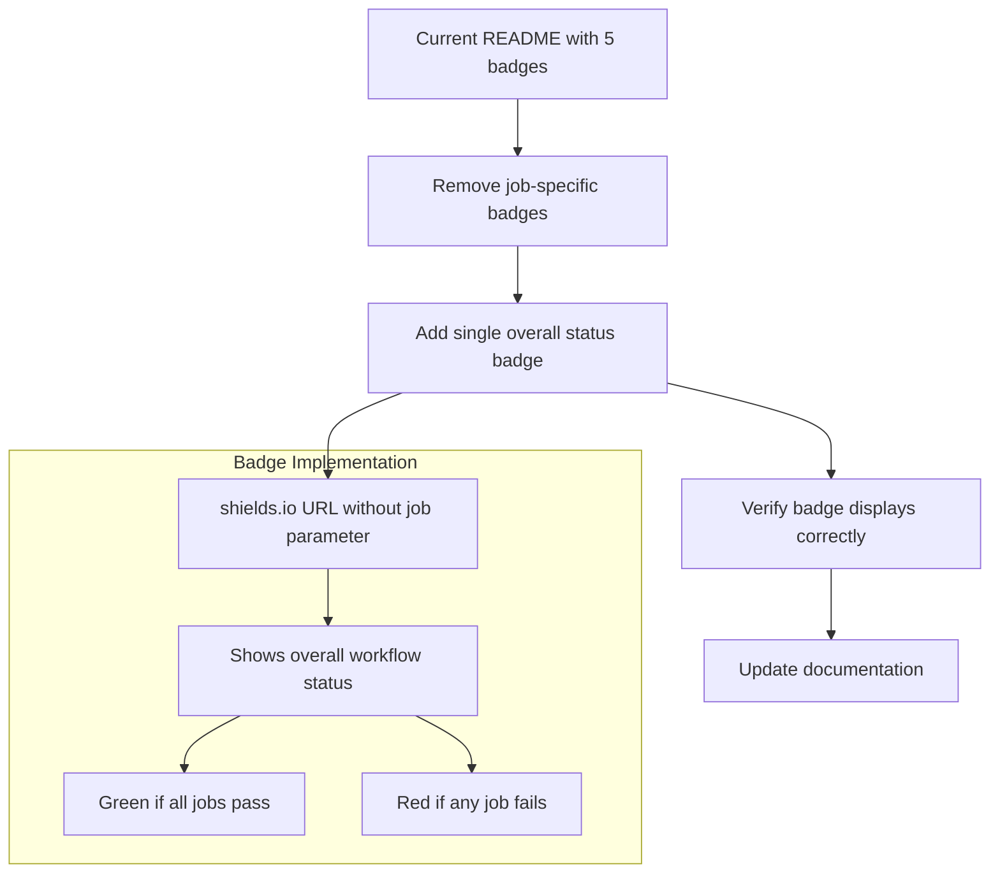

# Badge Simplification Plan

## Current Situation
- The README currently has 5 separate badges for different jobs in the CI/CD pipeline (Lint, Build and Test, Integration Tests, Test Setup, Deploy to Production)
- Each badge uses the GitHub Actions workflow status API with job-specific parameters
- According to the memory bank documentation, there was a previous issue with badges showing the same status, which was fixed by adding job-specific parameters
- However, now the user reports that the job-specific parameters aren't working correctly, with badges showing all green or all red even when the actual job statuses are mixed

## Proposed Solution
We'll simplify the approach by using a single badge that shows the overall status of the workflow. This will:
1. Replace the 5 separate badges with one consolidated badge
2. Show red if any job fails and green only if all jobs succeed
3. Still link to the GitHub Actions workflow page so users can see detailed status

## Implementation Details

### 1. Badge URL Format
Based on the information in the memory bank, we'll use the shields.io URL format without the job parameter to show the overall workflow status:

```
https://img.shields.io/github/actions/workflow/status/jsbattig/share-things/share-things-ci-cd.yml?label=Build%20Status
```

This URL will:
- Use shields.io for badge generation
- Reference the share-things-ci-cd.yml workflow file
- Set a label of "Build Status"
- Omit the job parameter to show the overall workflow status

### 2. Badge Markdown
The markdown for the new badge will be:

```markdown
[](https://github.com/jsbattig/share-things/actions/workflows/share-things-ci-cd.yml)
```

This will:
- Display a badge with the label "Build Status"
- Show the overall status of the workflow (green for success, red for failure)
- Link to the GitHub Actions workflow page when clicked

### 3. README.md Changes
We'll need to:
1. Remove the 5 existing badges
2. Add the new consolidated badge
3. Ensure the badge is placed at the top of the README, just below the project title

## Implementation Steps

1. **Update README.md**:
   - Remove the 5 existing badges
   - Add the new consolidated badge
   - Ensure the badge links to the GitHub Actions workflow page

2. **Verify the Badge**:
   - After implementation, verify that the badge correctly shows the overall status of the workflow
   - Confirm that clicking the badge takes users to the GitHub Actions workflow page

3. **Documentation**:
   - Update any relevant documentation that references the badges
   - Consider adding a note to the memory bank about the badge simplification

## Mermaid Diagram



## Benefits of This Approach

1. **Simplicity**: One badge is easier to understand at a glance than five separate badges
2. **Reliability**: Using the overall workflow status avoids issues with job-specific parameters
3. **Clarity**: The badge will clearly indicate if there are any issues in the build process
4. **Detailed Information**: Users can still access detailed job status by clicking the badge

## Example Implementation

Here's how the badge section of the README.md would change:

### Current Implementation:
```markdown
[](https://github.com/jsbattig/share-things/actions/workflows/share-things-ci-cd.yml)
[](https://github.com/jsbattig/share-things/actions/workflows/share-things-ci-cd.yml)
[](https://github.com/jsbattig/share-things/actions/workflows/share-things-ci-cd.yml)
[](https://github.com/jsbattig/share-things/actions/workflows/share-things-ci-cd.yml)
[](https://github.com/jsbattig/share-things/actions/workflows/share-things-ci-cd.yml)
```

### New Implementation:
```markdown
[](https://github.com/jsbattig/share-things/actions/workflows/share-things-ci-cd.yml)