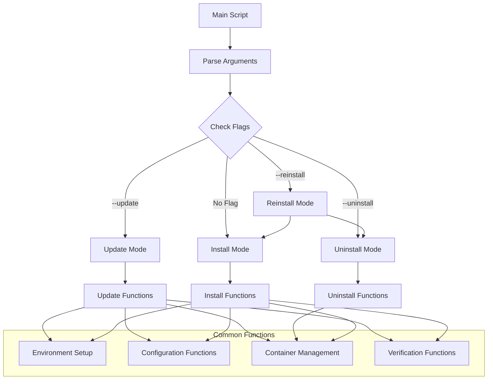

# ShareThings Consolidated Setup Script Plan

## Overview

This document outlines the plan for consolidating the `setup.sh` and `update-server.sh` scripts into a single, modularized, Podman-only script with support for installation, updates, reinstallation, and uninstallation.

## Requirements

1. Remove all Docker references - Podman only going forward
2. Consolidate setup and update into one script
3. Add support for `--reinstall`, `--update`, and `--uninstall` flags
4. Update GitHub action to use the new script with `--update` flag
5. Modularize and clean up the script
6. Ensure Podman configuration is in line with previous steps
7. Support both interactive and non-interactive modes
8. Simplify the setup process by removing unnecessary options
9. Focus on port mapping configuration
10. Maintain HAProxy compatibility
11. Update documentation

## Backup Recommendation

Before implementing the new script, create backups of the existing scripts:

```bash
mkdir -p script-backups
cp setup.sh script-backups/setup.sh.bak
cp update-server.sh script-backups/update-server.sh.bak
## Script Structure

### 1. Main Script Components



### 2. Modularization

The script will be organized into logical sections:

1. **Core Functions**
   - Text colors and formatting
   - OS detection for sed compatibility
   - Common utility functions
   - Logging functions

2. **Environment Setup**
   - Podman installation check
   - Podman-compose installation check
   - Environment file creation/management

3. **Configuration**
   - Hostname configuration
   - Port configuration
   - Environment variable management
   - HAProxy configuration

4. **Container Management**
   - Container stopping/starting
   - Image cleanup
   - Container verification
   - Port mapping management

5. **Main Script Logic**
   - Argument parsing
   - Mode selection (install, update, reinstall, uninstall)
   - Execution flow control
## Implementation Details

### Script Header

```bash
#!/bin/bash

# ShareThings Setup and Management Script
# This script handles installation, updates, and management of ShareThings application
# Podman-only implementation

# Version
VERSION="1.0.0"

# Script name for logging
SCRIPT_NAME=$(basename "$0")
```

### Command Line Arguments

The script will support the following command-line arguments:

1. **Mode Selection**
   - `--update`: Update an existing installation
   - `--reinstall`: Remove and reinstall
   - `--uninstall`: Remove the installation
   - No flag: Perform a fresh installation

2. **Configuration Parameters**
   - `--hostname=VALUE`: Set the hostname (or "auto" for auto-detection)
   - `--frontend-port=VALUE`: Set the frontend port
   - `--backend-port=VALUE`: Set the backend port
   - `--api-port=VALUE`: Set the API port
   - `--https`: Use HTTPS instead of HTTP
   - `--expose-ports`: Expose container ports to host
   - `--production`: Run in production mode (no volume mounts)

3. **Other Options**
   - `--non-interactive`: Run in non-interactive mode (use defaults or provided values)
   - `--force`: Force operation without confirmation
   - `--help`: Show help message

### Parameter Handling

The script will handle parameters in the following order of precedence:

1. Command-line arguments
2. Environment variables
3. Detected values from existing installation (for update/reinstall)
4. Interactive user input (if not in non-interactive mode)
5. Default values

### Installation Detection

To detect if ShareThings is already installed:

```bash
check_installation() {
  # Check for running containers
  if podman ps -a | grep -q "share-things"; then
    return 0  # Installation found
  fi
  
  # Check for configuration files
  if [ -f .env ] && [ -f client/.env ] && [ -f server/.env ]; then
    return 0  # Installation found
  fi
  
  return 1  # No installation found
}
```
### Mode Implementation

#### Install Mode

1. Check if already installed
2. If installed, abort and suggest `--update` or `--reinstall`
3. Configure environment (hostname, ports, etc.)
4. Create necessary .env files
5. Build and start containers
6. Verify installation

#### Update Mode

1. Backup current configuration
2. Pull latest code (if git repository)
3. Capture current container configuration
4. Stop running containers
5. Clean container image cache
6. Rebuild containers
7. Start containers with preserved configuration
8. Verify deployment

#### Reinstall Mode

1. Capture current configuration
2. Run uninstall functions
3. Run install functions with captured configuration

#### Uninstall Mode

1. Stop and remove all containers
2. Remove all related images
3. Remove configuration files (optional with prompt)
4. Clean up networks and volumes

### GitHub Actions Update

The GitHub Actions workflow needs to be updated to use the new script with the `--update` flag:

```yaml
# Current
sshpass -p "${{ secrets.GHRUserPassword }}" ssh -o StrictHostKeyChecking=no ${{ secrets.GHRUserName }}@${{ secrets.DeploymentServerIP }} "cd ~/share-things && ./update-server.sh"

# New
sshpass -p "${{ secrets.GHRUserPassword }}" ssh -o StrictHostKeyChecking=no ${{ secrets.GHRUserName }}@${{ secrets.DeploymentServerIP }} "cd ~/share-things && ./setup.sh --update --non-interactive"
```

Also update the check for running processes:

```yaml
# Current
sshpass -p "${{ secrets.GHRUserPassword }}" ssh -o StrictHostKeyChecking=no ${{ secrets.GHRUserName }}@${{ secrets.DeploymentServerIP }} "pgrep -f update-server.sh" > /dev/null

# New
sshpass -p "${{ secrets.GHRUserPassword }}" ssh -o StrictHostKeyChecking=no ${{ secrets.GHRUserName }}@${{ secrets.DeploymentServerIP }} "pgrep -f 'setup.sh --update'" > /dev/null
```
## Detailed Function Specifications

### Core Functions

#### Text Colors and Formatting

```bash
# Text colors
GREEN='\033[0;32m'
BLUE='\033[0;34m'
YELLOW='\033[1;33m'
RED='\033[0;31m'
NC='\033[0m' # No Color
```

#### OS Detection for sed Compatibility

```bash
# Detect OS for sed compatibility
if [[ "$OSTYPE" == "darwin"* ]]; then
  # macOS uses BSD sed which requires an extension argument for -i
  SED_CMD="sed -i.bak"
else
  # Linux and others use GNU sed
  SED_CMD="sed -i"
fi
```

#### Logging Functions

```bash
log_info() {
  echo -e "${BLUE}[INFO]${NC} $1"
}

log_success() {
  echo -e "${GREEN}[SUCCESS]${NC} $1"
}

log_warning() {
  echo -e "${YELLOW}[WARNING]${NC} $1"
}

log_error() {
  echo -e "${RED}[ERROR]${NC} $1"
}
```

### Environment Setup Functions

#### Check Podman Installation

```bash
check_podman() {
  if ! command -v podman &> /dev/null; then
    log_error "Podman is not installed."
    log_info "Please install Podman before running this script."
    exit 1
  fi
  
  if ! command -v podman-compose &> /dev/null; then
    log_error "Podman Compose is not installed."
    log_info "Please install Podman Compose before running this script."
    exit 1
  fi
  
  log_success "Podman $(podman --version) and Podman Compose are installed."
}
```

#### Create Environment Files

```bash
create_env_files() {
  # Create .env file from template if it doesn't exist
  if [ ! -f .env ]; then
    log_info "Creating .env file from template..."
    cp .env.example .env
    log_success "Created .env file."
  else
    log_info ".env file already exists. Skipping..."
  fi
  
  # Create client/.env file from template if it doesn't exist
  if [ ! -f client/.env ]; then
    log_info "Creating client/.env file from template..."
    cp client/.env.example client/.env
    log_success "Created client/.env file."
  else
    log_info "client/.env file already exists. Skipping..."
  fi
  
  # Create server/.env file from template if it doesn't exist
  if [ ! -f server/.env ]; then
    log_info "Creating server/.env file from template..."
    cp server/.env.example server/.env
    log_success "Created server/.env file."
  else
    log_info "server/.env file already exists. Skipping..."
  fi
}
```
### Configuration Functions

#### Configure Hostname

```bash
configure_hostname() {
  # Use command line argument if provided
  if [ -n "$HOSTNAME_ARG" ]; then
    HOSTNAME="$HOSTNAME_ARG"
  elif [ "$NON_INTERACTIVE" != "true" ]; then
    # Interactive mode
    echo ""
    echo -e "${BLUE}=== Hostname Configuration ===${NC}"
    echo "The hostname can be provided manually or automatically determined at runtime."
    echo ""
    echo "1. If you provide a hostname, it will be used for all configurations"
    echo "2. If you leave it blank, the application will auto-detect the hostname"
    echo ""
    echo "Use cases for different hostname values:"
    echo "- 'localhost': For local development only"
    echo "- IP address: For accessing from other machines on your network"
    echo "- Domain name: For production deployments with a real domain"
    echo "- Leave blank: For automatic detection (recommended)"
    echo ""
    read -p "Enter your hostname (or leave blank for auto-detection): " HOSTNAME
  else
    # Non-interactive mode with no argument - use auto-detection
    HOSTNAME=""
  fi
  
  if [ -z "$HOSTNAME" ]; then
    log_success "Using automatic hostname detection"
    HOSTNAME="auto"
  else
    log_success "Using hostname: ${HOSTNAME}"
  fi
}
```

#### Configure Ports

```bash
configure_ports() {
  # Use command line arguments if provided
  if [ -n "$FRONTEND_PORT_ARG" ]; then
    FRONTEND_PORT="$FRONTEND_PORT_ARG"
  fi
  
  if [ -n "$BACKEND_PORT_ARG" ]; then
    BACKEND_PORT="$BACKEND_PORT_ARG"
  fi
  
  if [ -n "$API_PORT_ARG" ]; then
    API_PORT="$API_PORT_ARG"
  fi
  
  # If in non-interactive mode and ports not provided, use defaults
  if [ "$NON_INTERACTIVE" == "true" ]; then
    FRONTEND_PORT=${FRONTEND_PORT:-15000}
    BACKEND_PORT=${BACKEND_PORT:-15001}
    API_PORT=${API_PORT:-15001}
    EXPOSE_PORTS=${EXPOSE_PORTS:-"true"}
    return
  fi
  
  # Interactive mode
  read -p "Are you using custom ports for HAProxy? (y/n): " USE_CUSTOM_PORTS
  if [[ $USE_CUSTOM_PORTS =~ ^[Yy]$ ]]; then
    read -p "Enter the client app port (default: 15000): " CLIENT_PORT
    CLIENT_PORT=${CLIENT_PORT:-15000}
    FRONTEND_PORT=$CLIENT_PORT
    
    read -p "Enter the API port (default: 15001): " API_PORT_INPUT
    API_PORT=${API_PORT_INPUT:-15001}
    BACKEND_PORT=$API_PORT
  else
    # Use default ports
    FRONTEND_PORT=15000
    BACKEND_PORT=15001
    API_PORT=15001
  fi
  
  # Ask if want to expose ports to host
  read -p "Do you want to expose container ports to the host? (y/n): " EXPOSE_PORTS_INPUT
  if [[ $EXPOSE_PORTS_INPUT =~ ^[Yy]$ ]]; then
    EXPOSE_PORTS="true"
  else
    EXPOSE_PORTS="false"
  fi
}
```

#### Update Environment Files

```bash
update_env_files() {
  # Update .env file
  if [ "$HOSTNAME" = "auto" ]; then
    $SED_CMD "s|API_URL=http://localhost|API_URL=auto|g" .env
    $SED_CMD "s|SOCKET_URL=http://localhost|SOCKET_URL=auto|g" .env
    $SED_CMD "s|CORS_ORIGIN=http://localhost|CORS_ORIGIN=*|g" .env
    
    # Add API_PORT to .env
    if ! grep -q "API_PORT" .env; then
      echo "API_PORT=${API_PORT}" >> .env
    else
      $SED_CMD "s|API_PORT=.*|API_PORT=${API_PORT}|g" .env
    fi
  else
    $SED_CMD "s|API_URL=http://localhost|API_URL=${PROTOCOL}://${HOSTNAME}:${API_PORT}|g" .env
    $SED_CMD "s|SOCKET_URL=http://localhost|SOCKET_URL=${PROTOCOL}://${HOSTNAME}:${API_PORT}|g" .env
    $SED_CMD "s|CORS_ORIGIN=http://localhost|CORS_ORIGIN=${PROTOCOL}://${HOSTNAME}:${FRONTEND_PORT}|g" .env
  fi
  
  # Update client/.env file
  if [ "$HOSTNAME" = "auto" ]; then
    $SED_CMD "s|VITE_API_URL=http://localhost|VITE_API_URL=auto|g" client/.env
    $SED_CMD "s|VITE_SOCKET_URL=http://localhost|VITE_SOCKET_URL=auto|g" client/.env
    
    # Add VITE_API_PORT to client/.env
    if ! grep -q "VITE_API_PORT" client/.env; then
      echo "VITE_API_PORT=${API_PORT}" >> client/.env
    else
      $SED_CMD "s|VITE_API_PORT=.*|VITE_API_PORT=${API_PORT}|g" client/.env
    fi
  else
    $SED_CMD "s|VITE_API_URL=http://localhost|VITE_API_URL=${PROTOCOL}://${HOSTNAME}:${API_PORT}|g" client/.env
    $SED_CMD "s|VITE_SOCKET_URL=http://localhost|VITE_SOCKET_URL=${PROTOCOL}://${HOSTNAME}:${API_PORT}|g" client/.env
  fi
  
  # Update server/.env file
  if [ "$HOSTNAME" = "auto" ]; then
    $SED_CMD "s|CORS_ORIGIN=http://localhost|CORS_ORIGIN=*|g" server/.env
  else
    $SED_CMD "s|CORS_ORIGIN=http://localhost|CORS_ORIGIN=${PROTOCOL}://${HOSTNAME}:${FRONTEND_PORT}|g" server/.env
  fi
  
  # Update port mappings in .env
  if [ "$EXPOSE_PORTS" = "true" ]; then
    # Check if the variables already exist in the .env file
    if grep -q "^FRONTEND_PORT=" .env; then
      # Update existing variables
      $SED_CMD "s|^FRONTEND_PORT=.*|FRONTEND_PORT=${FRONTEND_PORT}|g" .env
      $SED_CMD "s|^BACKEND_PORT=.*|BACKEND_PORT=${BACKEND_PORT}|g" .env
    elif grep -q "# FRONTEND_PORT=" .env; then
      # Uncomment and update commented variables
      $SED_CMD "s|# FRONTEND_PORT=.*|FRONTEND_PORT=${FRONTEND_PORT}|g" .env
      $SED_CMD "s|# BACKEND_PORT=.*|BACKEND_PORT=${BACKEND_PORT}|g" .env
    else
      # Add the variables if they don't exist
      echo "FRONTEND_PORT=${FRONTEND_PORT}" >> .env
      echo "BACKEND_PORT=${BACKEND_PORT}" >> .env
    fi
  fi
}
```
### Container Management Functions

#### Stop Containers

```bash
stop_containers() {
  log_info "Stopping running containers..."
  
  # Save the currently running container IDs for later verification
  RUNNING_CONTAINERS_BEFORE=$(podman ps -a -q --filter name=share-things)
  
  # First attempt with podman-compose down
  log_info "Stopping containers with podman-compose..."
  podman-compose -f $COMPOSE_FILE down
  COMPOSE_EXIT_CODE=$?
  
  # Check if any containers are still running with either naming convention
  STILL_RUNNING_AFTER_COMPOSE=$(podman ps -q --filter name=share-things)
  if [ -n "$STILL_RUNNING_AFTER_COMPOSE" ]; then
    log_warning "Some containers are still running after podman-compose down. Will try direct stop."
  fi
  
  # Second - try force stopping specific containers regardless of first attempt outcome
  log_info "Force stopping individual containers to ensure clean state..."
  
  # Get all container IDs with either naming convention
  CONTAINER_IDS=$(podman ps -a -q --filter name=share-things)
  
  if [ -n "$CONTAINER_IDS" ]; then
    # Display container IDs being stopped
    echo "$CONTAINER_IDS"
    
    # Stop with extended timeout
    for CONTAINER_ID in $CONTAINER_IDS; do
      podman stop --time 10 $CONTAINER_ID 2>/dev/null || echo "Failed to stop container $CONTAINER_ID"
    done
  else
    echo "No running containers to stop"
  fi
  
  # Remove containers with force flag
  log_info "Removing Podman containers..."
  CONTAINER_IDS=$(podman ps -a -q --filter name=share-things)
  
  if [ -n "$CONTAINER_IDS" ]; then
    # Display container IDs being removed
    echo "$CONTAINER_IDS"
    
    # Remove containers
    for CONTAINER_ID in $CONTAINER_IDS; do
      podman rm -f $CONTAINER_ID 2>/dev/null || echo "Failed to remove container $CONTAINER_ID"
    done
  else
    echo "No containers to remove"
  fi
  
  # Clean up any associated networks
  log_info "Cleaning up networks..."
  podman network prune -f 2>/dev/null || echo "Network prune not supported or no networks to remove"
  
  # Final verification to make sure ALL containers are stopped
  log_info "Performing final verification..."
  STILL_RUNNING=$(podman ps -q --filter name=share-things)
  if [ -n "$STILL_RUNNING" ]; then
    log_error "Some containers are still running despite multiple stop attempts!"
    log_error "This could cause problems with the update. Listing containers:"
    podman ps | grep "share-things"
    
    # Last resort - kill with SIGKILL
    log_error "Performing emergency container kill..."
    CONTAINER_IDS=$(podman ps -q --filter name=share-things)
    if [ -n "$CONTAINER_IDS" ]; then
      for CONTAINER_ID in $CONTAINER_IDS; do
        echo "Killing container $CONTAINER_ID"
        podman kill $CONTAINER_ID 2>/dev/null || echo "Failed to kill container $CONTAINER_ID"
      done
    fi
    
    CONTAINER_IDS=$(podman ps -a -q --filter name=share-things)
    if [ -n "$CONTAINER_IDS" ]; then
      for CONTAINER_ID in $CONTAINER_IDS; do
        echo "Removing container $CONTAINER_ID"
        podman rm -f $CONTAINER_ID 2>/dev/null || echo "Failed to remove container $CONTAINER_ID"
      done
    fi
    
    # Check one more time
    FINAL_CHECK=$(podman ps -q --filter name=share-things)
    if [ -n "$FINAL_CHECK" ]; then
      log_error "CRITICAL: Unable to stop containers. Manual intervention required."
      log_error "Please stop all ShareThings containers manually before continuing."
      exit 1
    fi
  fi
  
  log_success "All containers stopped successfully."
}
```

#### Clean Container Images

```bash
clean_container_images() {
  log_info "Cleaning container image cache before rebuilding..."
  
  # Remove dangling images (not used by any container)
  podman image prune -f
  log_success "Podman dangling images removed."
  
  # Perform full cleanup automatically in autonomous mode
  log_info "Performing full Podman system prune automatically..."
  podman system prune -f
  log_success "Podman system cache cleaned."
}
```

#### Build and Start Containers

```bash
build_and_start_containers() {
  # Determine if running in production mode
  if [ "$PRODUCTION_MODE" == "true" ]; then
    log_info "Creating temporary production docker-compose file without volume mounts..."
    
    # Create a temporary docker-compose file for production without volume mounts
    cat > podman-compose.prod.temp.yml << EOL
# Temporary production configuration for ShareThings Podman Compose

services:
  backend:
    build:
      context: ./server
      dockerfile: Dockerfile
      args:
        - PORT=${API_PORT:-15001}
    container_name: share-things-backend
    hostname: backend
    environment:
      - NODE_ENV=production
      - PORT=${API_PORT:-15001}
    ports:
      - "${BACKEND_PORT:-15001}:${API_PORT:-15001}"
    restart: always
    networks:
      app_network:
        aliases:
          - backend
    logging:
      driver: "json-file"
      options:
        max-size: "10m"
        max-file: "3"

  frontend:
    build:
      context: ./client
      dockerfile: Dockerfile
      args:
        - API_URL=auto
        - SOCKET_URL=auto
        - API_PORT=${API_PORT:-15001}
        - VITE_API_PORT=${API_PORT:-15001}  # Explicitly pass Vite env var
    container_name: share-things-frontend
    environment:
      - API_PORT=${API_PORT:-15001}
    ports:
      - "${FRONTEND_PORT:-15000}:80"
    restart: always
    depends_on:
      - backend
    networks:
      app_network:
        aliases:
          - frontend
    logging:
      driver: "json-file"
      options:
        max-size: "10m"
        max-file: "3"

# Explicit network configuration
networks:
  app_network:
    driver: bridge
EOL
    log_success "Temporary production docker-compose file created."
    
    log_info "Building containers in production mode..."
    
    # Export API_PORT as VITE_API_PORT to ensure it's available during build
    export VITE_API_PORT="${API_PORT:-15001}"
    log_info "Setting explicit VITE_API_PORT=${VITE_API_PORT} for build"
    
    podman-compose -f podman-compose.prod.temp.yml build --no-cache
    
    log_info "Starting containers in production mode with ports: Frontend=${FRONTEND_PORT}, Backend=${BACKEND_PORT}"
    
    # For podman-compose, we need to explicitly pass the environment variables
    # Include API_PORT to ensure it's available during the container runtime
    FRONTEND_PORT=$FRONTEND_PORT BACKEND_PORT=$BACKEND_PORT API_PORT=$API_PORT podman-compose -f podman-compose.prod.temp.yml up -d
    
    # Store the compose file name for later use
    COMPOSE_FILE="podman-compose.prod.temp.yml"
  else
    log_info "Building containers in development mode..."
    
    # Export API_PORT as VITE_API_PORT to ensure it's available during build
    export VITE_API_PORT="${API_PORT:-3001}"
    log_info "Setting explicit VITE_API_PORT=${VITE_API_PORT} for build"
    
    podman-compose build --no-cache
    
    log_info "Starting containers in development mode with ports: Frontend=${FRONTEND_PORT}, Backend=${BACKEND_PORT}"
    
    # For podman-compose, we need to explicitly pass the environment variables
    FRONTEND_PORT=$FRONTEND_PORT BACKEND_PORT=$BACKEND_PORT API_PORT=$API_PORT podman-compose up -d
    
    # Store the compose file name for later use
    COMPOSE_FILE="podman-compose.yml"
  fi
}
```
#### Verify Containers

```bash
verify_containers() {
  log_info "Checking container status..."
  echo "Running: podman ps --filter label=io.podman.compose.project=share-things"
  podman ps --filter label=io.podman.compose.project=share-things
  
  # Count running containers
  RUNNING_COUNT=$(podman ps --filter label=io.podman.compose.project=share-things | grep -c "share-things" || echo "0")
  if [ "$RUNNING_COUNT" -ge "2" ]; then
    log_success "Containers are running successfully!"
    
    # Check container logs for errors
    log_info "Checking container logs for errors..."
    echo "Backend container logs:"
    podman logs share-things-backend --tail 10
    
    echo "Frontend container logs:"
    podman logs share-things-frontend --tail 10
  else
    log_error "Warning: Not all containers appear to be running."
    echo "You can check container logs with: podman logs <container_name>"
    
    # Show logs for troubleshooting
    log_info "Checking container logs for errors..."
    echo "Backend container logs:"
    podman logs share-things-backend --tail 20 2>/dev/null || echo "No logs available for backend container"
    
    echo "Frontend container logs:"
    podman logs share-things-frontend --tail 20 2>/dev/null || echo "No logs available for frontend container"
  fi
}
```

### Main Script Logic

#### Argument Parsing

```bash
# Default values
INSTALL_MODE="install"
NON_INTERACTIVE="false"
FORCE_MODE="false"
PRODUCTION_MODE="false"
EXPOSE_PORTS="false"
PROTOCOL="http"

# Parse command line arguments
while [[ $# -gt 0 ]]; do
  case $1 in
    --update)
      INSTALL_MODE="update"
      shift
      ;;
    --reinstall)
      INSTALL_MODE="reinstall"
      shift
      ;;
    --uninstall)
      INSTALL_MODE="uninstall"
      shift
      ;;
    --hostname=*)
      HOSTNAME_ARG="${1#*=}"
      shift
      ;;
    --frontend-port=*)
      FRONTEND_PORT_ARG="${1#*=}"
      shift
      ;;
    --backend-port=*)
      BACKEND_PORT_ARG="${1#*=}"
      shift
      ;;
    --api-port=*)
      API_PORT_ARG="${1#*=}"
      shift
      ;;
    --https)
      PROTOCOL="https"
      shift
      ;;
    --expose-ports)
      EXPOSE_PORTS="true"
      shift
      ;;
    --production)
      PRODUCTION_MODE="true"
      shift
      ;;
    --non-interactive)
      NON_INTERACTIVE="true"
      shift
      ;;
    --force)
      FORCE_MODE="true"
      shift
      ;;
    --help)
      show_help
      exit 0
      ;;
    *)
      echo "Unknown option: $1"
      show_help
      exit 1
      ;;
  esac
done
```

#### Mode Selection

```bash
# Main execution flow based on mode
case $INSTALL_MODE in
  "install")
    # Check if already installed
    if check_installation; then
      log_error "ShareThings is already installed."
      log_info "Use --update to update the existing installation."
      log_info "Use --reinstall to remove and reinstall."
      exit 1
    fi
    
    # Perform installation
    perform_installation
    ;;
    
  "update")
    # Check if installed
    if ! check_installation; then
      log_error "ShareThings is not installed. Cannot update."
      log_info "Use the script without flags to perform a fresh installation."
      exit 1
    fi
    
    # Perform update
    perform_update
    ;;
    
  "reinstall")
    # Check if installed
    if ! check_installation; then
      log_error "ShareThings is not installed. Cannot reinstall."
      log_info "Use the script without flags to perform a fresh installation."
      exit 1
    fi
    
    # Capture current configuration
    capture_current_configuration
    
    # Perform uninstall
    perform_uninstall
    
    # Perform installation with captured configuration
    perform_installation
    ;;
    
  "uninstall")
    # Check if installed
    if ! check_installation; then
      log_error "ShareThings is not installed. Nothing to uninstall."
      exit 0
    fi
    
    # Perform uninstall
    perform_uninstall
    ;;
esac
```

## GitHub Actions Update

The GitHub Actions workflow file (`.github/workflows/share-things-ci-cd.yml`) needs to be updated to use the new script with the `--update` flag. Here's the specific change needed:

```yaml
# In the deploy-production job, update the following lines:

# Function to check if update-server.sh is running
check_update_script_running() {
  sshpass -p "${{ secrets.GHRUserPassword }}" ssh -o StrictHostKeyChecking=no ${{ secrets.GHRUserName }}@${{ secrets.DeploymentServerIP }} "pgrep -f 'setup.sh --update'" > /dev/null
  return $?
}

# Wait until any existing update-server.sh process completes
echo "Checking if setup.sh --update is already running on the production server..."
while check_update_script_running; do
  echo "setup.sh --update is currently running. Waiting 30 seconds before checking again..."
  sleep 30
done

echo "No running setup.sh --update process detected. Proceeding with deployment..."

# Set up SSH connection and run the update script, capturing the exit code
sshpass -p "${{ secrets.GHRUserPassword }}" ssh -o StrictHostKeyChecking=no ${{ secrets.GHRUserName }}@${{ secrets.DeploymentServerIP }} "cd ~/share-things && ./setup.sh --update --non-interactive"
DEPLOY_EXIT_CODE=$?

# Check if the deployment was successful
if [ $DEPLOY_EXIT_CODE -ne 0 ]; then
  echo "Deployment failed with exit code $DEPLOY_EXIT_CODE"
  exit $DEPLOY_EXIT_CODE
else
  echo "Deployment completed successfully"
fi
```

## Documentation Updates

The README.md file should be updated to reflect the new script usage. Here's a template for the updated documentation:

```markdown
## Setup and Management

ShareThings can be set up and managed using the `setup.sh` script, which supports the following operations:

### Installation

```bash
./setup.sh
```

This will guide you through an interactive setup process.

### Non-interactive Installation

```bash
./setup.sh --hostname=example.com --frontend-port=15000 --backend-port=15001 --api-port=15001 --https --expose-ports --production --non-interactive
```

### Update Existing Installation

```bash
./setup.sh --update
```

### Reinstall

```bash
./setup.sh --reinstall
```

### Uninstall

```bash
./setup.sh --uninstall
```

### Available Options

- `--update`: Update an existing installation
- `--reinstall`: Remove and reinstall
- `--uninstall`: Remove the installation
- `--hostname=VALUE`: Set the hostname (or "auto" for auto-detection)
- `--frontend-port=VALUE`: Set the frontend port
- `--backend-port=VALUE`: Set the backend port
- `--api-port=VALUE`: Set the API port
- `--https`: Use HTTPS instead of HTTP
- `--expose-ports`: Expose container ports to host
- `--production`: Run in production mode (no volume mounts)
- `--non-interactive`: Run in non-interactive mode (use defaults or provided values)
- `--force`: Force operation without confirmation
- `--help`: Show help message
```
## Conclusion

This plan outlines a comprehensive approach to consolidating the `setup.sh` and `update-server.sh` scripts into a single, modularized, Podman-only script with support for installation, updates, reinstallation, and uninstallation.

### Key Improvements

1. **Simplified Management**: A single script handles all deployment operations
2. **Podman-Only**: Removed all Docker references for a cleaner codebase
3. **Flexible Operation Modes**: Support for install, update, reinstall, and uninstall operations
4. **Improved Parameter Handling**: Command-line arguments for all configuration options
5. **Non-Interactive Support**: Can run fully automated with provided parameters
6. **Better Error Handling**: Comprehensive error checking and reporting
7. **Modular Design**: Organized into logical functions for better maintainability
8. **Improved Documentation**: Clear usage instructions for all operations

### Next Steps

1. Create backups of the existing scripts
2. Implement the consolidated script according to this plan
3. Create the test script as outlined in the Testing Plan section
4. Run the tests and fix any issues that arise
5. Update the GitHub Actions workflow to use the new script
6. Update documentation to reflect the new script usage

### Implementation Approach

The implementation should be done in the following order:

1. Core functions and utilities
2. Environment setup functions
3. Configuration functions
4. Container management functions
5. Main script logic and argument parsing
6. Test script implementation
7. Testing and debugging
8. GitHub Actions workflow update
9. Documentation updates

This approach ensures that the fundamental building blocks are in place before implementing the higher-level functionality, and that thorough testing is performed before deployment.
## Testing Plan

To ensure the consolidated script works correctly, we'll create a comprehensive test script that verifies all operations: install, update, reinstall, and uninstall. This test script will help identify and fix any issues before deploying to production.

### Test Script Design

The test script (`test-setup.sh`) will:

1. Test each operation in sequence
2. Verify the expected state after each operation
3. Log all actions and results
4. Report success or failure for each test case

```bash
#!/bin/bash

# Test script for setup.sh
# This script tests all operations: install, update, reinstall, and uninstall

# Text colors for output
GREEN='\033[0;32m'
BLUE='\033[0;34m'
YELLOW='\033[1;33m'
RED='\033[0;31m'
NC='\033[0m' # No Color

# Log functions
log_info() {
  echo -e "${BLUE}[INFO]${NC} $1"
}

log_success() {
  echo -e "${GREEN}[SUCCESS]${NC} $1"
}

log_warning() {
  echo -e "${YELLOW}[WARNING]${NC} $1"
}

log_error() {
  echo -e "${RED}[ERROR]${NC} $1"
}

# Test result tracking
TESTS_TOTAL=0
TESTS_PASSED=0
TESTS_FAILED=0

# Function to run a test and check result
run_test() {
  local test_name="$1"
  local command="$2"
  local expected_exit_code="${3:-0}"
  
  TESTS_TOTAL=$((TESTS_TOTAL + 1))
  
  log_info "Running test: $test_name"
  log_info "Command: $command"
  
  # Run the command and capture output and exit code
  OUTPUT=$(eval "$command" 2>&1)
  EXIT_CODE=$?
  
  # Check if exit code matches expected
  if [ $EXIT_CODE -eq $expected_exit_code ]; then
    log_success "Test passed: $test_name"
    TESTS_PASSED=$((TESTS_PASSED + 1))
  else
    log_error "Test failed: $test_name"
    log_error "Expected exit code: $expected_exit_code, got: $EXIT_CODE"
    log_error "Command output:"
    echo "$OUTPUT"
    TESTS_FAILED=$((TESTS_FAILED + 1))
  fi
  
  # Return the command's exit code for additional checks
  return $EXIT_CODE
}

# Function to verify containers are running
verify_containers_running() {
  log_info "Verifying containers are running..."
  
  # Check if frontend container is running
  podman ps | grep -q "share-things-frontend"
  FRONTEND_RUNNING=$?
  
  # Check if backend container is running
  podman ps | grep -q "share-things-backend"
  BACKEND_RUNNING=$?
  
  if [ $FRONTEND_RUNNING -eq 0 ] && [ $BACKEND_RUNNING -eq 0 ]; then
    log_success "Both containers are running"
    return 0
  else
    log_error "Not all containers are running"
    log_info "Current container status:"
    podman ps
    return 1
  fi
}

# Function to verify containers are not running
verify_containers_not_running() {
  log_info "Verifying containers are not running..."
  
  # Check if any share-things containers are running
  podman ps | grep -q "share-things"
  CONTAINERS_RUNNING=$?
  
  if [ $CONTAINERS_RUNNING -ne 0 ]; then
    log_success "No containers are running"
    return 0
  else
    log_error "Some containers are still running"
    log_info "Current container status:"
    podman ps
    return 1
  fi
}

# Main test sequence
log_info "Starting setup.sh test sequence"
log_info "================================"

# Test 1: Fresh installation
log_info "Test 1: Fresh installation"
run_test "Fresh installation" "./setup.sh --non-interactive --hostname=auto --frontend-port=15000 --backend-port=15001 --api-port=15001 --expose-ports"
verify_containers_running

# Test 2: Update installation
log_info "Test 2: Update installation"
run_test "Update installation" "./setup.sh --update --non-interactive"
verify_containers_running

# Test 3: Reinstall
log_info "Test 3: Reinstall"
run_test "Reinstall" "./setup.sh --reinstall --non-interactive"
verify_containers_running

# Test 4: Uninstall
log_info "Test 4: Uninstall"
run_test "Uninstall" "./setup.sh --uninstall --non-interactive"
verify_containers_not_running

# Test 5: Install with custom ports
log_info "Test 5: Install with custom ports"
run_test "Install with custom ports" "./setup.sh --non-interactive --hostname=auto --frontend-port=15100 --backend-port=15101 --api-port=15101 --expose-ports"
verify_containers_running

# Test 6: Final uninstall
log_info "Test 6: Final uninstall"
run_test "Final uninstall" "./setup.sh --uninstall --non-interactive"
verify_containers_not_running

# Report test results
log_info "================================"
log_info "Test Results:"
log_info "Total tests: $TESTS_TOTAL"
log_success "Tests passed: $TESTS_PASSED"
if [ $TESTS_FAILED -gt 0 ]; then
  log_error "Tests failed: $TESTS_FAILED"
  exit 1
else
  log_success "All tests passed!"
  exit 0
fi
```

### Test Execution Process

1. Create the test script in the project root directory
2. Make it executable: `chmod +x test-setup.sh`
3. Run the test script: `./test-setup.sh`
4. Review the test results and fix any issues
5. Re-run the tests until all pass

### Test Verification Criteria

For each operation, the test script will verify:

1. **Install**:
   - Script exits with code 0
   - Both frontend and backend containers are running
   - Configuration files exist

2. **Update**:
   - Script exits with code 0
   - Both containers are running with updated images
   - Configuration is preserved

3. **Reinstall**:
   - Script exits with code 0
   - Both containers are running with fresh images
   - Configuration is preserved

4. **Uninstall**:
   - Script exits with code 0
   - No containers are running
   - Optional: Configuration files are removed (if specified)

### Troubleshooting Common Issues

The test script will help identify common issues:

1. **Port Conflicts**: If ports are already in use, the containers won't start
2. **Permission Issues**: Especially with rootless Podman
3. **Network Configuration**: Problems with container networking
4. **SELinux Issues**: On systems with SELinux enabled
5. **Resource Constraints**: If the system doesn't have enough resources

### Fixing Issues

For any issues identified during testing:

1. Review the test output and container logs
2. Make necessary adjustments to the setup script
3. Re-run the tests to verify the fixes
4. Document any system-specific requirements or workarounds

By implementing this comprehensive testing approach, we can ensure the consolidated script works correctly in all scenarios before deploying it to production.