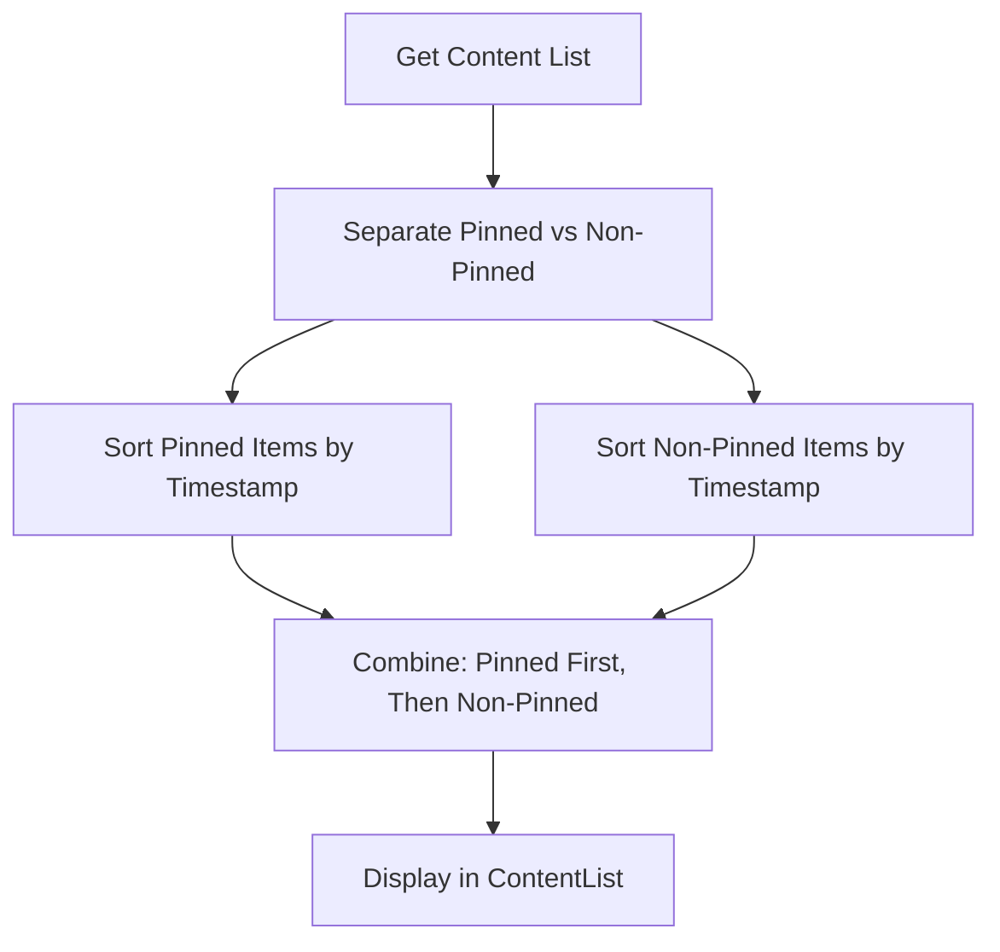
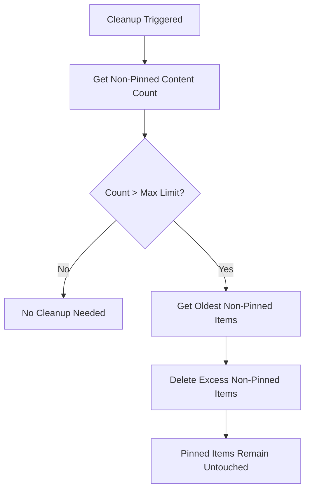
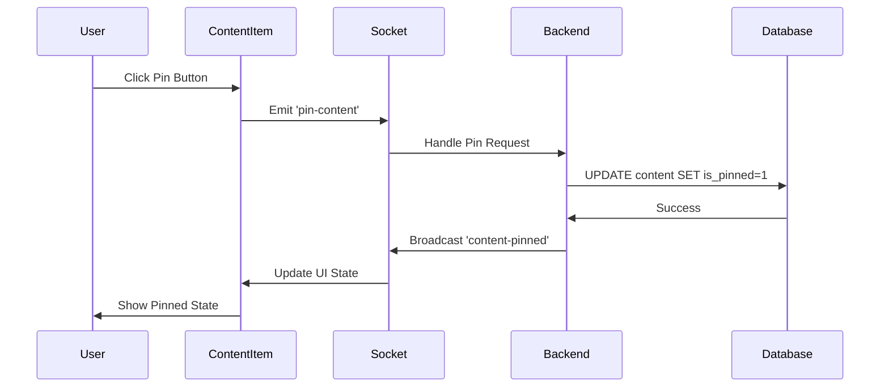

# ShareThings Content Pinning Feature Implementation Plan

## Overview

This plan outlines the implementation of a content pinning feature for the ShareThings application. Users will be able to pin important content items to keep them at the top of the content list, preventing them from being automatically purged by the cleanup logic.

## Current System Analysis

Based on the memory bank analysis, the current system has:

- **Database Schema**: SQLite with `content_metadata` and `chunk_metadata` tables
- **Storage Configuration**: Maximum 20 items per session (configurable via `MAX_ITEMS_PER_SESSION`)
- **Cleanup Logic**: Implemented in `FileSystemChunkStorage.cleanupOldContent()` method
- **Content Display**: React components with sorting by timestamp (newest/oldest first)
- **Content Types**: Text, images, and files with chunked storage support

## Feature Requirements

### Core Functionality
- Users can pin/unpin any content in a session (any user can pin/unpin any content)
- Pinned content appears at the top of the content list
- Pinned content is sorted by the current sort criteria (newest/oldest first)
- Non-pinned content appears below pinned content, also sorted by current criteria
- Pinned content is excluded from automatic cleanup logic
- Visual indicator: Pin icon (📌) in the top-right corner of each content item
- Real-time synchronization of pin/unpin actions across all clients

### Business Logic
- If max items per session is 10 and there are 5 pinned items, the system can still store 10 additional non-pinned items
- Pinned items are completely ignored in the cleanup count logic
- No limit on the number of pinned items (with optional safety configuration)

## Implementation Strategy

### 1. Database Schema Changes

#### 1.1 Add Pinned Column to Content Table
```sql
-- Migration: Add pinned column to existing content table
ALTER TABLE content ADD COLUMN is_pinned BOOLEAN NOT NULL DEFAULT 0;

-- Add index for efficient pinned content queries
CREATE INDEX IF NOT EXISTS idx_content_pinned ON content(is_pinned, created_at);
```

#### 1.2 Update Schema File
Update [`server/src/infrastructure/storage/schema.sql`](server/src/infrastructure/storage/schema.sql) to include the new column in the initial schema:

```sql
-- Content metadata table (updated)
CREATE TABLE IF NOT EXISTS content_metadata (
  content_id TEXT PRIMARY KEY,
  session_id TEXT NOT NULL,
  content_type TEXT NOT NULL,
  total_chunks INTEGER NOT NULL,
  total_size INTEGER NOT NULL,
  created_at INTEGER NOT NULL,
  encryption_iv BLOB NOT NULL,
  additional_metadata TEXT,
  is_complete BOOLEAN NOT NULL DEFAULT 0,
  last_accessed INTEGER NOT NULL,
  is_pinned BOOLEAN NOT NULL DEFAULT 0  -- NEW FIELD
);

-- Add index for pinned content queries
CREATE INDEX IF NOT EXISTS idx_content_pinned ON content_metadata(is_pinned, created_at);
```

### 2. Backend Changes

#### 2.1 Update Domain Models

**File**: [`server/src/domain/ChunkStorage.interface.ts`](server/src/domain/ChunkStorage.interface.ts)
```typescript
interface ContentMetadata {
  contentId: string;
  sessionId: string;
  contentType: string;
  totalChunks: number;
  totalSize: number;
  createdAt: number;
  isComplete: boolean;
  encryptionIv: Uint8Array;
  additionalMetadata?: string | null;
  isPinned: boolean; // NEW FIELD
}

// Add new interface methods
interface IChunkStorage {
  // ... existing methods
  pinContent(contentId: string): Promise<void>;
  unpinContent(contentId: string): Promise<void>;
  getPinnedContentCount(sessionId: string): Promise<number>;
}
```

#### 2.2 Update FileSystemChunkStorage

**File**: [`server/src/infrastructure/storage/FileSystemChunkStorage.ts`](server/src/infrastructure/storage/FileSystemChunkStorage.ts)

**Changes needed**:

1. **Database Migration**: Add migration logic for the `is_pinned` column
2. **Pin/Unpin Methods**: Add new methods to handle pinning operations
3. **Modified Cleanup Logic**: Update `cleanupOldContent` to exclude pinned items
4. **Updated Queries**: Modify content retrieval to handle pinned status

```typescript
// New methods to add:
async pinContent(contentId: string): Promise<void> {
  if (!this.isInitialized || !this.db) {
    throw new Error('Storage not initialized');
  }

  await this.db.run(
    'UPDATE content SET is_pinned = 1 WHERE id = ?',
    contentId
  );
}

async unpinContent(contentId: string): Promise<void> {
  if (!this.isInitialized || !this.db) {
    throw new Error('Storage not initialized');
  }

  await this.db.run(
    'UPDATE content SET is_pinned = 0 WHERE id = ?',
    contentId
  );
}

async getPinnedContentCount(sessionId: string): Promise<number> {
  if (!this.isInitialized || !this.db) {
    throw new Error('Storage not initialized');
  }

  const result = await this.db.get<{ count: number }>(
    'SELECT COUNT(*) as count FROM content WHERE session_id = ? AND is_pinned = 1',
    sessionId
  );

  return result?.count || 0;
}

// Modified method:
async cleanupOldContent(sessionId: string, maxItems: number): Promise<{ removed: string[] }> {
  if (!this.isInitialized || !this.db) {
    throw new Error('Storage not initialized');
  }

  // Only count and cleanup non-pinned items
  const oldContent = await this.db.all<{ id: string }[]>(
    `SELECT id FROM content
     WHERE session_id = ? AND is_pinned = 0
     ORDER BY created_at DESC
     LIMIT -1 OFFSET ?`,
    sessionId,
    maxItems
  );

  const removed: string[] = [];
  for (const content of oldContent) {
    await this.deleteContent(content.id);
    removed.push(content.id);
  }

  return { removed };
}

// Update getContentMetadata to include pinned status
async getContentMetadata(sessionId: string, limit: number = 50): Promise<ContentMetadata[]> {
  // ... existing code ...
  
  const rows = await this.db.all<ContentRow[]>(
    `SELECT
       id as contentId,
       session_id as sessionId,
       content_type as contentType,
       total_chunks as totalChunks,
       total_size as totalSize,
       created_at as createdAt,
       encryption_iv as encryptionIv,
       mime_type,
       additional_metadata,
       is_pinned as isPinned
     FROM content
     WHERE session_id = ?
     ORDER BY is_pinned DESC, created_at DESC
     LIMIT ?`,
    sessionId,
    limit
  );

  return rows.map(row => ({
    contentId: row.contentId,
    sessionId: row.sessionId,
    contentType: row.contentType,
    totalChunks: row.totalChunks,
    totalSize: row.totalSize || 0,
    createdAt: row.createdAt,
    isComplete: true,
    encryptionIv: row.encryptionIv ? new Uint8Array(row.encryptionIv) : new Uint8Array(12),
    additionalMetadata: row.additional_metadata || (row.mime_type ? JSON.stringify({ mimeType: row.mime_type }) : null),
    isPinned: Boolean(row.isPinned) // NEW FIELD
  }));
}
```

#### 2.3 Update Storage Configuration

**File**: [`server/src/infrastructure/config/storage.config.ts`](server/src/infrastructure/config/storage.config.ts)

Add configuration for maximum pinned items (optional safety limit):
```typescript
interface StorageConfig {
  storagePath: string;
  maxItemsPerSession: number;
  maxItemsToSend: number;
  cleanupInterval: number;
  maxPinnedItemsPerSession: number; // NEW: Default 50 (optional safety limit)
}

export function getStorageConfig(): StorageConfig {
  return {
    storagePath: process.env.CHUNK_STORAGE_PATH || './data/sessions',
    maxItemsPerSession: parseInt(process.env.MAX_ITEMS_PER_SESSION || '20', 10),
    maxItemsToSend: parseInt(process.env.MAX_ITEMS_TO_SEND || '5', 10),
    cleanupInterval: parseInt(process.env.CLEANUP_INTERVAL || '3600000', 10),
    maxPinnedItemsPerSession: parseInt(process.env.MAX_PINNED_ITEMS_PER_SESSION || '50', 10)
  };
}
```

#### 2.4 Add Socket.IO Events

**File**: [`server/src/socket/index.ts`](server/src/socket/index.ts)

Add new socket events:
```typescript
// New events to handle:
socket.on('pin-content', async (data: { sessionId: string, contentId: string }) => {
  try {
    await chunkStorage.pinContent(data.contentId);
    
    // Broadcast to all clients in the session
    socket.to(data.sessionId).emit('content-pinned', {
      sessionId: data.sessionId,
      contentId: data.contentId,
      pinnedBy: socket.data.clientName
    });
    
    // Confirm to sender
    socket.emit('content-pinned', {
      sessionId: data.sessionId,
      contentId: data.contentId,
      pinnedBy: socket.data.clientName
    });
  } catch (error) {
    socket.emit('pin-error', { contentId: data.contentId, error: error.message });
  }
});

socket.on('unpin-content', async (data: { sessionId: string, contentId: string }) => {
  try {
    await chunkStorage.unpinContent(data.contentId);
    
    // Broadcast to all clients in the session
    socket.to(data.sessionId).emit('content-unpinned', {
      sessionId: data.sessionId,
      contentId: data.contentId,
      unpinnedBy: socket.data.clientName
    });
    
    // Confirm to sender
    socket.emit('content-unpinned', {
      sessionId: data.sessionId,
      contentId: data.contentId,
      unpinnedBy: socket.data.clientName
    });
  } catch (error) {
    socket.emit('unpin-error', { contentId: data.contentId, error: error.message });
  }
});
```

### 3. Frontend Changes

#### 3.1 Update Data Models

**File**: [`client/src/contexts/ContentStoreContext.tsx`](client/src/contexts/ContentStoreContext.tsx)

Update the `SharedContent` interface:
```typescript
interface SharedContent {
  contentId: string;
  senderId: string;
  senderName: string;
  contentType: ContentType;
  timestamp: number;
  metadata: ContentMetadata;
  isChunked: boolean;
  totalChunks?: number;
  totalSize: number;
  isPinned: boolean; // NEW FIELD
}

// Add new context methods
interface ContentStoreContextType {
  // ... existing methods
  pinContent: (contentId: string) => Promise<void>;
  unpinContent: (contentId: string) => Promise<void>;
}
```

#### 3.2 Update ContentItem Component

**File**: [`client/src/components/content/ContentItem.tsx`](client/src/components/content/ContentItem.tsx)

**Changes**:
1. Add pin/unpin button in top-right corner
2. Add visual indicator (📌 icon) for pinned items
3. Add click handler for pin/unpin functionality
4. Add hover effects and tooltips

```tsx
import { RiPushpinFill, RiPushpinLine } from 'react-icons/ri';

const ContentItem: React.FC<ContentItemProps> = React.memo(({ contentId }) => {
  const { getContent, pinContent, unpinContent } = useContentStore();
  const content = getContent(contentId);
  
  if (!content) return null;
  
  const handlePinToggle = useCallback(async (e: React.MouseEvent) => {
    e.stopPropagation();
    try {
      if (content.metadata.isPinned) {
        await unpinContent(contentId);
      } else {
        await pinContent(contentId);
      }
    } catch (error) {
      console.error('Failed to toggle pin status:', error);
    }
  }, [content.metadata.isPinned, contentId, pinContent, unpinContent]);

  return (
    <Box position="relative" /* ... other props */>
      {/* Pin/Unpin Button */}
      <IconButton
        icon={<Icon as={content.metadata.isPinned ? RiPushpinFill : RiPushpinLine} />}
        aria-label={content.metadata.isPinned ? "Unpin content" : "Pin content"}
        size="sm"
        variant="ghost"
        position="absolute"
        top={2}
        right={2}
        onClick={handlePinToggle}
        colorScheme={content.metadata.isPinned ? "blue" : "gray"}
        _hover={{
          bg: content.metadata.isPinned ? "blue.100" : "gray.100"
        }}
        title={content.metadata.isPinned ? "Unpin this content" : "Pin this content"}
        zIndex={1}
      />
      
      {/* Existing content rendering */}
      {/* ... rest of component */}
    </Box>
  );
});
```

#### 3.3 Update ContentList Component

**File**: [`client/src/components/content/ContentList.tsx`](client/src/components/content/ContentList.tsx)

**Changes**:
1. Modify sorting logic to show pinned items first
2. Within pinned items, sort by the selected criteria (newest/oldest)
3. Within non-pinned items, sort by the selected criteria

```typescript
// Sort content list - memoized for performance
const sortedContentList = useMemo(() => {
  return [...contentList].sort((a, b) => {
    // First, sort by pinned status (pinned items first)
    if (a.isPinned !== b.isPinned) {
      return a.isPinned ? -1 : 1;
    }
    
    // Then sort by timestamp within each group (pinned/non-pinned)
    if (sortOrder === 'asc') {
      return a.timestamp - b.timestamp;
    } else {
      return b.timestamp - a.timestamp;
    }
  });
}, [contentList, sortOrder]);

// Add visual separator between pinned and non-pinned content
const pinnedItems = sortedContentList.filter(item => item.isPinned);
const nonPinnedItems = sortedContentList.filter(item => !item.isPinned);

return (
  <VStack spacing={4} align="stretch">
    {/* Pinned Items Section */}
    {pinnedItems.length > 0 && (
      <>
        {pinnedItems.map((content) => (
          <ContentItem key={content.contentId} contentId={content.contentId} />
        ))}
        
        {/* Separator if there are both pinned and non-pinned items */}
        {nonPinnedItems.length > 0 && (
          <Divider />
        )}
      </>
    )}
    
    {/* Non-Pinned Items Section */}
    {nonPinnedItems.map((content) => (
      <ContentItem key={content.contentId} contentId={content.contentId} />
    ))}
  </VStack>
);
```

#### 3.4 Add Socket Event Handlers

**File**: [`client/src/contexts/SocketContext.tsx`](client/src/contexts/SocketContext.tsx)

Add handlers for pin/unpin events:
```typescript
// New socket event handlers:
socket.on('content-pinned', (data: { sessionId: string, contentId: string, pinnedBy: string }) => {
  // Update content store to mark content as pinned
  updateContentPinStatus(data.contentId, true);
});

socket.on('content-unpinned', (data: { sessionId: string, contentId: string, unpinnedBy: string }) => {
  // Update content store to mark content as unpinned
  updateContentPinStatus(data.contentId, false);
});

socket.on('pin-error', (data: { contentId: string, error: string }) => {
  console.error('Pin operation failed:', data.error);
  // Show error toast
});

socket.on('unpin-error', (data: { contentId: string, error: string }) => {
  console.error('Unpin operation failed:', data.error);
  // Show error toast
});
```

### 4. API Changes

#### 4.1 New REST Endpoints

Add new endpoints for pinning operations:

```typescript
// POST /api/sessions/:sessionId/content/:contentId/pin
app.post('/api/sessions/:sessionId/content/:contentId/pin', async (req, res) => {
  try {
    await chunkStorage.pinContent(req.params.contentId);
    res.json({ success: true });
  } catch (error) {
    res.status(500).json({ error: error.message });
  }
});

// DELETE /api/sessions/:sessionId/content/:contentId/pin
app.delete('/api/sessions/:sessionId/content/:contentId/pin', async (req, res) => {
  try {
    await chunkStorage.unpinContent(req.params.contentId);
    res.json({ success: true });
  } catch (error) {
    res.status(500).json({ error: error.message });
  }
});
```

### 5. Testing Strategy

#### 5.1 Unit Tests

**Files to create/update**:
- `server/src/__tests__/unit/FileSystemChunkStorage.pin.test.ts`
- `server/src/__tests__/unit/ContentPinning.test.ts`
- `client/src/__tests__/components/ContentItem.pin.test.tsx`

**Test scenarios**:
```typescript
describe('Content Pinning', () => {
  it('should pin content successfully', async () => {
    // Test pinning functionality
  });
  
  it('should unpin content successfully', async () => {
    // Test unpinning functionality
  });
  
  it('should exclude pinned content from cleanup', async () => {
    // Create 25 items (5 pinned, 20 non-pinned)
    // Set max items to 20
    // Trigger cleanup
    // Verify all 5 pinned items remain
    // Verify only newest 20 non-pinned items remain
  });
  
  it('should sort pinned items first', async () => {
    // Test sorting logic
  });
  
  it('should handle socket events correctly', async () => {
    // Test real-time synchronization
  });
});
```

#### 5.2 Integration Tests

**File**: `server/src/__tests__/integration/content-pinning.test.ts`

**Test scenarios**:
1. Pin content and verify it appears first in list
2. Verify pinned content survives cleanup when limit is exceeded
3. Test stress scenario: Create more pinned items than max limit
4. Test real-time pin/unpin synchronization across clients

#### 5.3 Stress Test

**File**: `test/e2e/functional/pinning-stress.test.ts`

**Test scenario**:
```typescript
describe('Pinning Stress Test', () => {
  it('should handle more pinned items than max session limit', async () => {
    const maxItems = 10;
    const pinnedItemsCount = 15;
    const nonPinnedItemsCount = 10;
    
    // Set max items to 10
    // Create and pin 15 items
    // Create 10 additional non-pinned items
    // Trigger cleanup
    // Verify all 15 pinned items remain
    // Verify only newest non-pinned items remain (respecting the 10 limit)
    
    const pinnedItems = await getPinnedContent(sessionId);
    const nonPinnedItems = await getNonPinnedContent(sessionId);
    
    expect(pinnedItems).toHaveLength(15);
    expect(nonPinnedItems.length).toBeLessThanOrEqual(10);
  });
  
  it('should handle concurrent pin/unpin operations', async () => {
    // Test concurrent operations from multiple clients
  });
});
```

## Implementation Phases

### Phase 1: Backend Foundation (Week 1)
1. ✅ Database schema migration
2. ✅ Update domain models
3. ✅ Implement pin/unpin methods in FileSystemChunkStorage
4. ✅ Update cleanup logic to exclude pinned items
5. ✅ Add unit tests for backend functionality

### Phase 2: Frontend Implementation (Week 2)
1. ✅ Update client-side data models
2. ✅ Implement pin/unpin UI in ContentItem component
3. ✅ Update ContentList sorting logic
4. ✅ Add socket event handlers
5. ✅ Add frontend unit tests

### Phase 3: Integration & Testing (Week 3)
1. ✅ Implement socket.io events for real-time synchronization
2. ✅ Add REST API endpoints
3. ✅ Create integration tests
4. ✅ Implement stress tests
5. ✅ End-to-end testing

### Phase 4: Polish & Documentation (Week 4)
1. ✅ UI/UX improvements and animations
2. ✅ Error handling and edge cases
3. ✅ Performance optimization
4. ✅ Documentation updates
5. ✅ Final testing and bug fixes

## Database Migration Strategy

```sql
-- Migration script: 002-add-pinning-support.sql
BEGIN TRANSACTION;

-- Add is_pinned column with default value
ALTER TABLE content ADD COLUMN is_pinned BOOLEAN NOT NULL DEFAULT 0;

-- Create index for efficient queries
CREATE INDEX IF NOT EXISTS idx_content_pinned ON content(is_pinned, created_at);

-- Update any existing content to be unpinned (redundant but explicit)
UPDATE content SET is_pinned = 0 WHERE is_pinned IS NULL;

COMMIT;
```

## Configuration Changes

**Environment Variables**:
```bash
# Optional: Maximum pinned items per session (safety limit)
MAX_PINNED_ITEMS_PER_SESSION=50

# Existing: Maximum total items per session (now applies only to non-pinned)
MAX_ITEMS_PER_SESSION=20
```

## Mermaid Diagrams

### Content Sorting Flow


### Cleanup Logic Flow


### Pin/Unpin User Flow


## Risk Assessment & Mitigation

### Potential Risks
1. **Performance Impact**: Large number of pinned items could affect query performance
   - **Mitigation**: Add database indexes and optional limits
   
2. **Storage Growth**: Pinned items never get cleaned up automatically
   - **Mitigation**: Add optional maximum pinned items limit and manual cleanup tools
   
3. **UI Complexity**: Pin/unpin buttons might clutter the interface
   - **Mitigation**: Use subtle styling and show on hover
   
4. **Race Conditions**: Concurrent pin/unpin operations
   - **Mitigation**: Use database transactions and proper error handling

### Success Metrics
- ✅ Pinned content always appears at the top
- ✅ Pinned content survives cleanup operations
- ✅ Real-time synchronization works across all clients
- ✅ No performance degradation with up to 50 pinned items
- ✅ Stress test passes with more pinned items than session limit

## Conclusion

This comprehensive plan provides a complete roadmap for implementing the content pinning feature while maintaining the existing functionality and ensuring robust testing coverage. The implementation follows the existing architecture patterns and maintains backward compatibility.

The key innovation is the separation of pinned and non-pinned content in the cleanup logic, ensuring that pinned items are completely excluded from automatic deletion while still respecting the session limits for non-pinned content.