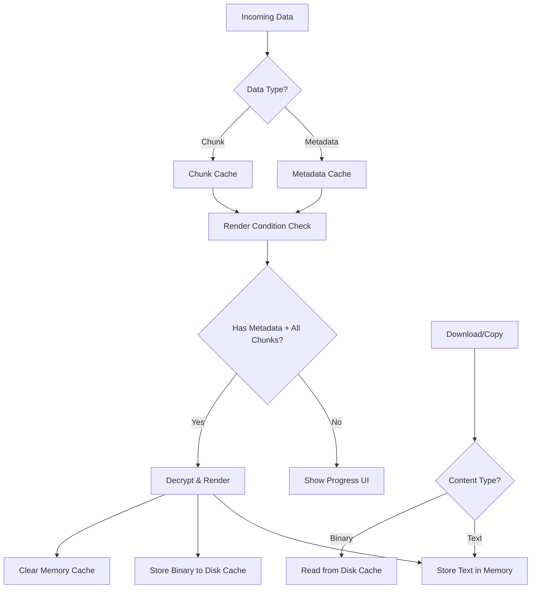

# Content Store Refactoring Plan

## 🎯 **OBJECTIVE**
Refactor the content rendering process to eliminate production issues including "loading limbo", "half alive" content, and race conditions through a clean two-dictionary cache system.

## 📋 **CURRENT PROBLEMS**

### **Critical Issues Identified**
1. **Race Conditions**: Metadata and chunks arrive separately, causing timing issues
2. **Singleton Mess**: Complex state management with refs, maps, and reassembly flags  
3. **Premature Cleanup**: Chunk stores cleaned up before successful rendering
4. **Inconsistent State**: Content marked complete but data missing ("half alive")
5. **No Progress Feedback**: Users see "loading limbo" with no progress indication
6. **Missing Chunks**: Chunk 0 and 1 missing in large files causing reassembly failures
7. **Decryption Failures**: Key derivation mismatches between sharing and restoration

## 🏗️ **NEW ARCHITECTURE DESIGN**

### **Core Concept: Two-Dictionary Cache System**



### **Key Principles**
1. **Cache Everything**: Store all incoming metadata and chunks immediately
2. **Clear Render Condition**: Only render when metadata + all chunks available
3. **Progress Display**: Show progress UI as pieces arrive
4. **Memory Cleanup**: Discard cache upon successful rendering
5. **Disk-Based Operations**: Use disk cache for non-text content operations

## 🔧 **IMPLEMENTATION STRATEGY**

### **Phase 1: New Data Structures**

```typescript
// New simplified interfaces
interface ContentMetadataEntry {
  contentId: string;
  metadata: SharedContent;
  receivedAt: number;
}

interface ContentChunkEntry {
  contentId: string;
  chunkIndex: number;
  chunk: ContentChunk;
  receivedAt: number;
}

interface ContentProgress {
  contentId: string;
  metadata?: ContentMetadataEntry;
  chunks: Map<number, ContentChunkEntry>;
  totalChunks?: number;
  receivedChunks: number;
  isReadyToRender: boolean;
  progressPercentage: number;
}

interface RenderedContent {
  contentId: string;
  metadata: SharedContent;
  textData?: string;  // Only for text content
  diskCachePath?: string;  // For binary content
  renderedAt: number;
}
```

### **Phase 2: Core Cache System**

```typescript
// Two primary dictionaries
const metadataCache = new Map<string, ContentMetadataEntry>();
const chunkCache = new Map<string, Map<number, ContentChunkEntry>>();

// Progress tracking
const contentProgress = new Map<string, ContentProgress>();

// Final rendered content
const renderedContent = new Map<string, RenderedContent>();
```

### **Phase 3: Rendering Logic**

```typescript
// Render condition check
function checkRenderCondition(contentId: string): boolean {
  const progress = contentProgress.get(contentId);
  if (!progress) return false;
  
  const hasMetadata = !!progress.metadata;
  const hasAllChunks = progress.totalChunks ? 
    progress.receivedChunks === progress.totalChunks : false;
  
  return hasMetadata && hasAllChunks;
}

// Render process
async function renderContent(contentId: string): Promise<void> {
  // 1. Decrypt all chunks
  // 2. Reassemble content
  // 3. Store text in memory OR binary to disk
  // 4. Clear memory cache for this content
  // 5. Update UI
}
```

### **Phase 4: Progress UI**

```typescript
// Progress component
interface ContentProgressProps {
  contentId: string;
  progress: ContentProgress;
}

function ContentProgressItem({ contentId, progress }: ContentProgressProps) {
  return (
    <div className="content-progress">
      <div className="progress-header">
        {progress.metadata?.metadata.fileName || 'Unknown Content'}
      </div>
      <div className="progress-bar">
        <div 
          className="progress-fill" 
          style={{ width: `${progress.progressPercentage}%` }}
        />
      </div>
      <div className="progress-text">
        {progress.receivedChunks}/{progress.totalChunks || '?'} chunks
      </div>
    </div>
  );
}
```

### **Phase 5: Disk Cache Integration**

```typescript
// Disk cache service
class DiskCacheService {
  async storeContent(contentId: string, data: Blob): Promise<string> {
    // Store to IndexedDB or similar
    // Return cache path/key
  }
  
  async retrieveContent(contentId: string): Promise<Blob | null> {
    // Retrieve from disk cache
  }
  
  async clearContent(contentId: string): Promise<void> {
    // Remove from disk cache
  }
}
```

### **Phase 6: Download/Copy Functions**

```typescript
// New download function
async function downloadContent(contentId: string): Promise<void> {
  const rendered = renderedContent.get(contentId);
  if (!rendered) return;
  
  if (rendered.textData) {
    // Download text directly from memory
    downloadTextContent(rendered.textData, rendered.metadata);
  } else if (rendered.diskCachePath) {
    // Retrieve from disk cache and download
    const blob = await diskCache.retrieveContent(contentId);
    if (blob) downloadBlobContent(blob, rendered.metadata);
  }
}

// New copy function
async function copyToClipboard(contentId: string): Promise<void> {
  const rendered = renderedContent.get(contentId);
  if (!rendered) return;
  
  if (rendered.textData) {
    // Copy text directly from memory
    await navigator.clipboard.writeText(rendered.textData);
  } else if (rendered.diskCachePath) {
    // Retrieve from disk cache and copy
    const blob = await diskCache.retrieveContent(contentId);
    if (blob) await copyBlobToClipboard(blob);
  }
}
```

## 🚀 **IMPLEMENTATION BENEFITS**

1. **✅ Eliminates Race Conditions**: Clear separation of metadata and chunk handling
2. **✅ Progress Feedback**: Users see real-time progress as chunks arrive
3. **✅ Clean State Management**: Simple dictionaries replace complex singleton state
4. **✅ Reliable Rendering**: Clear conditions for when content can be rendered
5. **✅ Memory Efficiency**: Cache cleared after rendering, disk used for binary content
6. **✅ Consistent Operations**: Download/copy always work from the same data sources

## 📝 **IMPLEMENTATION TIMELINE**

### **Step 1: Create New Interfaces** (1-2 hours)
- Define new data structures
- Create disk cache service interface

### **Step 2: Implement Core Cache System** (2-3 hours)
- Replace current state management
- Implement metadata/chunk caching
- Add render condition logic

### **Step 3: Add Progress UI** (1-2 hours)
- Create progress components
- Update ContentList to show progress
- Add real-time progress updates

### **Step 4: Implement Rendering Engine** (2-3 hours)
- Decrypt and reassemble logic
- Text memory storage
- Binary disk cache storage
- Memory cleanup after rendering

### **Step 5: Refactor Download/Copy** (1-2 hours)
- Update download functions
- Update copy to clipboard functions
- Test with both text and binary content

### **Step 6: Testing & Validation** (2-3 hours)
- Test file upload scenarios
- Test session restoration
- Test deletion functionality
- Verify no "half alive" content

**Total Estimated Time: 9-15 hours**

## 🎯 **SUCCESS CRITERIA**

1. **No Loading Limbo**: Files complete upload and become immediately usable
2. **No Half-Alive Content**: Deleted content is completely removed
3. **Progress Feedback**: Users see progress as chunks arrive
4. **Reliable Operations**: Download/copy always work correctly
5. **Memory Efficiency**: No memory leaks or excessive cache usage
6. **Session Restoration**: Content properly restores after re-login
7. **Chunk Completeness**: All chunks (including 0 and 1) properly handled

## 🔍 **TESTING STRATEGY**

### **Test Scenarios**
1. **Small Text Content**: Single chunk, immediate rendering
2. **Large File Upload**: Multi-chunk, progress display, final rendering
3. **Session Restoration**: Re-login and verify content restoration
4. **Content Deletion**: Verify complete removal from all caches
5. **Download Operations**: Test both text and binary downloads
6. **Copy Operations**: Test clipboard functionality
7. **Race Conditions**: Rapid metadata/chunk arrival
8. **Network Interruptions**: Partial chunk reception handling

### **Performance Metrics**
- Memory usage during large file uploads
- Disk cache efficiency
- UI responsiveness during chunk processing
- Time to render after final chunk received

## 📋 **MIGRATION STRATEGY**

1. **Backward Compatibility**: Maintain existing API surface
2. **Gradual Migration**: Replace components incrementally
3. **Feature Flags**: Enable new system progressively
4. **Rollback Plan**: Keep old system available during transition
5. **Data Migration**: Handle existing cached content gracefully

This refactoring will transform the ShareThings content system from a fragile, race-condition-prone architecture to a robust, user-friendly system with clear progress feedback and reliable operations.