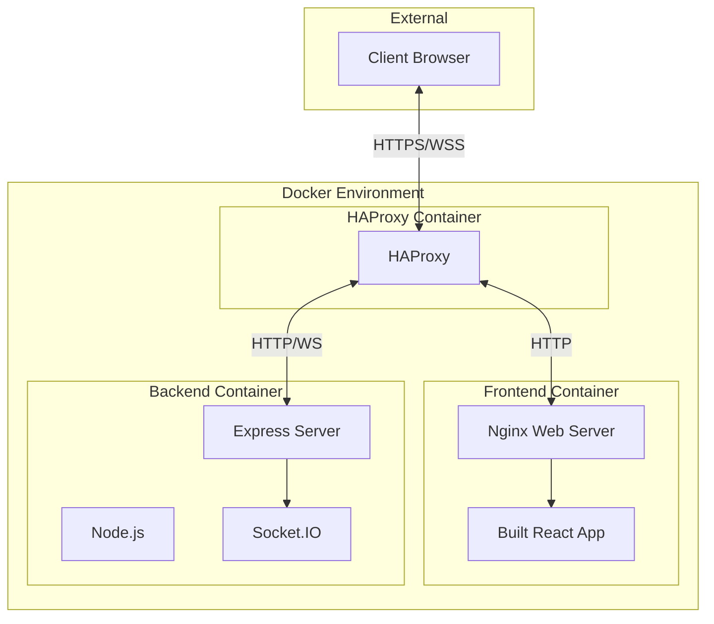

# ShareThings Docker Architecture Overview

## Introduction

This document provides a high-level overview of the Docker-based architecture for the ShareThings application. The architecture is designed to be production-ready, scalable, and easy to deploy.

## Architecture Decision: Static Files vs Development Server

For serving the client application in production, we've chosen to build the React application into static files and serve them with Nginx rather than using the development server. This decision was made for the following reasons:

1. **Performance**: Static files served by Nginx are significantly more performant than using a development server
2. **Resource Efficiency**: Nginx uses fewer resources than running a Node.js development server
3. **Industry Standard**: This approach is the standard for deploying React applications in production
4. **Compatibility**: Works well with HAProxy for load balancing and SSL termination
5. **Scalability**: Easier to scale horizontally with multiple instances

## Architecture Diagram

## Key Components

### 1. HAProxy

HAProxy sits at the edge of the architecture and handles:
- SSL termination
- Load balancing
- WebSocket proxying
- Routing traffic to the appropriate container

### 2. Frontend Container

The frontend container runs Nginx and serves the built React application:
- Static files are built during the Docker image creation
- Nginx is configured to handle React Router
- Proxy configuration for API and WebSocket requests

### 3. Backend Container

The backend container runs the Node.js application:
- Express server for HTTP endpoints
- Socket.IO for WebSocket communication
- Session management and business logic

## Data Flow

1. **Client Request**:
   - Client connects to HAProxy via HTTPS
   - HAProxy terminates SSL and routes the request

2. **Static Content**:
   - Regular HTTP requests are routed to the frontend container
   - Nginx serves the static React application

3. **API Requests**:
   - API requests are proxied through Nginx to the backend container
   - Express handles the API requests

4. **WebSocket Communication**:
   - WebSocket connections are detected by HAProxy
   - Socket.IO traffic is routed directly to the backend container
   - Real-time communication is established

## Scalability

This architecture supports horizontal scaling:

1. **Multiple Backend Instances**:
   - Deploy multiple backend containers
   - HAProxy load balances between them
   - Sticky sessions ensure WebSocket connections stay on the same backend

2. **Multiple Frontend Instances**:
   - Deploy multiple frontend containers
   - HAProxy load balances between them

## Security Considerations

1. **SSL Termination**:
   - SSL is terminated at HAProxy
   - Internal communication uses HTTP/WS
   - All sensitive data is end-to-end encrypted by the application

2. **Network Isolation**:
   - Containers communicate on an isolated Docker network
   - Only necessary ports are exposed

3. **Environment Variables**:
   - Sensitive configuration is passed via environment variables
   - No hardcoded secrets in the Docker images

## Deployment Workflow

The deployment workflow is straightforward:

1. Build Docker images for frontend and backend
2. Start containers with Docker Compose
3. Configure HAProxy to route traffic to the containers
4. Access the application via HAProxy

## Conclusion

This Docker-based architecture provides a robust, scalable, and secure deployment solution for the ShareThings application. By using industry-standard components and practices, it ensures optimal performance and maintainability.

For detailed implementation instructions, refer to the [Docker Deployment Guide](./docker-deployment-guide.md) and [Docker Configuration Files](./docker-configuration-files.md).