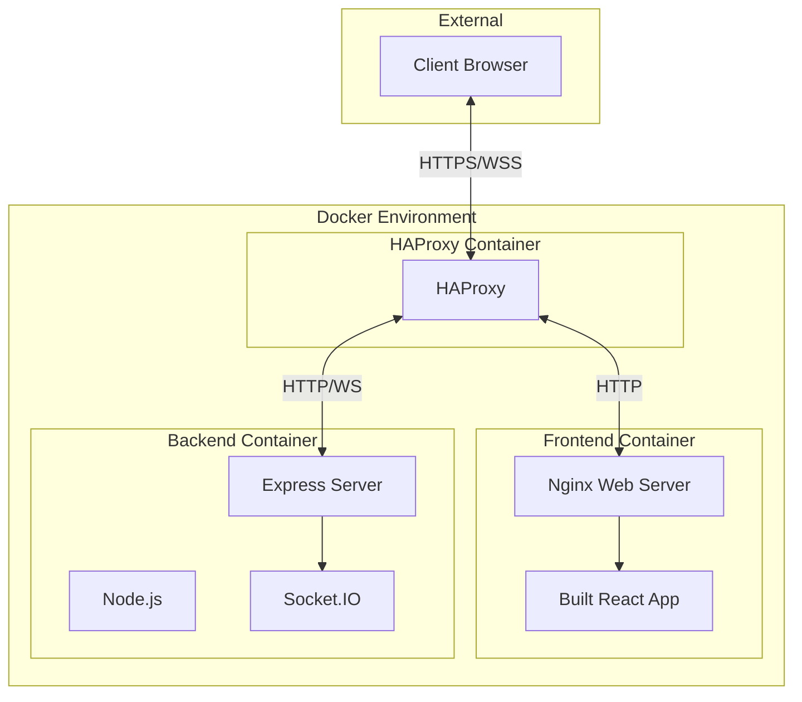

# ShareThings Docker Solution Summary

## Overview

We've designed a comprehensive Docker-based solution for the ShareThings application that:

1. Packages both client and server components in separate containers
2. Uses Nginx to serve the client's static files (built from the React application)
3. Configures HAProxy for SSL termination and WebSocket support
4. Provides a template-based approach for easy deployment

## Documentation Created

We've created the following documentation to guide the implementation:

1. **[Docker Deployment Guide](./docker-deployment-guide.md)** - Comprehensive deployment instructions
2. **[Docker Configuration Files](./docker-configuration-files.md)** - All required configuration files
3. **[Docker Architecture Overview](./docker-architecture-overview.md)** - High-level architecture explanation
4. **[HAProxy Docker Integration](./haproxy-docker-integration.md)** - Detailed HAProxy configuration
5. **[Client Server Options](./client-server-options.md)** - Analysis of client deployment options
6. **[Docker Implementation Plan](./docker-implementation-plan.md)** - Implementation steps and next steps
7. **[Docker Template Approach](./docker-template-approach.md)** - Template-based deployment strategy

## Key Decisions

1. **Client Deployment Approach**: We've chosen to build the React application into static files and serve them with Nginx, rather than using the development server. This decision is based on performance, resource efficiency, and industry best practices.

2. **Container Structure**: The application is split into two main containers:
   - Frontend container: Nginx serving the built React application
   - Backend container: Node.js running the Express and Socket.IO server

3. **HAProxy Integration**: HAProxy sits in front of the Docker containers, handling SSL termination and routing traffic to the appropriate container.

4. **Template-Based Deployment**: We'll implement a template-based approach with sensible defaults to minimize configuration work when deploying to production.

## Architecture Diagram

## Next Steps: Code Mode Implementation

When we switch to Code mode, we'll implement:

1. **Docker Compose Template**: A pre-configured docker-compose.yml file with sensible defaults
2. **Environment Variable Templates**: .env.example files for both client and server
3. **Dockerfiles**: Optimized Dockerfiles for both client and server
4. **Configuration Templates**: Nginx and HAProxy configuration templates
5. **Setup Script**: A script to automate the configuration process

## Deployment Process

With the template-based approach, the deployment process will be:

1. Clone the repository
2. Run the setup script or manually configure environment files
3. Start the containers with docker-compose
4. Access the application

## Benefits of This Approach

1. **Minimal Configuration**: Only change what's necessary for your environment
2. **Reproducible Deployments**: Consistent setup across different environments
3. **Quick Setup**: Get up and running with just a few commands
4. **Flexibility**: Easy to customize for specific requirements
5. **Production-Ready**: Optimized for performance, security, and stability

## Ready for Implementation

The architecture and planning phase is complete. We're now ready to switch to Code mode to implement the Docker configuration files and templates as outlined in the documentation.