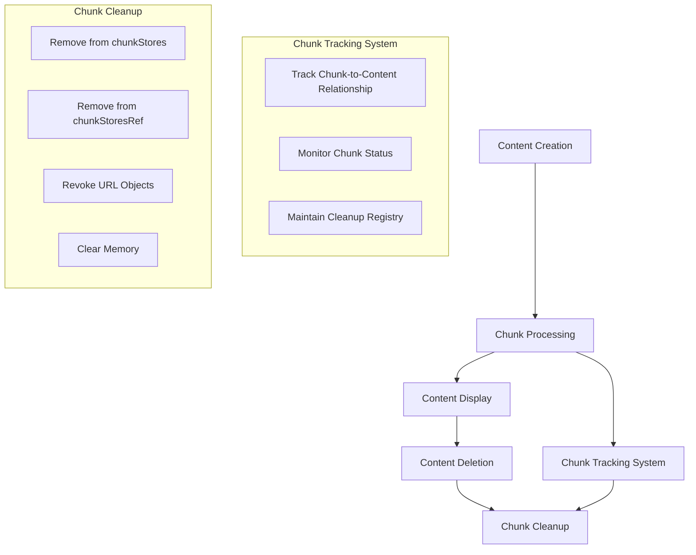

# Image Deletion and Chunk Management Solution

## Problem Statement

We have identified two related issues in our application:

1. **Image deletion function is leaving fully rendered images behind** - When users delete images through the UI, the images may still appear or resources associated with them are not properly cleaned up.

2. **Processed chunks are not being properly managed** - After content (especially images) has been reassembled and displayed, the chunks used for transmission are not being consistently removed.

## Root Causes

After analyzing the codebase, we've identified several root causes:

### 1. Incomplete Chunk Cleanup After Processing

The current system has mechanisms to clean up chunks after content reassembly, but there are several potential failure points:

- In `decryptAndReassembleContent()`, chunk stores are removed using `setChunkStores()` to delete the contentId from the chunk stores map, but this happens in multiple places with different conditions.
- There's a "CRITICAL FIX" comment in the `removeContent()` function that suggests there was a previous issue with not properly cleaning up `chunkStoresRef.current`.
- The cleanup logic is spread across multiple functions and might not execute consistently, especially in error cases.

### 2. Image URL Object Leaks

When displaying images, the application creates URL objects using `URL.createObjectURL()`:

- In `ContentItem.tsx`, URLs are created for image display but might not be properly revoked in all cases.
- In `EmergencyImageRenderer.tsx`, URLs are created for emergency rendering and should be revoked on component unmount, but this might not happen if there are errors.
- Multiple temporary URLs are created during content processing and might not be properly cleaned up.

### 3. No Clear Tracking of Chunk-to-Content Relationship

While chunks have a `contentId` property that links them to their content, there's no clear tracking mechanism to ensure all chunks for a piece of content are cleaned up when the content is deleted or processed.

## Proposed Solutions

### 1. Implement a Robust Chunk Tracking System



1. Create a dedicated `ChunkTrackingService` that:
   - Maintains a registry of all chunks by contentId
   - Tracks the status of each chunk (pending, processed, displayed)
   - Provides methods to clean up all chunks for a given contentId

2. Modify the `ContentStoreContext` to use this service for all chunk operations.

#### Implementation Details

```typescript
// ChunkTrackingService.ts
export enum ChunkStatus {
  PENDING = 'pending',
  PROCESSED = 'processed',
  DISPLAYED = 'displayed'
}

export interface TrackedChunk {
  contentId: string;
  chunkIndex: number;
  status: ChunkStatus;
  timestamp: number;
}

export class ChunkTrackingService {
  private chunkRegistry: Map<string, Map<number, TrackedChunk>> = new Map();
  
  // Register a new chunk
  registerChunk(contentId: string, chunkIndex: number): void {
    if (!this.chunkRegistry.has(contentId)) {
      this.chunkRegistry.set(contentId, new Map());
    }
    
    const contentChunks = this.chunkRegistry.get(contentId)!;
    contentChunks.set(chunkIndex, {
      contentId,
      chunkIndex,
      status: ChunkStatus.PENDING,
      timestamp: Date.now()
    });
    
    console.log(`[ChunkTracker] Registered chunk ${chunkIndex} for content ${contentId}`);
  }
  
  // Update chunk status
  updateChunkStatus(contentId: string, chunkIndex: number, status: ChunkStatus): void {
    const contentChunks = this.chunkRegistry.get(contentId);
    if (!contentChunks) {
      console.warn(`[ChunkTracker] Cannot update status for unknown content ${contentId}`);
      return;
    }
    
    const chunk = contentChunks.get(chunkIndex);
    if (!chunk) {
      console.warn(`[ChunkTracker] Cannot update status for unknown chunk ${chunkIndex} of content ${contentId}`);
      return;
    }
    
    contentChunks.set(chunkIndex, {
      ...chunk,
      status,
      timestamp: Date.now()
    });
    
    console.log(`[ChunkTracker] Updated chunk ${chunkIndex} for content ${contentId} to status ${status}`);
  }
  
  // Mark all chunks for a content as processed
  markContentProcessed(contentId: string): void {
    const contentChunks = this.chunkRegistry.get(contentId);
    if (!contentChunks) {
      console.warn(`[ChunkTracker] Cannot mark as processed: unknown content ${contentId}`);
      return;
    }
    
    for (const [chunkIndex, chunk] of contentChunks.entries()) {
      contentChunks.set(chunkIndex, {
        ...chunk,
        status: ChunkStatus.PROCESSED,
        timestamp: Date.now()
      });
    }
    
    console.log(`[ChunkTracker] Marked all chunks for content ${contentId} as processed`);
  }
  
  // Clean up all chunks for a content
  cleanupChunks(contentId: string): void {
    if (this.chunkRegistry.has(contentId)) {
      console.log(`[ChunkTracker] Cleaning up all chunks for content ${contentId}`);
      this.chunkRegistry.delete(contentId);
    }
  }
  
  // Get all content IDs with pending chunks
  getContentIdsWithPendingChunks(): string[] {
    const contentIds: string[] = [];
    
    for (const [contentId, contentChunks] of this.chunkRegistry.entries()) {
      for (const chunk of contentChunks.values()) {
        if (chunk.status === ChunkStatus.PENDING) {
          contentIds.push(contentId);
          break;
        }
      }
    }
    
    return contentIds;
  }
  
  // Find orphaned chunks (chunks for content that no longer exists)
  findOrphanedChunks(activeContentIds: Set<string>): string[] {
    const orphanedContentIds: string[] = [];
    
    for (const contentId of this.chunkRegistry.keys()) {
      if (!activeContentIds.has(contentId)) {
        orphanedContentIds.push(contentId);
      }
    }
    
    return orphanedContentIds;
  }
}
```

### 2. Improve URL Object Management

1. Implement a centralized URL object registry that:
   - Tracks all created URL objects by contentId
   - Provides methods to revoke all URLs for a given contentId
   - Automatically revokes URLs after a timeout or when content is deleted

2. Ensure all URL creations are registered and properly revoked:

```typescript
// UrlRegistry.ts
export class UrlRegistry {
  private urls: Map<string, string[]> = new Map();
  
  // Create and register a URL
  createUrl(contentId: string, blob: Blob): string {
    const url = URL.createObjectURL(blob);
    
    if (!this.urls.has(contentId)) {
      this.urls.set(contentId, []);
    }
    
    this.urls.get(contentId)!.push(url);
    console.log(`[UrlRegistry] Created URL for content ${contentId}: ${url}`);
    return url;
  }
  
  // Revoke all URLs for a content
  revokeAllUrls(contentId: string): void {
    const urls = this.urls.get(contentId);
    if (urls) {
      console.log(`[UrlRegistry] Revoking ${urls.length} URLs for content ${contentId}`);
      urls.forEach(url => {
        URL.revokeObjectURL(url);
        console.log(`[UrlRegistry] Revoked URL: ${url}`);
      });
      this.urls.delete(contentId);
    }
  }
  
  // Revoke a specific URL
  revokeUrl(contentId: string, url: string): void {
    const urls = this.urls.get(contentId);
    if (urls) {
      const index = urls.indexOf(url);
      if (index !== -1) {
        URL.revokeObjectURL(url);
        urls.splice(index, 1);
        console.log(`[UrlRegistry] Revoked URL: ${url}`);
        
        if (urls.length === 0) {
          this.urls.delete(contentId);
        }
      }
    }
  }
  
  // Clean up orphaned URLs
  cleanupOrphanedUrls(activeContentIds: Set<string>): void {
    for (const [contentId, urls] of this.urls.entries()) {
      if (!activeContentIds.has(contentId)) {
        console.log(`[UrlRegistry] Cleaning up orphaned URLs for content ${contentId}`);
        urls.forEach(url => URL.revokeObjectURL(url));
        this.urls.delete(contentId);
      }
    }
  }
  
  // Clean up all URLs (for component unmount or app shutdown)
  revokeAllUrls(): void {
    console.log(`[UrlRegistry] Revoking all URLs`);
    for (const [contentId, urls] of this.urls.entries()) {
      urls.forEach(url => URL.revokeObjectURL(url));
    }
    this.urls.clear();
  }
}
```

### 3. Enhance Content Deletion Process

Modify the `removeContent` function to ensure complete cleanup:

```typescript
const removeContent = (contentId: string): boolean => {
  const content = contents.get(contentId);
  
  if (!content) {
    return false;
  }
  
  console.log(`[ContentStore] Removing content: ${contentId}`);
  
  // 1. Revoke all URL objects for this content
  urlRegistry.revokeAllUrls(contentId);
  
  // 2. Remove content from contents map
  setContents(prevContents => {
    const newContents = new Map(prevContents);
    newContents.delete(contentId);
    return newContents;
  });
  
  // 3. Remove chunk store from chunkStores map
  setChunkStores(prevChunkStores => {
    const newChunkStores = new Map(prevChunkStores);
    newChunkStores.delete(contentId);
    return newChunkStores;
  });
  
  // 4. Remove from chunkStoresRef.current
  if (chunkStoresRef.current.has(contentId)) {
    console.log(`[ContentStore] Removing content from chunkStoresRef: ${contentId}`);
    chunkStoresRef.current.delete(contentId);
  }
  
  // 5. Clean up any remaining chunks
  chunkTrackingService.cleanupChunks(contentId);
  
  return true;
};
```

### 4. Implement Periodic Cleanup for Orphaned Chunks

Add a periodic cleanup mechanism that runs at intervals to identify and remove any orphaned chunks:

```typescript
// Add to ContentStoreProvider component
useEffect(() => {
  // Run cleanup every 5 minutes
  const cleanupInterval = setInterval(() => {
    console.log('[ChunkCleanup] Running periodic cleanup');
    
    // Get all content IDs from the contents map
    const activeContentIds = new Set(Array.from(contents.keys()));
    
    // Check all chunk stores for orphaned chunks
    for (const [contentId, _] of chunkStoresRef.current.entries()) {
      if (!activeContentIds.has(contentId)) {
        console.log(`[ChunkCleanup] Found orphaned chunks for content ${contentId}, cleaning up`);
        chunkStoresRef.current.delete(contentId);
        
        setChunkStores(prevChunkStores => {
          const newChunkStores = new Map(prevChunkStores);
          newChunkStores.delete(contentId);
          return newChunkStores;
        });
      }
    }
    
    // Also clean up any orphaned URL objects
    urlRegistry.cleanupOrphanedUrls(activeContentIds);
    
    // Clean up orphaned chunks in the tracking service
    const orphanedContentIds = chunkTrackingService.findOrphanedChunks(activeContentIds);
    orphanedContentIds.forEach(contentId => {
      console.log(`[ChunkCleanup] Cleaning up orphaned tracked chunks for content ${contentId}`);
      chunkTrackingService.cleanupChunks(contentId);
    });
  }, 5 * 60 * 1000); // 5 minutes
  
  // Clean up on unmount
  return () => {
    clearInterval(cleanupInterval);
  };
}, []);
```

### 5. Modify the Chunk Reassembly Process

Update the `decryptAndReassembleContent` function to ensure proper cleanup after reassembly:

```typescript
const decryptAndReassembleContent = async (contentId: string, passphrase: string): Promise<void> => {
  console.log(`[decryptAndReassemble] Starting reassembly for content ${contentId}`);
  
  try {
    // ... existing reassembly code ...
    
    // After successful reassembly:
    
    // 1. Mark all chunks as processed in the tracking service
    chunkTrackingService.markContentProcessed(contentId);
    
    // 2. Remove chunk store to free memory (existing code)
    setChunkStores(prevChunkStores => {
      const newChunkStores = new Map(prevChunkStores);
      console.log(`[decryptAndReassemble] Removing chunk store to free memory`);
      newChunkStores.delete(contentId);
      return newChunkStores;
    });
    
    // 3. Also remove from chunkStoresRef.current
    if (chunkStoresRef.current.has(contentId)) {
      console.log(`[decryptAndReassemble] Removing from chunkStoresRef.current`);
      chunkStoresRef.current.delete(contentId);
    }
    
    console.log(`[decryptAndReassemble] Content ${contentId} successfully reassembled and stored`);
  } catch (error) {
    console.error('[decryptAndReassemble] Error decrypting and reassembling content:', error);
    
    // Even in case of error, try to clean up any partial resources
    // This prevents resource leaks when reassembly fails
    try {
      if (chunkStoresRef.current.has(contentId)) {
        console.log(`[decryptAndReassemble] Cleaning up after error for content ${contentId}`);
        chunkStoresRef.current.delete(contentId);
        
        setChunkStores(prevChunkStores => {
          const newChunkStores = new Map(prevChunkStores);
          newChunkStores.delete(contentId);
          return newChunkStores;
        });
      }
    } catch (cleanupError) {
      console.error('[decryptAndReassemble] Error during cleanup after reassembly failure:', cleanupError);
    }
  }
};
```

## Integration with ContentItem Component

Update the ContentItem component to use the URL registry:

```typescript
// In ContentItem.tsx
const ContentItem: React.FC<ContentItemProps> = ({ contentId }) => {
  // ... existing code ...
  
  // Get URL registry from context
  const { urlRegistry } = useContext(UrlRegistryContext);
  
  // ... existing code ...
  
  // In the render function, replace:
  <Image
    key={`image-${contentId}-${Date.now()}`}
    src={URL.createObjectURL(content.data)}
    alt={metadata.metadata.fileName || 'Shared image'}
    maxH="200px"
    objectFit="contain"
    onLoad={...}
    onError={...}
  />
  
  // With:
  <Image
    key={`image-${contentId}-${Date.now()}`}
    src={urlRegistry.createUrl(contentId, content.data)}
    alt={metadata.metadata.fileName || 'Shared image'}
    maxH="200px"
    objectFit="contain"
    onLoad={...}
    onError={...}
  />
  
  // ... existing code ...
};
```

## Implementation Plan

1. **Phase 1: Diagnostic Logging**
   - Add detailed logging around chunk creation, processing, and cleanup
   - Log URL object creation and revocation
   - Monitor memory usage during image operations

2. **Phase 2: Implement Chunk Tracking Service**
   - Create the ChunkTrackingService class
   - Integrate it with ContentStoreContext
   - Add tests to verify chunk tracking

3. **Phase 3: Implement URL Registry**
   - Create the UrlRegistry class
   - Replace all direct URL.createObjectURL calls with registry methods
   - Add tests to verify URL management

4. **Phase 4: Enhance Content Deletion**
   - Update the removeContent function
   - Add comprehensive cleanup steps
   - Test deletion with various content types and sizes

5. **Phase 5: Add Periodic Cleanup**
   - Implement the periodic cleanup mechanism
   - Add monitoring to detect orphaned resources
   - Test with long-running sessions

## Testing Strategy

1. **Unit Tests**
   - Test ChunkTrackingService methods
   - Test UrlRegistry methods
   - Test enhanced removeContent function

2. **Integration Tests**
   - Test chunk processing and cleanup
   - Test image rendering and URL management
   - Test content deletion and resource cleanup

3. **End-to-End Tests**
   - Test image sharing between browsers
   - Test image deletion and verify no resources are left behind
   - Test long-running sessions with multiple image shares and deletions

4. **Memory Profiling**
   - Use browser memory profiling tools to verify no memory leaks
   - Monitor URL object creation and revocation
   - Verify chunk cleanup after content reassembly

## Conclusion

The proposed solution addresses the root causes of the image deletion and chunk management issues by:

1. Implementing a robust chunk tracking system to ensure all chunks are properly tracked and cleaned up
2. Centralizing URL object management to prevent URL leaks
3. Enhancing the content deletion process to ensure complete cleanup
4. Adding periodic cleanup to catch any orphaned resources

These changes will ensure that when images are deleted through the UI, all associated resources are properly cleaned up, and processed chunks are removed after content has been reassembled and displayed.