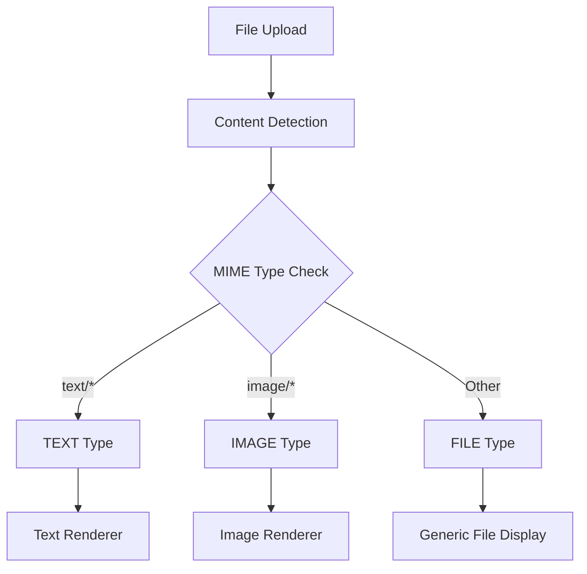
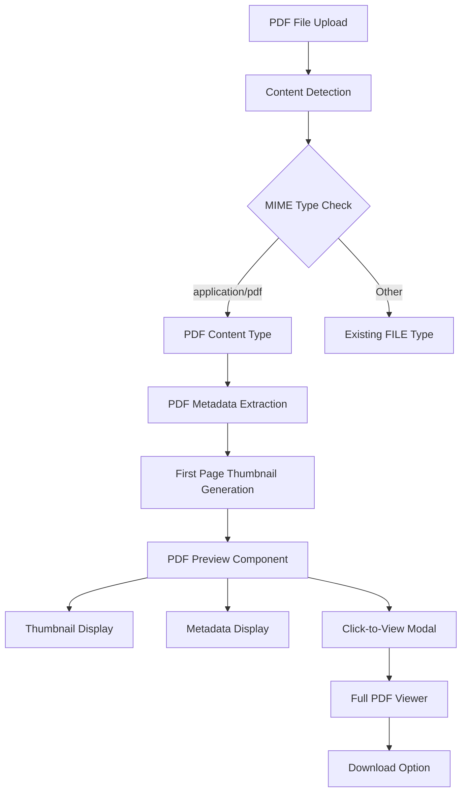

# PDF Preview Implementation Plan

## Overview

This document outlines the comprehensive plan for implementing PDF preview functionality in the ShareThings application. The goal is to add thumbnail preview of the first page of PDF files with metadata display and click-to-view functionality using web-native approaches.

## Current System Analysis

### Existing Architecture
- **Content System**: Uses [`ContentType`](../client/src/contexts/ContentStoreContext.tsx) enum (TEXT, IMAGE, FILE, OTHER)
- **Content Rendering**: [`ContentItem.tsx`](../client/src/components/content/ContentItem.tsx) handles different content types
- **File Handling**: Currently shows generic file icon with basic metadata for FILE type
- **Technology Stack**: React + TypeScript + Chakra UI + WebSocket real-time sharing

### Current Content Flow


## Proposed PDF Enhancement

### Architecture Overview


## Implementation Plan

### Phase 1: Content Type Enhancement

#### 1.1 Update ContentType Enum
**File**: [`client/src/contexts/ContentStoreContext.tsx`](../client/src/contexts/ContentStoreContext.tsx)

```typescript
export enum ContentType {
  TEXT = 'text',
  IMAGE = 'image',
  FILE = 'file',
  PDF = 'pdf',  // New PDF type
  OTHER = 'other'
}
```

#### 1.2 Extend ContentMetadata Interface
**File**: [`client/src/contexts/ContentStoreContext.tsx`](../client/src/contexts/ContentStoreContext.tsx)

```typescript
export interface ContentMetadata {
  fileName?: string;
  mimeType: string;
  size: number;
  textInfo?: {
    encoding: string;
    language?: string;
    lineCount?: number;
  };
  imageInfo?: {
    width: number;
    height: number;
    thumbnailData?: string;
    format: string;
  };
  fileInfo?: {
    extension: string;
    icon?: string;
  };
  // New PDF metadata
  pdfInfo?: {
    pageCount: number;
    title?: string;
    author?: string;
    creationDate?: string;
    thumbnailData?: string; // Base64 encoded first page thumbnail
    version?: string;
    producer?: string;
  };
}
```

#### 1.3 Update Content Detection Logic
**File**: [`client/src/components/content/ContentItem.tsx`](../client/src/components/content/ContentItem.tsx)

- Add PDF MIME type detection (`application/pdf`)
- Update content type determination logic
- Add PDF-specific icon handling

### Phase 2: PDF Processing & Dependencies

#### 2.1 Add Required Dependencies
**File**: [`client/package.json`](../client/package.json)

```json
{
  "dependencies": {
    "pdfjs-dist": "^3.11.174",
    "react-pdf": "^7.5.1"
  },
  "devDependencies": {
    "@types/pdfjs-dist": "^2.10.378"
  }
}
```

#### 2.2 Create PDF Processing Service
**New File**: `client/src/services/PDFProcessingService.ts`

```typescript
import * as pdfjsLib from 'pdfjs-dist';

export interface PDFMetadata {
  pageCount: number;
  title?: string;
  author?: string;
  creationDate?: string;
  version?: string;
  producer?: string;
}

export class PDFProcessingService {
  constructor() {
    // Configure PDF.js worker
    pdfjsLib.GlobalWorkerOptions.workerSrc = '/pdf.worker.min.js';
  }

  async extractMetadata(pdfBlob: Blob): Promise<PDFMetadata>
  async generateThumbnail(pdfBlob: Blob, maxWidth: number = 200): Promise<string>
  async validatePDF(blob: Blob): Promise<boolean>
  private async loadPDFDocument(pdfBlob: Blob): Promise<pdfjsLib.PDFDocumentProxy>
}
```

#### 2.3 Create PDF Utilities
**New File**: `client/src/utils/pdfUtils.ts`

```typescript
export const isPDFMimeType = (mimeType: string): boolean => {
  return mimeType === 'application/pdf';
};

export const isPDFFile = (fileName: string): boolean => {
  return fileName.toLowerCase().endsWith('.pdf');
};

export const formatPDFMetadata = (metadata: PDFMetadata): string => {
  // Format metadata for display
};
```

### Phase 3: PDF Preview Components

#### 3.1 Create PDF Renderer Component
**New File**: `client/src/components/content/PDFRenderer.tsx`

```typescript
import React, { useState, useEffect, useCallback } from 'react';
import { Box, Image, Text, Flex, Icon, Spinner, Button } from '@chakra-ui/react';
import { FaFilePdf, FaEye, FaDownload } from 'react-icons/fa';

interface PDFRendererProps {
  contentId: string;
  blob: Blob;
  fileName?: string;
  metadata: PDFMetadata;
  isComplete: boolean;
  onViewFullPDF: () => void;
  updateContentLastAccessed: (contentId: string) => void;
}

const PDFRenderer: React.FC<PDFRendererProps> = ({
  contentId,
  blob,
  fileName,
  metadata,
  isComplete,
  onViewFullPDF,
  updateContentLastAccessed
}) => {
  const [thumbnailUrl, setThumbnailUrl] = useState<string | null>(null);
  const [isLoading, setIsLoading] = useState(true);
  const [error, setError] = useState<string | null>(null);

  // Generate thumbnail on component mount
  // Handle click to view full PDF
  // Error handling and fallbacks
  
  return (
    <Box position="relative" borderRadius="md" overflow="hidden">
      {/* Thumbnail with overlay */}
      {/* Metadata display */}
      {/* Action buttons */}
    </Box>
  );
};
```

#### 3.2 Create PDF Viewer Modal
**New File**: `client/src/components/content/PDFViewerModal.tsx`

```typescript
import React from 'react';
import {
  Modal,
  ModalOverlay,
  ModalContent,
  ModalHeader,
  ModalBody,
  ModalCloseButton,
  Button,
  HStack
} from '@chakra-ui/react';

interface PDFViewerModalProps {
  isOpen: boolean;
  onClose: () => void;
  pdfBlob: Blob;
  fileName: string;
  metadata: PDFMetadata;
}

const PDFViewerModal: React.FC<PDFViewerModalProps> = ({
  isOpen,
  onClose,
  pdfBlob,
  fileName,
  metadata
}) => {
  // PDF.js viewer integration
  // Navigation controls
  // Download functionality
  
  return (
    <Modal isOpen={isOpen} onClose={onClose} size="6xl">
      {/* Modal content with PDF viewer */}
    </Modal>
  );
};
```

### Phase 4: Integration with Existing System

#### 4.1 Update ContentItem Component
**File**: [`client/src/components/content/ContentItem.tsx`](../client/src/components/content/ContentItem.tsx)

```typescript
// Add PDF case to renderContentPreview()
case ContentType.PDF:
  return (
    <PDFRenderer
      contentId={contentId}
      blob={content.data as Blob}
      fileName={metadata.metadata.fileName}
      metadata={metadata.metadata.pdfInfo!}
      isComplete={content.isComplete}
      onViewFullPDF={() => setShowPDFModal(true)}
      updateContentLastAccessed={updateContentLastAccessed}
    />
  );

// Add PDF icon to getContentIcon()
case ContentType.PDF:
  return FaFilePdf;
```

#### 4.2 Update Content Detection Logic
**File**: [`client/src/components/content/ContentItem.tsx`](../client/src/components/content/ContentItem.tsx)

```typescript
// Enhanced content type detection
if (metadata.metadata.mimeType === 'application/pdf' || 
    (metadata.metadata.fileName && metadata.metadata.fileName.toLowerCase().endsWith('.pdf'))) {
  effectiveContentType = ContentType.PDF;
}
```

#### 4.3 Update SharePanel for PDF Processing
**File**: [`client/src/components/content/SharePanel.tsx`](../client/src/components/content/SharePanel.tsx)

- Add PDF detection during file upload
- Generate PDF metadata and thumbnail before sharing
- Handle PDF processing errors

### Phase 5: File Structure Changes

```
client/src/
├── components/content/
│   ├── ContentItem.tsx (updated)
│   ├── PDFRenderer.tsx (new)
│   ├── PDFViewerModal.tsx (new)
│   └── SharePanel.tsx (updated)
├── services/
│   └── PDFProcessingService.ts (new)
├── utils/
│   └── pdfUtils.ts (new)
├── contexts/
│   └── ContentStoreContext.tsx (updated)
└── public/
    └── pdf.worker.min.js (new - PDF.js worker)
```

## Technical Implementation Details

### PDF.js Integration

#### Worker Configuration
```typescript
// Configure PDF.js worker in main application
import * as pdfjsLib from 'pdfjs-dist';

pdfjsLib.GlobalWorkerOptions.workerSrc = '/pdf.worker.min.js';
```

#### Thumbnail Generation
```typescript
async generateThumbnail(pdfBlob: Blob, maxWidth: number = 200): Promise<string> {
  const pdf = await this.loadPDFDocument(pdfBlob);
  const page = await pdf.getPage(1); // First page
  
  const viewport = page.getViewport({ scale: 1 });
  const scale = maxWidth / viewport.width;
  const scaledViewport = page.getViewport({ scale });
  
  const canvas = document.createElement('canvas');
  const context = canvas.getContext('2d')!;
  canvas.height = scaledViewport.height;
  canvas.width = scaledViewport.width;
  
  await page.render({
    canvasContext: context,
    viewport: scaledViewport
  }).promise;
  
  return canvas.toDataURL('image/png');
}
```

### User Experience Flow

1. **PDF Upload**: User shares a PDF file
2. **Processing**: System detects PDF, extracts metadata, generates thumbnail
3. **Preview Display**: Shows thumbnail with page count and file size overlay
4. **Click Interaction**: User clicks thumbnail to open full PDF viewer
5. **Full Viewer**: Modal with PDF.js viewer, navigation controls, download option
6. **Download**: Direct download of original PDF file

### Error Handling Strategy

#### PDF Processing Errors
```typescript
try {
  const metadata = await pdfProcessingService.extractMetadata(blob);
  const thumbnail = await pdfProcessingService.generateThumbnail(blob);
  // Success path
} catch (error) {
  console.error('PDF processing failed:', error);
  // Fallback to generic file display
  effectiveContentType = ContentType.FILE;
}
```

#### Fallback Scenarios
- **Corrupted PDF**: Show error message with download option
- **Large Files**: Progress indicator during processing
- **Browser Compatibility**: Graceful degradation to file download
- **Memory Limits**: Optimize for large PDF files

### Performance Considerations

#### Optimization Strategies
- **Lazy Loading**: Generate thumbnails only when content is visible
- **Caching**: Cache thumbnails in browser storage
- **Memory Management**: Proper cleanup of PDF.js resources
- **Chunked Processing**: Handle large PDFs efficiently

#### Memory Management
```typescript
// Cleanup PDF resources
useEffect(() => {
  return () => {
    if (pdfDocument) {
      pdfDocument.destroy();
    }
    if (thumbnailUrl) {
      URL.revokeObjectURL(thumbnailUrl);
    }
  };
}, [pdfDocument, thumbnailUrl]);
```

## Testing Strategy

### Unit Tests
- PDF processing functions
- Metadata extraction
- Thumbnail generation
- Error handling scenarios

### Integration Tests
- PDF content flow through the system
- Content type detection
- Component rendering

### E2E Tests
- Full user interaction scenarios
- PDF upload and preview
- Modal functionality
- Download functionality

### Performance Tests
- Large PDF handling
- Memory usage monitoring
- Thumbnail generation speed

### Browser Compatibility Tests
- Cross-browser PDF.js functionality
- Canvas API support
- File API compatibility

## Security Considerations

### Client-Side Processing
- All PDF processing happens in the browser
- No server-side PDF handling required
- Reduces security attack surface

### Content Validation
- Validate PDF structure before processing
- Handle malformed PDF files gracefully
- Prevent memory exhaustion attacks

## Deployment Considerations

### Static Assets
- Include PDF.js worker file in build
- Configure proper MIME types for PDF files
- Ensure CDN compatibility

### Browser Support
- Modern browsers with Canvas API support
- PDF.js compatibility matrix
- Graceful degradation for older browsers

## Future Enhancements

### Phase 2 Features
- **Multi-page Thumbnails**: Show first few pages
- **Text Search**: Search within PDF content
- **Annotations**: Basic PDF annotation support
- **Print Support**: Direct printing from viewer

### Advanced Features
- **OCR Integration**: Extract text from scanned PDFs
- **Collaborative Annotations**: Shared PDF annotations
- **Version Comparison**: Compare different PDF versions
- **Accessibility**: Screen reader support

## Success Metrics

### User Experience
- Reduced time to preview PDF content
- Increased user engagement with PDF files
- Improved content discovery

### Technical Metrics
- Thumbnail generation speed < 2 seconds
- Memory usage < 50MB for typical PDFs
- Error rate < 1% for valid PDF files

### Performance Targets
- **Thumbnail Generation**: < 2 seconds for typical PDFs
- **Modal Load Time**: < 1 second
- **Memory Usage**: < 50MB per PDF
- **Error Rate**: < 1% for valid PDFs

## Implementation Timeline

### Week 1: Foundation
- Add dependencies and basic PDF detection
- Create PDF processing service
- Implement metadata extraction

### Week 2: Components
- Build PDF renderer component
- Create PDF viewer modal
- Integrate with existing content system

### Week 3: Integration & Testing
- Update ContentItem component
- Comprehensive testing
- Error handling and edge cases

### Week 4: Polish & Deployment
- Performance optimization
- Documentation updates
- Production deployment

## Conclusion

This implementation plan provides a comprehensive approach to adding PDF preview functionality to ShareThings using web-native technologies. The solution leverages PDF.js for reliable cross-browser PDF processing while maintaining the existing architecture and performance characteristics of the application.

The phased approach ensures minimal disruption to existing functionality while providing a robust foundation for future PDF-related enhancements.