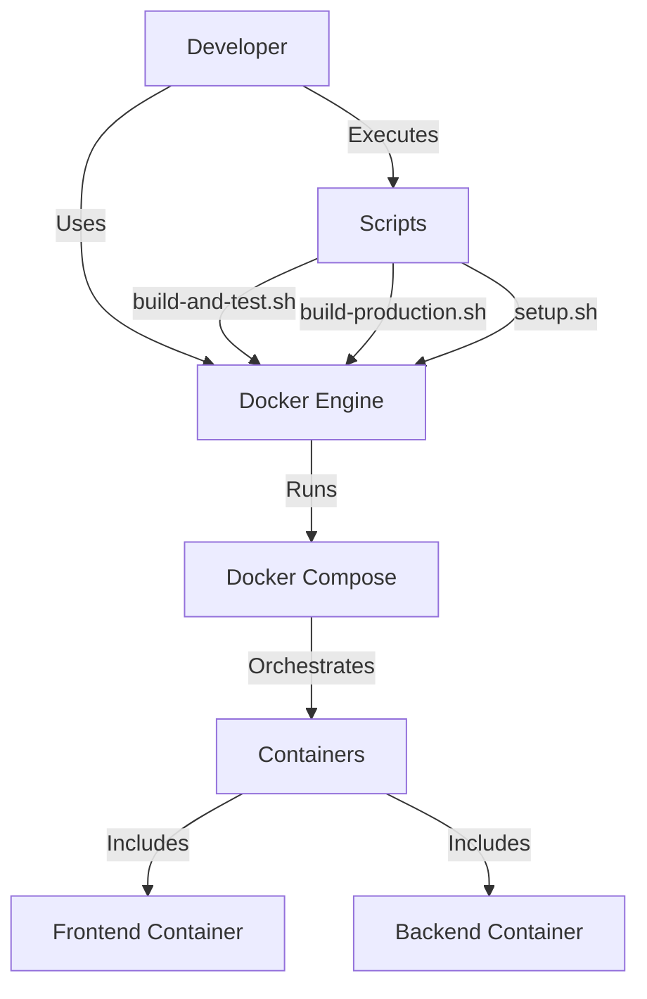
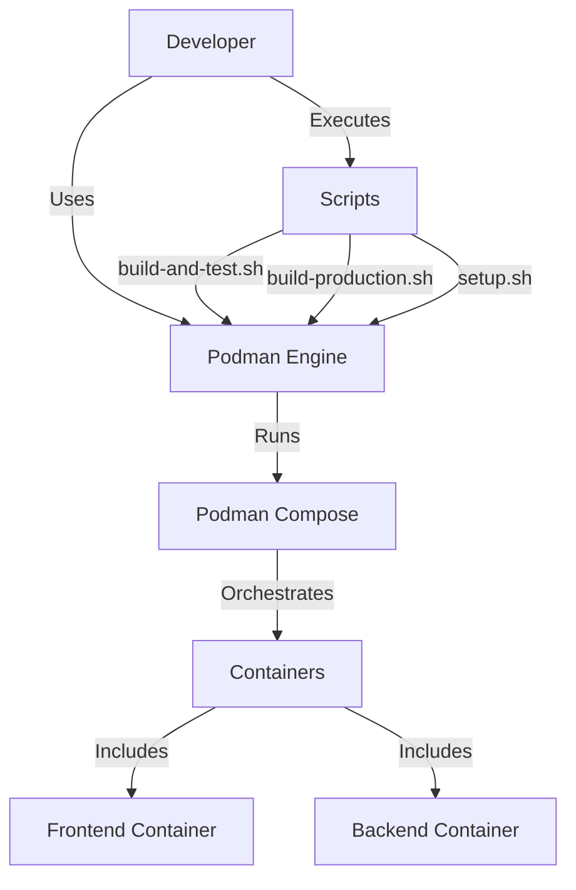
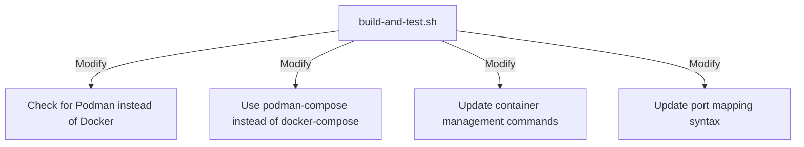
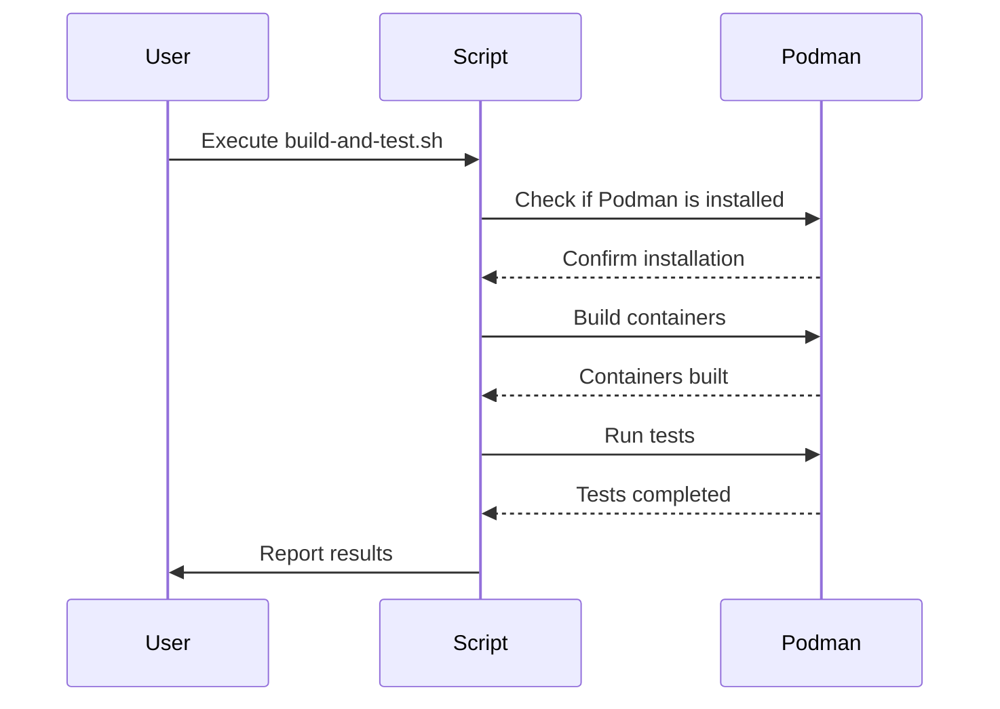
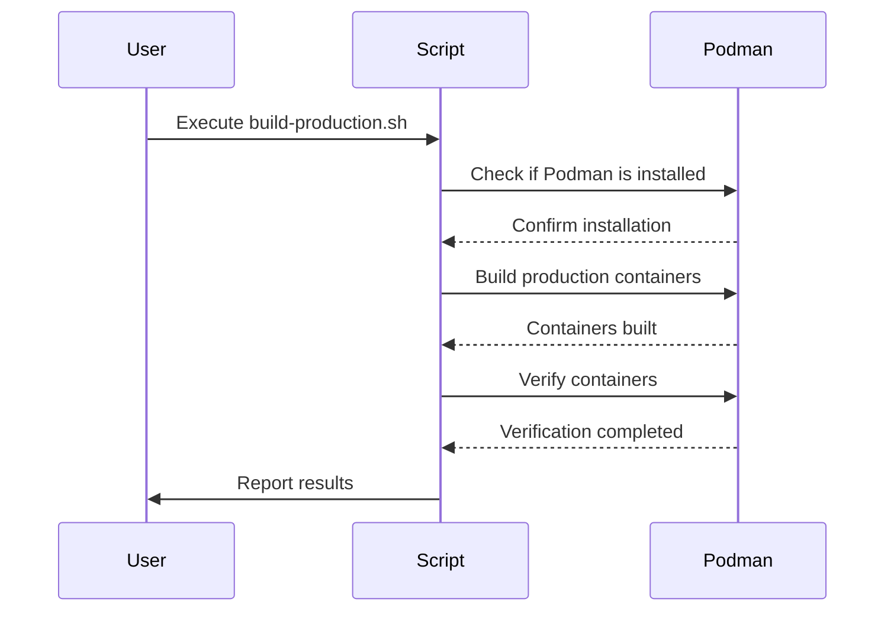
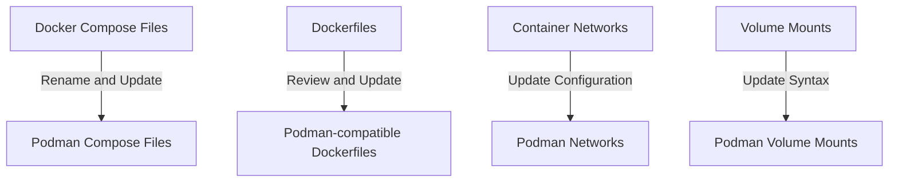
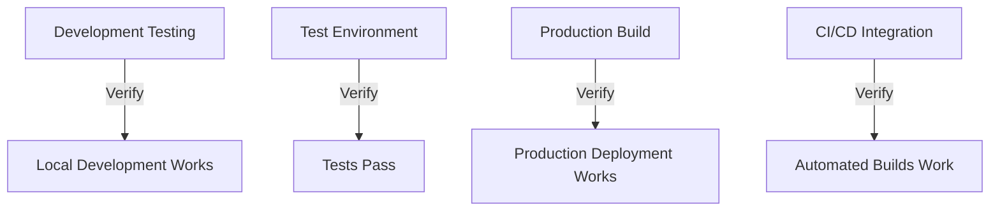

# Podman Migration Plan for ShareThings

Based on my analysis of your project, I've created a comprehensive plan to replace all Docker dependencies with Podman. I've noticed that your project already has some Podman compatibility built in, which gives us a good foundation to work from.

## 1. Current Architecture Overview



## 2. Target Architecture



## 3. Migration Plan

### 3.1 Prerequisites

1. **Verify Podman and Podman Compose**
   - Confirm Podman is working correctly:
     ```bash
     podman info
     ```
   - Confirm Podman Compose is available:
     ```bash
     podman-compose version
     ```

2. **Prepare Environment**
   - Ensure Podman machine is running (for macOS):
     ```bash
     podman machine list
     ```
   - If needed, start the Podman machine:
     ```bash
     podman machine start
     ```

### 3.2 Script Modifications

#### 3.2.1 Update build-and-test.sh

1. Replace Docker command checks with Podman
2. Update Docker Compose command detection to use Podman Compose
3. Modify container management commands



#### 3.2.2 Update build-production.sh

1. Remove Docker-specific checks and replace with Podman
2. Update Docker Compose commands to use Podman Compose
3. Modify container health checks to be compatible with Podman

#### 3.2.3 Update setup.sh

1. Set Podman as the default container engine
2. Remove Docker-specific options
3. Update container management commands to use Podman

### 3.3 Docker Compose File Modifications

#### 3.3.1 Update docker-compose.yml

1. Rename to podman-compose.yml for clarity
2. Update volume mount syntax for Podman compatibility
3. Update network configuration for Podman

#### 3.3.2 Update docker-compose.test.yml

1. Rename to podman-compose.test.yml
2. Update test-specific configurations for Podman

#### 3.3.3 Update docker-compose.prod.yml

1. Rename to podman-compose.prod.yml
2. Update production-specific configurations for Podman

### 3.4 Dockerfile and Registry Modifications

1. Review and update multi-stage builds if needed
2. Ensure base images are compatible with Podman
3. Update any Docker-specific commands or syntax
4. Replace all references to docker.io with linner.ddns.net:4443/docker.io.proxy
   ```diff
   - FROM node:18-alpine
   + FROM linner.ddns.net:4443/docker.io.proxy/node:18-alpine
   
   - FROM nginx:alpine
   + FROM linner.ddns.net:4443/docker.io.proxy/nginx:alpine
   ```

### 3.5 Testing Strategy

1. Test each component individually
2. Test the complete application in development mode
3. Test the complete application in production mode
4. Verify all functionality works as expected

### 3.6 Documentation Updates

1. Update README.md with Podman instructions
2. Rename DOCKER.md to CONTAINERS.md and update content
3. Update any other documentation referencing Docker

## 4. Detailed Implementation Steps

Let's break down the implementation into specific tasks:

### 4.1 Script Updates

#### build-and-test.sh



#### build-production.sh



### 4.2 Container Configuration Updates



### 4.3 Testing and Verification



## 5. Implementation Plan

Now, let's create a detailed implementation plan with specific tasks and their order:

### Phase 1: Setup and Preparation

1. Install Podman and Podman Compose on development machines
2. Create a new branch for Podman migration
3. Create backup copies of all Docker-related files

### Phase 2: Script Modifications

1. Update build-and-test.sh
   - Replace Docker checks with Podman checks
   - Update Docker Compose commands to use Podman Compose
   - Test the script with basic functionality

2. Update build-production.sh
   - Replace Docker checks with Podman checks
   - Update Docker Compose commands to use Podman Compose
   - Modify container health checks for Podman compatibility
   - Test the script with basic functionality

3. Update setup.sh
   - Set Podman as the default container engine
   - Update container management commands
   - Test the script with basic functionality

### Phase 3: Container Configuration Updates

1. Update docker-compose.yml
   - Rename to podman-compose.yml
   - Update volume mount syntax
   - Update network configuration
   - Test basic container startup

2. Update docker-compose.test.yml
   - Rename to podman-compose.test.yml
   - Update test-specific configurations
   - Test basic test container functionality

3. Update docker-compose.prod.yml
   - Rename to podman-compose.prod.yml
   - Update production-specific configurations
   - Test basic production container functionality

4. Review and update Dockerfiles
   - Ensure compatibility with Podman
   - Test building images with Podman

### Phase 4: Testing and Verification

1. Test development workflow
   - Run the application in development mode
   - Verify all functionality works as expected

2. Test testing workflow
   - Run the test suite
   - Verify all tests pass

3. Test production workflow
   - Build the application in production mode
   - Verify all functionality works as expected

### Phase 5: Documentation and Finalization

1. Update documentation
   - Update README.md
   - Rename and update DOCKER.md
   - Update any other documentation

2. Create migration guide for team members
   - Document steps to migrate from Docker to Podman
   - Include troubleshooting tips

3. Finalize and merge changes
   - Review all changes
   - Merge to main branch

## 6. Potential Challenges and Solutions

### 6.1 Podman Compose Compatibility

**Challenge**: Podman Compose may have slightly different syntax or behavior compared to Docker Compose.

**Solution**: 
- Test each Docker Compose file thoroughly with Podman Compose
- Document any differences or workarounds
- Consider using the `--compatibility` flag with Podman Compose

### 6.2 Volume Mounting

**Challenge**: Volume mounting syntax and behavior may differ between Docker and Podman.

**Solution**:
- Test volume mounts thoroughly
- Use absolute paths where possible
- Document any specific requirements for Podman volume mounts

### 6.3 Network Configuration

**Challenge**: Network configuration and container communication may differ.

**Solution**:
- Test inter-container communication thoroughly
- Update network aliases and hostnames as needed
- Document any specific requirements for Podman networks

### 6.4 macOS-specific Issues

**Challenge**: Podman on macOS runs in a VM, which may cause performance or compatibility issues.

**Solution**:
- Test performance thoroughly
- Adjust resource allocation for the Podman machine if needed
- Document any macOS-specific considerations

## 7. Timeline and Resources

### 7.1 Estimated Timeline

1. **Phase 1 (Setup and Preparation)**: 1 day
2. **Phase 2 (Script Modifications)**: 2-3 days
3. **Phase 3 (Container Configuration Updates)**: 2-3 days
4. **Phase 4 (Testing and Verification)**: 2-3 days
5. **Phase 5 (Documentation and Finalization)**: 1-2 days

**Total Estimated Time**: 8-12 days

### 7.2 Required Resources

1. **Development Environment**: macOS with Podman and Podman Compose installed
2. **Testing Environment**: Sufficient to test all application functionality
3. **Documentation**: Time to update all documentation

## 8. Specific File Changes

### 8.1 Script Updates

#### build-and-test.sh

```diff
- # Check if Docker is installed
- if ! command -v docker &> /dev/null; then
-     echo -e "${RED}Error: Docker is not installed.${NC}"
-     echo "Please install Docker before running this script."
-     exit 1
- fi
+ # Check if Podman is installed
+ if ! command -v podman &> /dev/null; then
+     echo -e "${RED}Error: Podman is not installed.${NC}"
+     echo "Please install Podman before running this script."
+     exit 1
+ fi

- # Check if Docker Compose is installed (either standalone or as part of Docker CLI)
+ # Check if Podman Compose is installed
  DOCKER_COMPOSE_CMD=""
- if command -v docker-compose &> /dev/null; then
-     DOCKER_COMPOSE_CMD="docker-compose"
- elif docker compose version &> /dev/null; then
-     DOCKER_COMPOSE_CMD="docker compose"
+ if command -v podman-compose &> /dev/null; then
+     DOCKER_COMPOSE_CMD="podman-compose"
  else
-     echo -e "${RED}Error: Docker Compose is not installed.${NC}"
-     echo "Please install Docker Compose before running this script."
+     echo -e "${RED}Error: Podman Compose is not installed.${NC}"
+     echo "Please install Podman Compose before running this script."
      exit 1
  fi

- # Check if Docker daemon is running
- if ! docker info &> /dev/null; then
-     echo -e "${RED}Error: Docker daemon is not running.${NC}"
-     echo "Please start Docker before running this script."
-     exit 1
- fi
+ # Check if Podman is running
+ if ! podman info &> /dev/null; then
+     echo -e "${RED}Error: Podman is not running.${NC}"
+     echo "Please start Podman before running this script."
+     exit 1
+ fi
```

#### build-production.sh

Similar changes to build-and-test.sh, plus:

```diff
- # Check if Docker Compose or Podman Compose is installed
  DOCKER_COMPOSE_CMD=""
- if command -v podman-compose &> /dev/null; then
-     DOCKER_COMPOSE_CMD="podman-compose"
-     echo -e "${YELLOW}Using podman-compose instead of docker-compose${NC}"
-     echo -e "${YELLOW}Note: Some commands may behave differently with podman-compose${NC}"
- elif command -v docker-compose &> /dev/null; then
-     DOCKER_COMPOSE_CMD="docker-compose"
- elif docker compose version &> /dev/null; then
-     DOCKER_COMPOSE_CMD="docker compose"
+ if command -v podman-compose &> /dev/null; then
+     DOCKER_COMPOSE_CMD="podman-compose"
  else
-     echo -e "${RED}Error: Neither Docker Compose nor Podman Compose is installed.${NC}"
-     echo "Please install Docker Compose or Podman Compose before running this script."
+     echo -e "${RED}Error: Podman Compose is not installed.${NC}"
+     echo "Please install Podman Compose before running this script."
      exit 1
  fi
```

### 8.2 Docker Compose File Updates

#### docker-compose.yml → podman-compose.yml

```diff
  # Base configuration for ShareThings Docker Compose
+ # Now using Podman Compose
  
  services:
    backend:
      build:
        context: ./server
        dockerfile: Dockerfile
        args:
          - PORT=${API_PORT:-3001}
      container_name: share-things-backend  # Explicit container name
      hostname: backend  # Explicit hostname
      environment:
        - NODE_ENV=development
        - PORT=${API_PORT:-3001}
        # Explicitly set the port to ensure it's used
        - LISTEN_PORT=${API_PORT:-3001}
      ports:
        - "${BACKEND_PORT:-3001}:${API_PORT:-3001}"
      volumes:
-       - ./server:/app
-       - /app/node_modules
+       - ./server:/app:Z
+       - volume-backend-node-modules:/app/node_modules:Z
      networks:
        app_network:
          aliases:
            - backend  # Explicit network alias
  
    frontend:
      build:
        context: ./client
        dockerfile: Dockerfile
        args:
          - API_URL=auto
          - SOCKET_URL=auto
          - VITE_API_PORT=${API_PORT:-3001}  # Explicitly pass Vite env var
      container_name: share-things-frontend  # Explicit container name
      environment:
        - API_PORT=${API_PORT:-3001}
      ports:
        - "${FRONTEND_PORT:-8080}:80"
      volumes:
-       - ./client:/app
-       - /app/node_modules
+       - ./client:/app:Z
+       - volume-frontend-node-modules:/app/node_modules:Z
      depends_on:
        - backend
      networks:
        app_network:
          aliases:
            - frontend  # Explicit network alias
  
  # Explicit network configuration
  networks:
    app_network:
      driver: bridge
+
+ # Named volumes for node_modules
+ volumes:
+   volume-backend-node-modules:
+   volume-frontend-node-modules:
```

## 9. Conclusion

This migration plan provides a comprehensive approach to replacing Docker with Podman in your ShareThings project. The plan is structured to minimize disruption and ensure all functionality continues to work as expected.

By following this plan, you'll be able to completely replace Docker with Podman for all environments (development, testing, and production) on macOS.