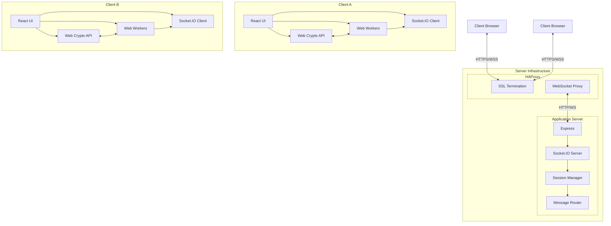
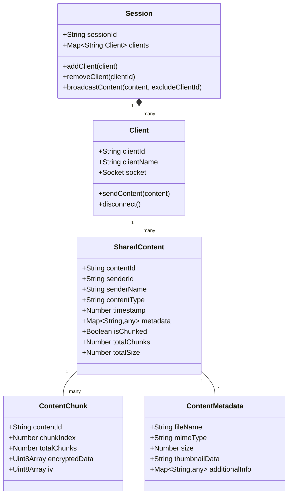
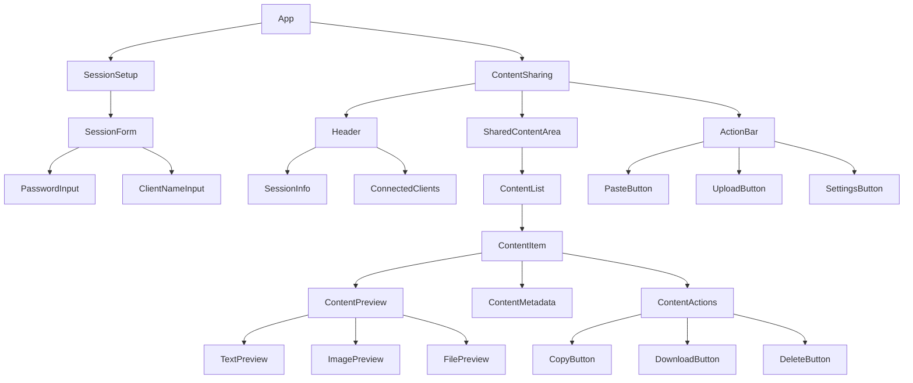
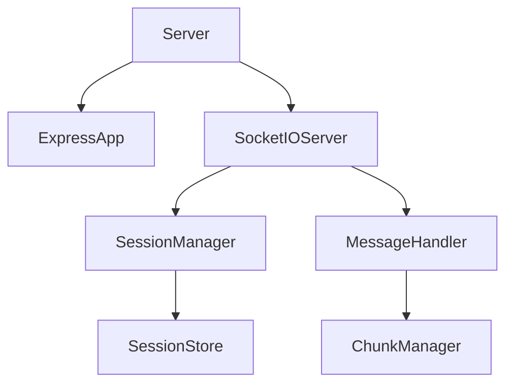
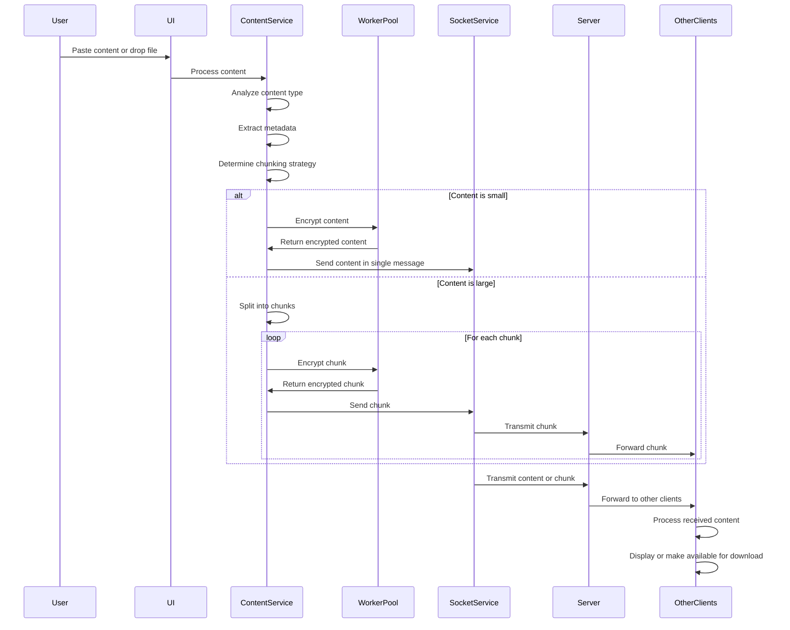

# ShareThings: Real-Time Content Sharing Application

A comprehensive plan for building a secure, real-time content sharing application with end-to-end encryption.

## Technology Stack

**Frontend:**
- React for UI framework
- Chakra UI for styling and components
- Socket.IO client for real-time communication
- Web Crypto API with Web Workers for encryption/decryption
- Jest + React Testing Library + Playwright for testing

**Backend:**
- Node.js with Express for the server
- Socket.IO for WebSocket communication
- Jest for testing

**Infrastructure:**
- HAProxy for SSL termination and WebSocket proxy
- Self-hosted on a private server or VPS

## System Architecture



## Domain Model



## Unified Data Transfer Model

Instead of differentiating between clipboard content and files, we'll use a unified data model with these content types:

1. **Text**: Plain text content
2. **Image**: Image data from clipboard or files
3. **File**: Any file type (including images that should be treated as files)
4. **Other**: Any other content type that might be supported in the future

All content will be processed through the same pipeline:

1. Content is captured (from clipboard, drag-and-drop, or file selection)
2. Content is analyzed to determine type and metadata
3. Content is chunked if necessary (based on size, not type)
4. Each chunk is encrypted using Web Workers
5. Chunks are transmitted sequentially
6. Receiving clients reassemble and decrypt chunks
7. Content is displayed or made available for download based on type

## Content Type Handling

### Domain Model Approach

We'll use a composition-based approach with a single `SharedContent` interface and type discrimination:

```typescript
// Base interface for all shared content
interface SharedContent {
  contentId: string;
  senderId: string;
  senderName: string;
  contentType: ContentType; // Enum or string literal type
  timestamp: number;
  metadata: ContentMetadata;
  isChunked: boolean;
  totalChunks?: number;
  totalSize: number;
}

// Enum for content types
enum ContentType {
  TEXT = 'text',
  IMAGE = 'image',
  FILE = 'file',
  OTHER = 'other'
}

// Type-specific metadata
interface ContentMetadata {
  // Common metadata
  fileName?: string;
  mimeType: string;
  size: number;
  
  // Type-specific metadata
  textInfo?: {
    encoding: string;
    language?: string;
    lineCount?: number;
  };
  
  imageInfo?: {
    width: number;
    height: number;
    thumbnailData?: string; // Base64 thumbnail for preview
    format: string;
  };
  
  fileInfo?: {
    extension: string;
    icon?: string; // Icon representation
  };
}
```

### Visualization Component Architecture

For visualization, we'll use a component-based approach with:

1. **Content Container Component**: Handles common functionality for all content types
2. **Type-Specific Renderer Components**: Specialized for each content type
3. **Content Factory**: Selects the appropriate renderer based on content type

```tsx
// Content container component
const ContentItem: React.FC<{ content: SharedContent }> = ({ content }) => {
  // Common rendering logic (sender info, timestamp, actions)
  return (
    <Box className="content-item">
      <ContentHeader content={content} />
      <ContentRenderer content={content} />
      <ContentActions content={content} />
    </Box>
  );
};

// Content renderer factory
const ContentRenderer: React.FC<{ content: SharedContent }> = ({ content }) => {
  // Select renderer based on content type
  switch (content.contentType) {
    case ContentType.TEXT:
      return <TextRenderer content={content} />;
    case ContentType.IMAGE:
      return <ImageRenderer content={content} />;
    case ContentType.FILE:
      return <FileRenderer content={content} />;
    default:
      return <GenericRenderer content={content} />;
  }
};

// Type-specific renderers
const TextRenderer: React.FC<{ content: SharedContent }> = ({ content }) => {
  // Text-specific rendering logic
  return <TextDisplay text={content.data} metadata={content.metadata} />;
};

const ImageRenderer: React.FC<{ content: SharedContent }> = ({ content }) => {
  // Image-specific rendering logic
  return <ImageDisplay src={content.data} metadata={content.metadata} />;
};

const FileRenderer: React.FC<{ content: SharedContent }> = ({ content }) => {
  // File-specific rendering logic
  return <FileDisplay metadata={content.metadata} />;
};
```

## Content Store

The ContentStore will manage all shared content:

```typescript
class ContentStore {
  private contentItems: Map<string, ContentEntry> = new Map();
  private chunkStores: Map<string, ChunkStore> = new Map();
  private evictionPolicy: ContentEvictionPolicy;
  private maxStorageSize: number;
  private currentStorageSize: number = 0;
  
  constructor(options: ContentStoreOptions) {
    this.evictionPolicy = new ContentEvictionPolicy(options);
    this.maxStorageSize = options.maxStorageSize || 100 * 1024 * 1024; // Default 100MB
  }
  
  // Add new content to the store
  public async addContent(content: SharedContent, data?: Blob|string): Promise<void> {
    // Implementation details
  }
  
  // Add a chunk to chunked content
  public async addChunk(chunk: ContentChunk): Promise<boolean> {
    // Implementation details
  }
  
  // Get content by ID
  public getContent(contentId: string): ContentEntry | undefined {
    // Implementation details
  }
  
  // Get list of all content
  public getContentList(): SharedContent[] {
    // Implementation details
  }
  
  // Remove content by ID
  public removeContent(contentId: string): boolean {
    // Implementation details
  }
  
  // Clear old content based on age
  public clearOldContent(): number {
    // Implementation details
  }
}
```

## Component Structure

### Frontend Components



### Backend Components



## Data Flow



## Project Knowledge Organization

We'll create a structured approach to maintaining project knowledge with:

1. A comprehensive README.md in the root folder
2. A dedicated `memory-bank` folder for detailed documentation

### Memory Bank Structure

```
share-things/
├── memory-bank/                # Project knowledge repository
│   ├── architecture/           # Architectural documentation
│   │   ├── system-overview.md  # High-level system architecture
│   │   ├── frontend.md         # Frontend architecture details
│   │   ├── backend.md          # Backend architecture details
│   │   ├── data-model.md       # Data model documentation
│   │   └── security.md         # Security architecture
│   │
│   ├── development/            # Development state and progress
│   │   ├── roadmap.md          # Development roadmap and milestones
│   │   ├── current-state.md    # Current state of development
│   │   └── decisions.md        # Key development decisions and rationales
│   │
│   ├── technical/              # Technical documentation
│   │   ├── content-handling.md # Content handling approach
│   │   ├── encryption.md       # Encryption implementation details
│   │   ├── websockets.md       # WebSocket configuration and usage
│   │   └── chunking.md         # Content chunking strategy
│   │
│   ├── deployment/             # Deployment documentation
│   │   ├── setup.md            # Setup instructions
│   │   ├── haproxy.md          # HAProxy configuration details
│   │   └── scaling.md          # Scaling considerations
│   │
│   └── testing/                # Testing documentation
│       ├── strategy.md         # Testing strategy overview
│       ├── unit-tests.md       # Unit testing approach
│       └── e2e-tests.md        # End-to-end testing approach
│
├── docs/                       # Public-facing documentation
│   ├── user-guide.md           # User guide
│   ├── api.md                  # API documentation
│   └── faq.md                  # Frequently asked questions
│
└── README.md                   # Project overview and quick start
```

## Implementation Plan

### Phase 1: Project Setup and Basic Structure

1. **Project Initialization**
   - Set up React frontend with Create React App or Vite
   - Set up Express backend
   - Configure ESLint, Prettier, and TypeScript
   - Set up Jest and testing environment
   - Create initial memory-bank structure

2. **Basic Server Implementation**
   - Implement Express server
   - Set up Socket.IO server with proxy-aware configuration
   - Create session management logic
   - Implement basic message routing
   - Add health check endpoint for HAProxy monitoring

3. **Basic Client Implementation**
   - Create React application structure
   - Set up Chakra UI theming
   - Implement Socket.IO client connection with proxy compatibility
   - Create session setup UI
   - Implement reconnection logic for proxy scenarios

### Phase 2: Core Functionality

4. **Encryption Implementation**
   - Implement Web Crypto API utilities
   - Set up Web Workers for encryption/decryption
   - Create encryption service for content
   - Implement passphrase-based key derivation

5. **Unified Content Handling**
   - Implement unified content model
   - Create content type detection service
   - Implement metadata extraction for different content types
   - Create content preview components for different types
   - Implement content actions based on type

6. **Content Transfer System**
   - Implement unified chunking strategy for all content types
   - Create progress tracking for content transfers
   - Implement chunk management and reassembly
   - Create worker pool for parallel processing

### Phase 3: Advanced Features and Optimization

7. **Progressive Chunking**
   - Implement adaptive chunk size based on content size
   - Optimize worker usage for different content sizes
   - Implement pause/resume functionality
   - Add transfer prioritization

8. **UI Enhancements**
   - Implement unified content display area
   - Create consistent preview components for all content types
   - Implement drag and drop for all content types
   - Add clipboard integration for text and images
   - Create content organization features

9. **Security Enhancements**
   - Implement content verification
   - Add session expiration
   - Create secure room creation/joining
   - Add optional server-side content validation

### Phase 4: Testing and Deployment

10. **Unit Testing**
    - Write tests for encryption/decryption utilities
    - Test session management logic
    - Test message routing
    - Test chunking and file transfer logic

11. **Integration Testing**
    - Test client-server communication
    - Test session joining/leaving
    - Test content sharing between clients
    - Test error handling and recovery

12. **End-to-End Testing**
    - Set up Playwright for E2E tests
    - Create multi-client test scenarios
    - Test real-time updates across clients
    - Test large file transfers

13. **Proxy Integration Testing**
    - Test WebSocket connections through HAProxy
    - Verify SSL termination is working correctly
    - Test reconnection scenarios with proxy
    - Validate session persistence through proxy

14. **Deployment Preparation**
    - Create production build configuration
    - Set up environment variables
    - Create HAProxy configuration templates
    - Prepare for VPS deployment
    - Create comprehensive deployment documentation

## Folder Structure

```
share-things/
├── client/                  # Frontend React application
│   ├── public/              # Static assets
│   ├── src/
│   │   ├── components/      # React components
│   │   │   ├── session/     # Session-related components
│   │   │   ├── content/     # Content display components
│   │   │   └── common/      # Shared components
│   │   ├── contexts/        # React contexts
│   │   ├── hooks/           # Custom React hooks
│   │   ├── services/        # Service modules
│   │   │   ├── socket/      # Socket.IO client service
│   │   │   ├── crypto/      # Encryption/decryption service
│   │   │   └── content/     # Content handling service
│   │   ├── utils/           # Utility functions
│   │   ├── workers/         # Web Workers
│   │   ├── types/           # TypeScript type definitions
│   │   └── App.tsx          # Main application component
│   ├── tests/
│   │   ├── unit/            # Unit tests
│   │   ├── integration/     # Integration tests
│   │   └── e2e/             # End-to-end tests
│   └── package.json
│
├── server/                  # Backend Node.js application
│   ├── src/
│   │   ├── domain/          # Domain models
│   │   ├── services/        # Service modules
│   │   │   ├── session/     # Session management
│   │   │   └── message/     # Message handling
│   │   ├── socket/          # Socket.IO server implementation
│   │   ├── utils/           # Utility functions
│   │   ├── types/           # TypeScript type definitions
│   │   └── server.ts        # Main server entry point
│   ├── tests/
│   │   ├── unit/            # Unit tests
│   │   └── integration/     # Integration tests
│   └── package.json
│
├── shared/                  # Shared code between client and server
│   ├── constants/           # Shared constants
│   ├── types/               # Shared TypeScript types
│   └── utils/               # Shared utility functions
│
├── scripts/                 # Build and deployment scripts
├── memory-bank/             # Project knowledge repository
├── docs/                    # Public-facing documentation
└── README.md                # Project overview and quick start
```

## HAProxy Configuration for WebSockets

HAProxy will be configured to handle WebSocket connections properly:

### Basic HAProxy Configuration

```
global
    log /dev/log local0
    log /dev/log local1 notice
    maxconn 4096
    user haproxy
    group haproxy
    daemon
    
    # SSL settings
    ssl-default-bind-options no-sslv3 no-tlsv10 no-tlsv11
    ssl-default-bind-ciphers ECDHE-ECDSA-AES128-GCM-SHA256:ECDHE-RSA-AES128-GCM-SHA256

defaults
    log global
    mode http
    option httplog
    option dontlognull
    
    # Standard timeouts
    timeout connect 5s
    timeout client 50s
    timeout server 50s
    
    # WebSocket specific timeouts
    timeout tunnel 3600s
    timeout http-keep-alive 1s
    timeout http-request 10s
    timeout client-fin 10s
    timeout server-fin 10s

frontend https_front
    bind *:443 ssl crt /etc/ssl/private/combined-cert.pem
    
    # Forward client IP
    option forwardfor
    http-request set-header X-Forwarded-Proto https
    
    # WebSocket detection for Socket.IO
    acl is_websocket hdr(Upgrade) -i WebSocket
    acl is_socketio path_beg /socket.io/
    
    # Route all traffic to backend
    default_backend sharethings_back

backend sharethings_back
    balance roundrobin
    option httpchk GET /health
    
    # WebSocket handling
    option http-server-close
    http-reuse safe
    
    # Sticky sessions
    stick-table type ip size 200k expire 30m
    stick on src
    
    # Server definition
    server sharethings_1 127.0.0.1:3000 check inter 2000 rise 3 fall 3 maxconn 1000
```

### Socket.IO Path Configuration

The Socket.IO path must be consistent across:

1. Socket.IO server configuration
2. Socket.IO client configuration
3. HAProxy ACL configuration

```javascript
// Server configuration
const io = new Server(server, {
  path: '/socket.io/',  // Must match HAProxy ACL
  // Other options...
});

// Client configuration
const socket = io({
  path: '/socket.io/',  // Must match server and HAProxy ACL
  // Other options...
});
```

## Key Technical Challenges and Solutions

### 1. Large Content Transfers

**Challenge:** Handling large content transfers without blocking the main thread or disconnecting WebSockets.

**Solution:**
- Implement progressive chunking that adapts chunk size based on content size
- Use Web Workers for encryption/decryption to keep the main thread responsive
- Implement a queue system for chunk processing and transmission
- Add progress tracking and pause/resume functionality

### 2. End-to-End Encryption

**Challenge:** Implementing secure encryption without exposing the passphrase to the server.

**Solution:**
- Use Web Crypto API for client-side encryption/decryption
- Derive encryption keys from the passphrase using PBKDF2
- Generate unique IVs for each encrypted message
- Implement secure key exchange protocols

### 3. Real-Time Synchronization

**Challenge:** Ensuring all clients stay in sync with shared content.

**Solution:**
- Use Socket.IO rooms for session management
- Implement message sequencing and acknowledgment
- Add reconnection handling with session state recovery
- Create conflict resolution strategies for simultaneous updates

### 4. Cross-Browser Compatibility

**Challenge:** Ensuring consistent behavior across different browsers.

**Solution:**
- Use feature detection for Web Crypto API and Clipboard API
- Implement fallbacks for browsers with limited support
- Comprehensive testing across multiple browsers with Playwright
- Progressive enhancement approach for advanced features

## Testing Strategy

### Unit Testing

- Test encryption/decryption utilities
- Test chunking and content handling logic
- Test session management and message routing
- Test React components with React Testing Library

### Integration Testing

- Test client-server communication
- Test Socket.IO event handling
- Test session joining/leaving flows
- Test content sharing between components

### End-to-End Testing

- Test multi-client scenarios with Playwright
- Test real-time updates across clients
- Test large content transfers
- Test error handling and recovery

## Deployment Considerations

- Set up HTTPS for secure WebSocket connections
- Configure HAProxy for WebSocket support
- Implement rate limiting to prevent abuse
- Set up monitoring and logging
- Create backup and recovery procedures
- Document server requirements and setup process

## Next Steps

1. Initialize the project structure
2. Set up the development environment
3. Create the initial memory-bank documentation
4. Begin implementation of the core functionality